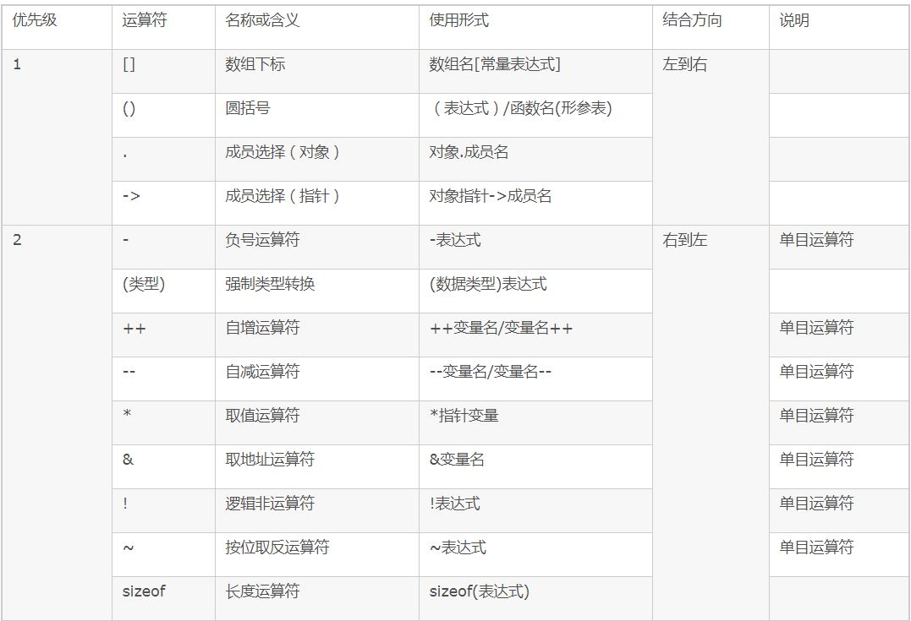
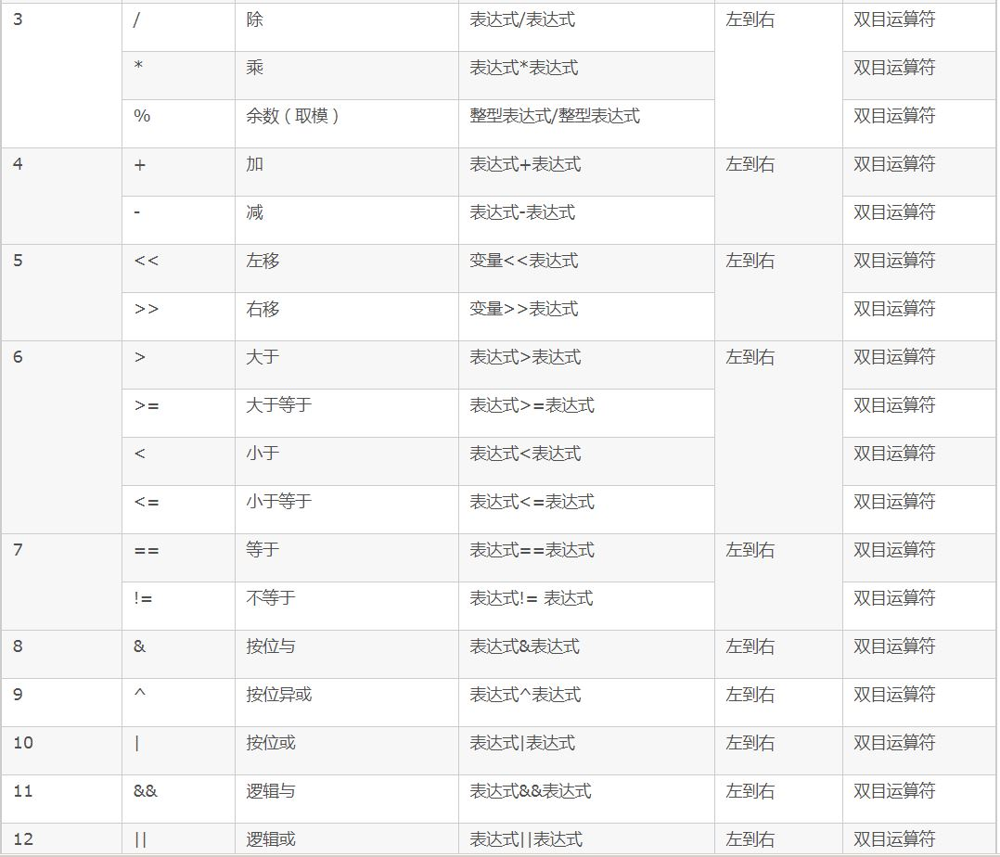
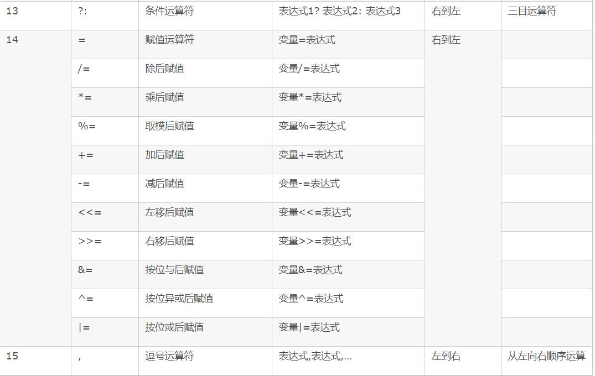
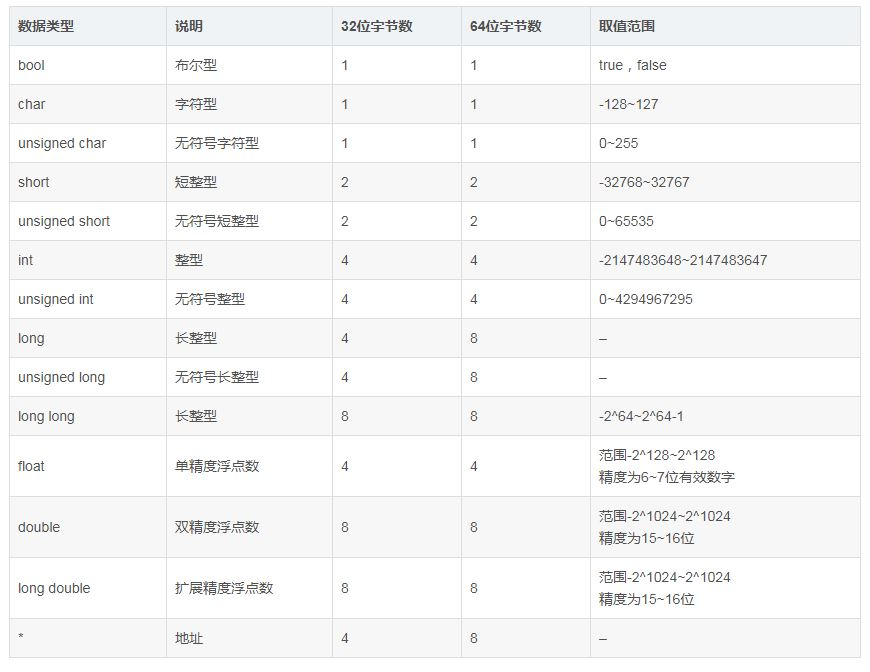

# 1. 数据类型宽度和优先级
   
   
   
   


# 2. 定义和声明
声明没有分配内存
> extern int i; // 单纯声明一个变量

定义创建了对象，并且分配了内存(堆/栈上)    
> 定义的时候**推荐对其进行初始化**

# 3. auto和register
auto：缺省情况下，编译器默认变量是auto    
register:编译器可能会把变量保存在CPU的内部寄存器中，目的是：CPU直接访问，不需要通过总线访问地址，取数据，以此提高效率      
> CPU内部寄存器有限，**定义过多register变量，某些不一定会在寄存器中**      
> 限制：必须是CPU寄存器能接受的类型，即是一个值，**长度小于寄存器长度**，register变量不存储在内存的时候，不能使用取地址符号&获取变量的地址    

# 4. static
编译时的语法检测行为?      

## 4.1 C中==>控制存储方式和可见性(作用域)    
1. 静态变量
#### 存储方式
保存在内存的静态区，因此下次进入函数，仍然可以使用上次的值  

#### 作用域
- 静态全局变量：作用域限制在定义之处开始，到当前文件结尾处结束，其他文件使用extern声明也不能使用           
- 静态局部变量：作用域限制在函数体中      

2. 静态函数
**修饰作用域**
- 指对函数的作用域局限于本文件(**内部函数**) ==> 目的是为了防止和其他文件中的函数同名      

## 4.2 C++中===> 增加了修饰数据成员和成员函数

------
# 5. sizeof===>编译时求值
- 计算变量所占空间大小时，括号可以省略
- 计算类型大小时，()不能省略     

```
char a[100] = {};
sizeof(a); // 100

```

- 通常sizeof在编译时求值，但是类似于sizeof(i=1234)这种表达式，没有必要也不允许存在，**因此sizeof操作符里面不要有其他的运算**        
- 计算柔性数组所占用空间大小时，sizeof是在**运行时求值，此为唯一特例**
> **柔性数组的概念?**

# 6. signed和unsigned    
```
int main(int argc, char *argv[])
{
        signed char a[1000];
        int i;
        for (i = 0; i < 1000; i ++)
        {
                a[i] = -1 - i;
        }

        printf("%d\n", strlen(a));  // 255 ===> 字符串遇到0就结束，注意和sizeof区分
        printf("%d\n", a[11]);  // -12
        return 0;
}
```

### 6.1 负数在计算机中的存储方式      
`i=0时，a[0]=-1`:
-1在内存中的存储方式, 在计算机系统中，数值用补码表示(存储):    
1. 使用补码可以把符号位和其他位统一处理    
2. 减法可以按加法处理    
3. 补码相加，最高位(符号位)有进位，则进位舍弃    
4. 正数补码和源码一致    
5. 负数补码有两种方式    

### 6.2 字符串数组结束标志    
根据第一步得出：a[0]~a[254]里面的值都不为0，而a[255]值为0       
**strlen是计算字符串长度的，并不包含最后的'\0'，判读一个字符串是否结束的标志就是看是否遇到'\0',如果遇到，则字符串结束**        
**计算机中的存储方式和printf函数打印输出方式的区别：打印出来屏幕显示的a[11]是-12,但是在计算机中保存的则是补码**

### 6.3 总结
1. signed char类型表示的值的范围是[-128, 127]，超出这个范围的值，溢出    
2. 缺省情况下，编译器默认数据为signed类型(char类型除外)

------
# 7. char三种类型    
1. 单纯的char：真正的字符类型，用来声明字符的，由编译环境决定，对于单纯的char类型，唯一允许的操作是赋值和相等运算符(=, ==, !=)    
2. signed char: 用于数值存储，范围是-128~127 ===> 存储数值        
3. unsigned char：用于数值存储，范围是0-255     
> 为了程序清晰，不要把char和unsigned char混用，前者定义了字符类型，后者定义了数值类型             
> 一些通用的对字符的处理函数以char类型为参数的，如果使用signed/unsigned char类型则会产生编译警告，去掉这些警告只能加强制类型转换         

-----
# 8. 和0比较
## 8.1 bool类型和0值比较
```
// c中的关键字TRUE FALSE? ===> 没有bool类型？？
// C++中的关键字TRUE FALSE? ===> 有bool类型，true和false是关键字
// python中的关键字True False这个是确定的
bool bTestFlag = false 
if (bTestFlag);     
if (!bTestFlag);    
```

## 8.2 float类型和0值比较
```
float fTestVal = 0.0;
if( (fTestVal>= -EPSINON) && (fTestVal <= EPSINON) ); // EPSINON为定义好的精度    
```

## 8.3 指针类型和0值比较
```
int *p = NULL; // nullptr ==> C++11后的关键字
if(NULL == p);
if(NULL != p)
```

# 9. switch, case的问题    
每个case语句结尾都需要加break，并且default语句尽量加上，即使不处理    
case后面只能是**整型或字符型的常量和常量表达式**    

# 10. break和continue的区别     
break表示终止本层循环，即跳出循环，接着执行后面的代码      
continue是终止本次循环，接着执行下次循环       
goto可以用，但要谨慎 ===> 某些地方使用这个还算多     

# 11. void
void关键字体现了一种抽象的需要，它指代了有类型的，类似于面向对象中的**抽象基类**的概念,不能够给它定义一个void的变量      

1. void \*可以**指向任意类型的数据**        
```
// 两种例子
void *p1;
int *p2;
p1 = p2; // 直接赋值
p2 = (int *)p1; // 强制类型转换
void a; // 错误，要指定具体的类型 ===> void *a可以
```
2. 修饰函数返回值和参数
如果函数没有返回值，则应当声明为void类型      
如果函数无参数，那么应声明其参数为void类型      
**在C语言中，不加返回值类型限定的函数，会被编译器作为返回整型值处理** ==> 推荐加上

3. ANSI和GNU对于void*类型的容忍度不同
```
void *pvoid;
pvoid ++; // ANSI错误；GNU正确
pvoid += 1; // ANSI错误; GNU正确
```

4. 如若函数参数可以是任意类型指针，则应声明为void*类型
```
// memcpy
void * memcpy(void *dest, const void *src, size_t len);

// memset
void *memset(void *buffer, int c, size_te num);

// 函数操作的是内存，而不论这片内存是什么类型
```

# 12. return
用来终止一个函数，并返回其后面跟着的值==> **不可返回指向"栈内存"的"指针"**      
```
int *Func(void)
{
    char str[30]; // 栈空间分配
    return str; // 失败，str为局部变量，位于栈内存中，函数结束被释放，因此不能返回
}

```

------
# 13. const
1. 编译期替换规则
C中，const修饰的量是只读(readonly)的变量，在编译期不能被使用==>因为编译器在编译的时候不知道其存储的内容
c++中，会在编译的时候把const类型的变量替换为值，但是C语言不会      

```
const int Max = 100; // 在定义的时候需要初始化，因为是readonly类型的
int array[Max];  // 在c语言中也没有出错
int array[Max] = {0};  // 在c语言中出错，因为并不知道Max的值

// 编译器通常不为普通的const只读变量分配存储空间，而是把它们保存在符号表中，是的它成为一个编译期间的值，没有了存储于读内存的操作
        const int a = 1000;
        #define M 3   // 预处理阶段替换
        int i = a;
        int I = M;
        int j = a;
        int J = M;

// C语言反汇编 
        pushl   %ebp
        movl    %esp, %ebp
        subl    $32, %esp
        movl    $1000, -20(%ebp)   
        movl    -20(%ebp), %eax    // 区别 ===> C编译阶段不替换
        movl    %eax, -16(%ebp)
        movl    $3, -12(%ebp)
        movl    -20(%ebp), %eax
        movl    %eax, -8(%ebp)
        movl    $3, -4(%ebp)
        leave  
        ret


// C++反汇编代码
        pushl   %ebp
        movl    %esp, %ebp
        subl    $32, %esp
        movl    $1000, -20(%ebp)  // ===> 编译阶段替换const的值
        movl    $1000, -16(%ebp)
        movl    $3, -12(%ebp)
        movl    $1000, -8(%ebp)
        movl    $3, -4(%ebp)
        movl    $0, %eax
        leave
        ret
```
**C语言中const修饰的是readonly的变量，这些只读变量不能作为定义数组的维数，也不能放在case关键字后面，但是C++可以**

2. 修饰各种类型
- 普通变量   
```
const int i = 10;    
int const i = 10;    
```

- 数组 
```  
const int a[10] = {1};   ===> 两者相同，没有初始值的默认为0
int const a[10] = {1};   ===> 和上面相同
```

- 指针==>把类型去掉来判断，const *(指向值不变) 还是 * const(本身地址不变)
```    
const int *p; // p(地址)可变，p指向对象不可变    
int const *p; // p(地址)可变，p指向对象不可变    

int *const p; // p不可变，p指向对象可变     
const int *const p; // 都不可变     
int const *const p; // 都不可变     
```

- 修饰函数的参数，函数返回值
```
const int Fun(const int *p);
```

- const char*类型赋值给char*类型
使用**strcpy**, 直接复制则会更改同一块内存位置的属性

-------
# 14. volatile
volatile关键字修饰的变量**编译器不会对其进行优化**，从而提供对特殊地址的稳定访问，常用在嵌入式中             
在const volatile修饰的变量中，volatile起作用               
```
// C++ const volatile int i = 1000;
        pushl   %ebp
        movl    %esp, %ebp
        subl    $32, %esp
        movl    $1000, -20(%ebp)
        movl    -20(%ebp), %eax  ===> 此时的const不起作用了
        movl    %eax, -16(%ebp)
        movl    $3, -12(%ebp)
        movl    -20(%ebp), %eax
        movl    %eax, -8(%ebp)
        movl    $3, -4(%ebp)
        movl    $0, %eax
        leave
        ret

// const  int i = 1000;
        pushl   %ebp
        movl    %esp, %ebp
        subl    $32, %esp
        movl    $1000, -20(%ebp)
        movl    $1000, -16(%ebp)
        movl    $3, -12(%ebp)
        movl    $1000, -8(%ebp)
        movl    $3, -4(%ebp)
        movl    $0, %eax
        leave
        ret


// c语言 const volatile int i = 1000

        pushl   %ebp
        movl    %esp, %ebp
        subl    $16, %esp
        movl    $1000, -16(%ebp)
        movl    -16(%ebp), %eax
        movl    %eax, -12(%ebp)
        movl    -16(%ebp), %eax
        movl    %eax, -8(%ebp)
        movl    $3, -4(%ebp)
        leave
        ret
// const  int i = 1000
        pushl   %ebp
        movl    %esp, %ebp
        subl    $16, %esp
        movl    $1000, -16(%ebp)
        movl    -16(%ebp), %eax
        movl    %eax, -12(%ebp)
        movl    -16(%ebp), %eax
        movl    %eax, -8(%ebp)
        movl    $3, -4(%ebp)
        leave
        ret
```

------
# 15. extern
extern修饰变量或者函数，表明**此变量或者函数的定义**在其他文件中       
> **提示链接器遇到此变量和函数时在其他模块中解析/绑定此标识符**

------
# 16. struct
struct用来把各种类型组合成一个整体     
在网络协议，通信控制，嵌入式系统，驱动开发中，经常需要传送多种数据组合，此时就需要使用结构体; 另外函数的参数多于4个时，使用**结构体来压缩参数个数**(ARM芯片对于超过4个参数的处理有讲究==>没有足够的寄存器做参数临时保存)
```
// 结构体所占用内存大小是其成员所占用内存之和(包括内存对齐)      
struct TT {

} testTT;

sizeof(testTT);  // 在某些编译器是0，某些是1: 不小于最小的char类型的大小，因此为1    

// C++中，空类的大小为1
```

# 17. 柔性数组：C99中，结构中的最后一个元素允许是未知大小的数组，称为柔性数组

------
# 18. union
1. union维护足够的空间来放置多个数据成员中的**一个**，而不是为每个数据成员配置空间, union的**大小为最大的成员的大小**        
> union中的所有的数据成员共用一个空间，同一时间只能存储一个数据成员，**所有的数据成员具有相同的起始地址，因此union主要用来压缩空间**      

```
union StateMain
{
    char character;
    int number;
    char *str;
    double exp;  // 8字节
};

```

2. 大小端
```
union {
    int i;
    char a[2];
} *p, u;
p = &u;
p->a[0] = 0x39;
p->a[1] = 0x38;
p->i = 0x3839; // 小端
p->i = 0x3938; // 大端

```

3. 测试大小端代码
```
int checkSytem
{
    union 
    {
        int i;
        char ch;
    } c;
    c.i = 1;
    return (c.ch == 1);
}

// 如果返回0，则是大端；返回1则是小端

```


------
# 19. 枚举变量的取值限定于枚举类型的范围内
```
// enum_variable_name的取值范围限定在enum_type_name中，如果不在列表中，则会报错或者警告
enum enum_type_name 
{ 
    // 常量符号，enum变量类型可以给常量符号赋值，如果不赋值，则从被赋初值的那个常量开始依次加1，都没有赋值则从0开始   
    ENUM\_CONST\_1,
    ENUM\_CONST\_2,
    ....
    ENUM\_CONST\_2,
} enum_variable_name;

```
## enum和#define的区别  
1. #define是在**预处理阶段**进行简单替换；enum则是在**编译时候**确定值     
2. 一般在调试器中可以调试枚举变量，但是不能调试宏常量     
3. 枚举可以一次定义大量相关常量，宏定义只能定义一个
```
sizeof(enum) 大小为4？明天尝试一下===> 的确在GNU的C++中为4byte

asb@docker:C$ vi enum.c 
#include <stdio.h>

enum port_type
{
  PORT_232,
  PORT_485,
  PORT_422,
};

// 数组里面的类型必须都是enum port_type，也就是说只能是定义的三个值中的某一个
enum port_type porttype[] = {PORT_485};
enum port_type a = PORT_232;

int main()
{
  printf("The output of enum port_type:%d\n", a);
  return 0;
}

asb@docker:C$ ./enum 
The output of enum port_type:0 ===> enum的默认值是从0开始

// 出现非法字符的时候错误
enum.c:6:2: error: stray ‘\357’ in program

```

# 20. typedef
1. typedef真正意思是给一个已经存在的数据类型(**不是变量**)取一个别名，**并不是定义一个新的数据类型**     
```
typedef struct student 
{
        // code 
}Stu_st, *Stu_pst;    
a. struct student stu1等价于Stu_st stu1    
b. struct student *stu2等价于Stu_st *stu2
c. Stu_pst stu2等价于Stu_st *stu2    

解释：     
其中struct student {// code} 看做一个整体    
typedef就是给struct student {// code} 取了个别名叫Stu_st     
同时给struct student {// code} *取了个别名叫Stu_pst   

const Stu_pst stu3;   // 这个时候Stu_pst就是一个类型名，因此可以把它忽略，从而得出const修饰的是stu3，所以stu3是个const readonly类型的
Stu_pst const stu4;   // 同理，因此代表stu4是个const类型的

```

2. typedef和#define的区别 ==> 在预处理阶段会不会被替换掉   
```
#define INT32 int
unsigned INT32 i = 10; // 能编译通过，因为在预处理阶段宏定义被替换

typedef int int32;
unsigned int32 j = 10; // 编译错误，因为int32不会被替换，无法识别unsigned int32的类型

``` 

------
# 21. indent格式化
```
// indent命令格式化代码为kr格式
root@a1822e80f633:~/c++# apt-get install indent

// 格式化
root@a1822e80f633:~/c++# indent -kr test_this.c
```