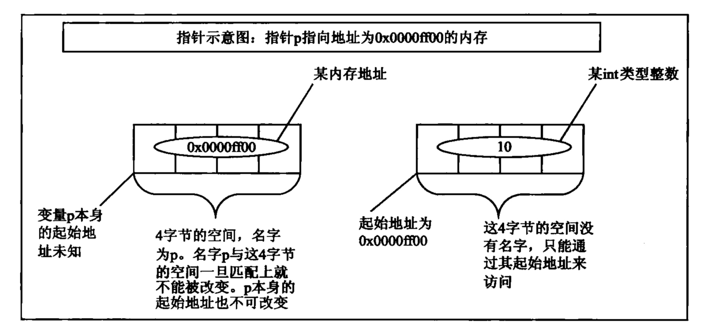
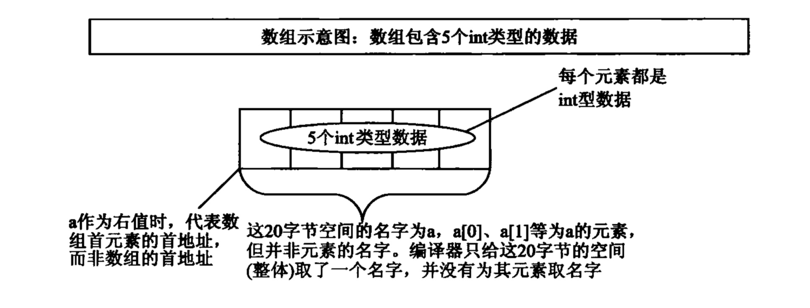
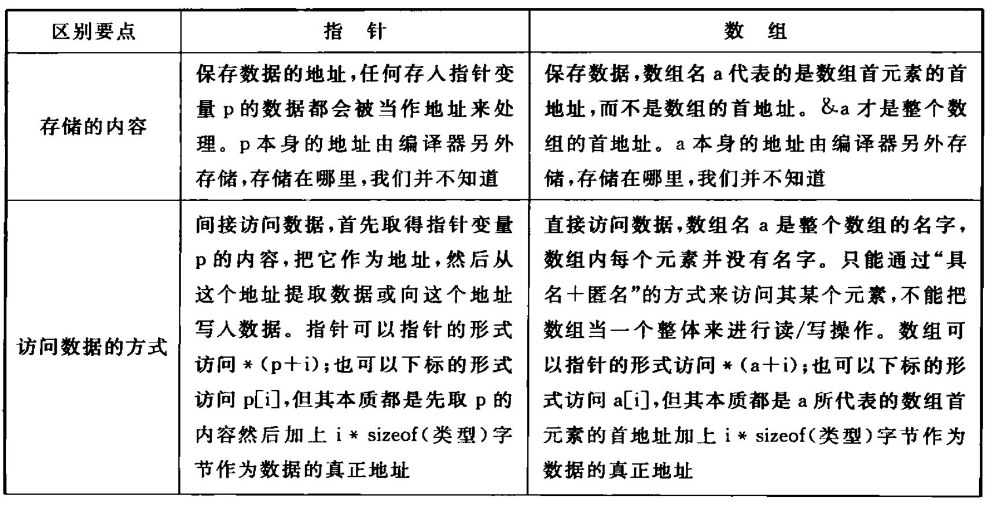
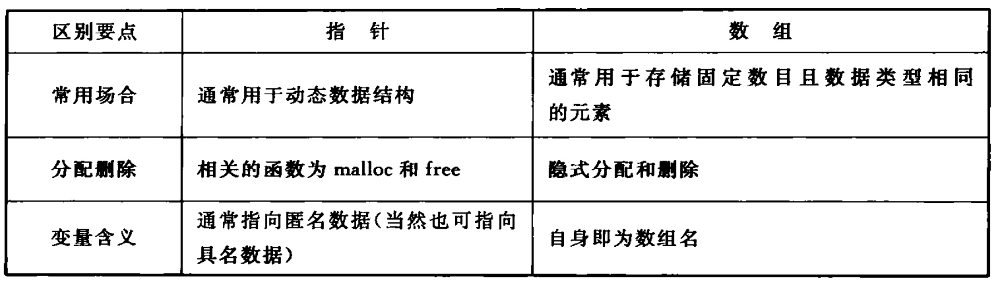
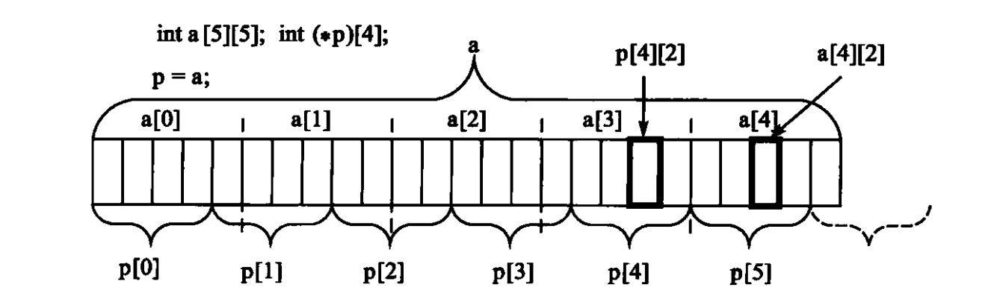
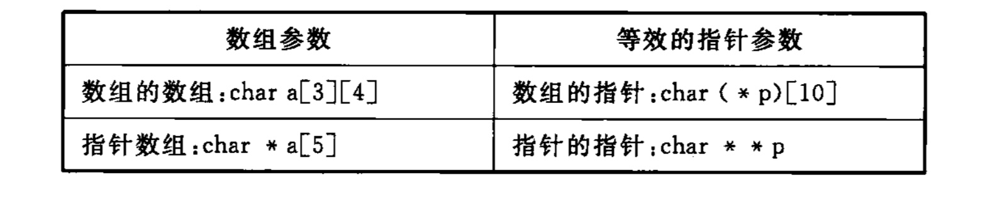

# 1. 指针
32位系统下是4byte, 64为系统下是8byte，根据数据位宽度来决定的     
> **初始化操作是在编译的时候进行的**

```
int *p; 
```

- 申请4bytes的空间，把这个空间大小命名为p   
- 限定这4字节的空间里面只能存储某个内存地址, 即存入其他的东西，也会当地址对待
- 以**这个内存地址**为其实地址的内存**里面保存的是int类型的值**


**一个基本数据类型(包括结构体等)+星号(*)=指针类型，这个类型大小固定，跟星号前面数据类型无关，星号前面数据类型只是说明指针指向的内存里存储的数据类型**     

- 区分定义和赋值
```

int *p = NULL; // 地址为空，NULL是固定写法  int* 是类型，看作一个整体 ==> 定义
*p = NULL // 地址指向内容为空 ==> 赋值

// 把数值写到固定地址 ==> 不推荐使用
int *p = (int *)0x12ff7c // 要强调一下数据类型转换 ==> 定义
*p = 0x100; ==> 赋值
```

**指针的意义和作用:**          
1. 作为**函数通讯**的一种手段：使用指针作为函数参数，不仅可以参数传递效率，还可以把**参数作为函数输出集的一员**，带回结果            
2. 作为构造复杂数据结构的手段：使用指针构造数据对象之间的关联，形成复杂的数据结构     
3. 作为动态内存分配和管理的手段：在程序执行期间动态构造数据对象之间的关联     
4. 作为执行特定程序代码的手段：使用指针指向特定代码段，执行未来才能实现的函数(函数指针)

**作为函数返回值时，不能返回函数内部局部变量(也就是指向栈空间))的地址，空指针NULL值为0，表示指针不指向任何地方，在使用指针前需要测试是否为空**      

# 2. 数组

如上图，定义一个数组a时，编译器根据指定的元素个数和元素类型分配确定大小的内存，并把内存的名字命名为a，**名字a一旦和内存匹配就不能被改变**，a[0], a[1]等为a的元素，但是并非元素的名字，**数组的每个元素是没有名字的**          
```
// 以下均在32位系统
sizeof(a)的值为sizeof(int)*5 // 20
sizeof(a[0])的值为sizeof(int) // 4
sizeof(a[5])的值为sizeof(int) // 4  
// 原因：sizeof是关键字不是函数，函数求值是在运行时，而sizeof求值是在编译时，因此并没有真正去访问a[5]，而仅仅是根据数组元素类型来确定其值，因此a[5]并不会出错

sizeof(&a[0]) // 4, 取数组元素a[0]的首地址
sizeof(&a) // 4， 取数组a的首地址
```

## 2.1 数组名a作为**左值**和**右值**的区别：    
左值：编译器认为是一个地址，这个地址只有编译器自己知道，在编译的时候确定，编译器在某特定的区域保存此地址，开发者不用考虑   
右值：内容，至于内容是什么，只有在运行的时候才能知道    
数组a被当做右值时，其意义代表数组**首元素**的地址，不是数组的地址(sizeof(a)中，**a表示数组名，此时并没有被用作右值**)
```
// a作为右值，代表数组首元素的地址
int t = *(a + 1) 

// 数组第i个元素地址：
a + i*sizeof(int)等价于&a[0] + i*sizeof(int)

```     
**数组名字a代表一个*常量*，不能作为左值，不能进行赋值操作， 如a++，a--等； 不能存储函数，但是可以存储函数的地址**===>注意是自赋值操作            

```
*a++; *运算符优先级高于++,因此先计算*a, 然后a++，a++为自赋值操作，a为常量是不允许的
(*a).c 等价于 a->c，因.的优先级高于*的优先级  ===> a是指针

```

# 3. 指针和数组
**指针和数组没有任何关系**    
```
// p指向一个常量 p大小为4,指向一个大小为7的静态存储区，这块内存没有名字，对其访问采用匿名的访问，字符串的结尾是'\0'
char *p = "abcdef" ===> p保存的是常量字符串的地址

// 求字符串的长度
strlen(p); // 有效长度6
strlen(p) + 1; // 总长度7

// 读取字符e
// 第一种方式:指针形式--取出p里面保存的地址，然后+4个元素(int的话是4*4个字节)的偏移量，最后取出相对应的内存地址保存的值，p代表数组首元素的地址
*(p + 4); 

// 第二种方式:下标形式--编译器总是把以下标形式的操作解析为以指针形式的操作，因此被解析为先取出p的地址值，然后加上4个偏移量，最后取出对应的内存地址保存的值
p[4];

// a保存的是一个字符串 a的大小为6，因为最后有个'\0'
char a[] = "12345" ===>有个copy的过程，把常量字符串的值copy到数组中

// 读取字符4，和上面一样的两种方式，不过在第一种方式中，a被认为是数组元素的首地址
```
总结：1. 从上可知，指针和数组没有关系，只不过两者都可以"以指针形式"或者"以下标形式"进行访问,**指针的加减运算是以目标数据类型为单位**

## 3.1 a和&a的区别
```
int a[5] = {1, 3, 5, 7, 9};
int *ptr = (int *)(&a + 1); // &a取得是数组的地址，以sizeof(T)为移动单位
*(a+1); // 3 a是元素的首地址
*(ptr-1); // 9

```

## 3.2 指针和数组的定义声明
**声明的时候不分配空间，定义是要分配空间的；声明可以有多次，但是定义只能有一个**     
```
// 文件1中定义：
char a[100];

// 文件2中声明:
// 告诉编译器a的名字已经在其他文件里面定义了，下面的代码使用的名字a是别的文件定义的
extern char *a;  
// 因为数组和指针是两种不同概念，因此以上编译会出问题

// 因为只声明，不分配空间，这两个声明都是告诉编译器a是在别的文件中被定义的一个数组，\
a同时代表着第一个元素的首地址，也就是这块内存的起始地址
extern char a[]; 等价于 extern char a[100]; 
```
**在文件1中，编译器知道a是一个数组，并且知道大小是100，但是在文件2中编译器认为a是个指针, 大小为4**

```
// 以下也是错误的
// 文件1
char *a;

// 文件2
extern char a[100];
```
总结：    
   
   


# 4. 数组指针和指针数组
```
// []的优先级比*优先级高
// 数组指针是个指针, p是个指针，它指向一个数组，数组里面都是int类型元素
int (*p)[]; 

// 指针数组是个数组, p是个数组，里面保存了int*类型的元素 
int *p[]

int main()
{
        int a[4] = {1, 2, 3, 4};
        int *ptr1 = (int *)(&a + 1);
        int *ptr2 = (int *)(a + 1);

        printf("The value of *ptr1 is %d, and the value of *ptr2 is %d\n", *(ptr1-1), *ptr2);
        return 0;
}
// The value of *ptr1 is 4, and the value of *ptr2 is 2

```
**注意要区分大小端**


# 5. c语言中的逗号表达式的计算过程：
```
/*
* 表达式1，表达式2，表达式3，...... ，表达式n
* 逗号表达式的要领：
* (1) 逗号表达式的运算过程为：从左往右逐个计算表达式
* (2) 逗号表达式作为一个整体，它的值为最后一个表达式（也即表达式n）的值
* (3) 逗号运算符的优先级别在所有运算符中最低
*/
int a[3][2] = {(0,1), (2,3), (4,5)}; ===>{1，3，5}
int *p = a[0];
p[0]; // 值为1
```
**逗号表达式最终的值是最后一个表达式的值**


# 6. 多维数组和多级指针
## 6.1 二维数组
```
int a[5][5];
int (*p)[4];
p = a;
&p[4][2] - &a[4][2]; // 值为-4 ===> 计算两者差了多少个int的距离
// 解释: p是一个指向包含4个元素的数组的指针, \
也就是说p+1表示的是指针p向后移动了一个"包含4个int类型元素的数组"，这里的1的单位是p指向的空间，\
即4*sizeof(int),所有p[4]相对于p[0]来说是向后移动了4个"包含4个int类型元素的数组"，\
即&p[4][2]的值为&a[0][0] + 4*4*sizeof(int)+2*sizeof(int)

// &a[4][2]的值则是&a[0][0]+4*5*sizeof(int) + 2*sizeof(int)

// 因此两者相减，差了4个sizeof(int)的距离

```
如下图所示：


## 6.2 二级指针
一级指针保存的是**数据的地址**，二级指针保存的是**一级指针的地址**
```
char **p;
p = NULL;
char *p2;
p = &p2; // p保存的是一级指针p2的地址
```
使用p的流程:    
1. 根据p这个变量，取出它里面存储的地址    
2. 找到这个地址所在的内存    
3. 用钥匙(*)打开这块内存，取出它里面的地址\*p的值
4. 找到第2次取出的这个地址
5. 用钥匙(*)打开这块内存，取出它里面的内容，也就是真正的数据**p的值    


# 7. 数组参数和指针参数
函数的参数分为形参和实参，形参是指声明和定义函数时的参数，实参是在调用函数时主调函数传递过来的实际值   
C语言中，当**一维数组**作为函数参数时，编译器总是把它解析成**指向数组首元素的地址的指针**, 只对一维数组有效，因此只能省略一维数组的个数        
C语言中，所有的非数组形式的数据实参都是以**传值的方式调用**，也即是传的参数是**实参的一份copy**，因此并不是改变实参的值  
同样，函数的返回值也不能是数组，只能是指针，另外**函数本身没有类型，有的只是返回值的类型**     
**在C语言中，应该没有传值和传址之说，因为本身传入的都是实参的copy**===>C中没有引用的概念      

## 7.1 二维数组参数和二级指针参数         
```
void fun(char a[3][4]);
// 二维数组a[3][4]可以理解为一个一维数组a[3]，其每个元素都是一个含4个char类型数据的数组，因此可以改写为:
void fun(char(*p)[4]);

// 因为作为参数时，一维数组[]内的数字完全可以省略，所以等价于:
void fun(char p[][4]);  // 注意第二维不可以省略，因为省略了，就没有办法根据一维数组首地址来偏移计算其余的元素===> 根据1维数组首地址偏移计算      

// 同理
void fun(char *p[4]);
// 等价于
void fun(char **p);

```   


## 7.2 例子1
```
void (*)(); // 函数指针，没有参数，没有名字，没有返回值
(void (*)())0; // 把0强制类型转换成函数指针类型，因为0是一个地址，也就是一个函数保存在首地址为0的一段区域    
(* (void (*)())0);  // 取函数，也即是函数调用
```
## 7.3 例子2
```
char** (*)(char **, char **); // 函数指针，两个char**参数，没有名字，一个char**返回值   
(char** (*)(char **, char **))0; // 把0强制类型转换成函数指针类型，因为0是一个地址，也就是一个函数保存在首地址为0的一段区域    
((char** (*)(char **, char **))0)(char **, char **);  // 取函数，也即是函数调用，给两个char**参数
```
## 7.4 例子3
```
char * (*pf[3])(char *p) // pf是个数组，数组里面保存了三个指针，指针是函数指针，函数是返回值为char*，参数为char *p的函数
```
## 7.5 例子4
```
char * (*(*pf)[3])(char *p)// pf是个指针，指向一个包含3个元素的数组，数组内保存的是函数指针，这些指针指向的函数的返回值为char*, 参数也为char *
```