## 1. 普通多继承子类的内存布局
```
/**
	普通继承（没有使用虚基类）
*/
// 基类A
class A {
public:
	int dataA;
};
 
class B : public A {
public:
	int dataB;
};
 
class C : public A {
public:
	int dataC;
};
 
class D : public B, public C {
public:
	int dataD;
};

// 查看内存布局
cl  [文件名].cpp /d1reportSingleClassLayout[类名]
```

**内存布局**：    
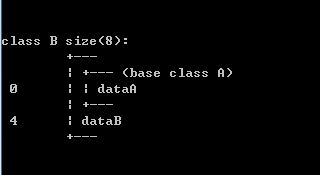
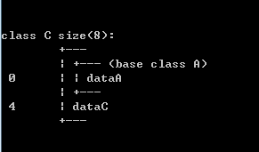
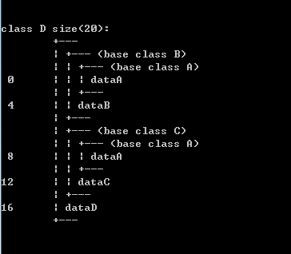

A派生出B和C ==> B和C中包含A的成员    
B和C派生出D ==> D包含B和C的成员   
D中就总共出现了2个A成员
> 左边的数字表明各成员在类中排列的起始地址，其中D有五个成员变量(B::dataA; dataB; C::dataA; dataC; dataD),各占用4个字节，因此sizeof(D) = 20

------
## 2. 虚继承类的内存布局
```
/**
	虚继承（虚基类）
*/ 
// 基类A
class A {
public:
	int dataA;
};
 
class B : virtual public A {
public:
	int dataB;
};
 
class C : virtual public A {
public:
	int dataC;
};
 
class D : public B, public C {
public:
	int dataD;
};
```
**内存布局**：        
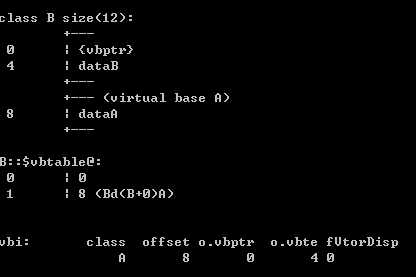
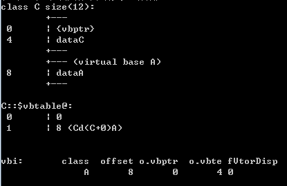
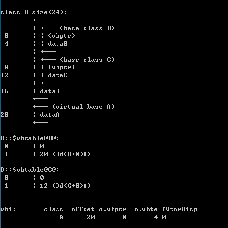

- B和C继承A时使用了virtual关键字，即虚继承，菱形继承体系中的子类在内存布局上和普通多继承体系中的子类类有很大的不一样
- 类B和C，sizeof的值变成了12，除了包含类A的成员变量dataA外还多了一个**指针vbptr**
- 类D除了继承B、C各自的成员变量dataB, dataA和自己的成员变量外，**还有两个分别属于B、C的指针**

**类D对象的内存布局**：          
- vbptr：继承自父类B中的指针
- int dataB：继承自父类B的成员变量
- vbptr：继承自父类C的指针
- int dataC：继承自父类C的成员变量
- int dataD：D自己的成员变量
- int A：继承自父类A的成员变量

**虚继承之所以能够实现在多重派生子类中只保存一份共有基类的拷贝，关键在于vbptr指针**    

**由类D内存布局图可得**:      
1. vbptr指的是**虚基类表指针(virtual base table pointer)**，该指针指向了一个**虚表**(virtual table)，虚表中记录了vbptr与本类的偏移地址
2. 第二项是vbptr到共有基类元素之间的偏移量
> 类B中的vbptr指向了虚表D::$vbtable@B@，虚表表明公共基类A的成员变量dataA距离类B开始处的位移为20，然后可以找到成员变量dataA，而虚继承也不用像普通多继承那样维持着公共基类的两份同样的拷贝，节省了存储空间

------
## 3. 虚函数实现机制
与C语言相比，C++在布局和存取时间上的额外开销主要是由**虚函数(virtual function)机制和虚继承（virtual base class）机制**引起的

**初探virtual function**      
在C++中，存在着**静态联编和动态联编的区别**
1. 静态联编：编译器在编译过程中就完成了**联编或绑定(binding)**，比如函数重载，C++编译器根据传递给函数的参数和函数名称就可以判断具体要使用哪一个函数，这种在编译过程中进行的绑定就称作静态联编(static binding)
2. 动态联编：在程序运行时完成的联编，C++通过**虚函数(virtual function)机制来支持动态联编(dynamic binding)，并实现了多态机制**
3. 多态是面向对象程序设计语言的基本特征之一。在C++中，多态就是**利用基类指针指向子类实例，然后通过基类指针调用子类(虚)函数从而实现一个接口，多种形态的效果**
> C++利用基类指针和虚函数来实现动态多态，虚函数的定义很简单，只要在成员函数原型前加上**关键字virtual即可**，并且virtual关键字只要声明一次，其派生类中的相应函数仍为虚函数，可以省略virtual关键字

### 例1
```
class Base1 
{
public:
    virtual void func1() { cout << "Base1::func1()" << endl; }
    void func2() { cout << "Base1::func2()" << endl; }
};

class Base2 : public Base1
{
    void func1() { cout << "Base2::func1()" << endl; }
};

int main()
{
    cout << "virtual function testing:" << endl;
    Base2 b;
    Base1 *ptr = &b;
    ptr->func1();
    ptr->func2();
}
```
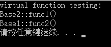

**同样是基类指针指向子类对象**：        
1. 对于func1，调用了基类的实现版本
2. 对于func2，却调用了子类的实现版本

**对于virtual函数，具体调用哪个版本的函数取决于指针所指向对象类型**      
**对于非virtual函数，具体调用哪个版本的函数取决于指针本身的类型，而和指针所指对象类型无关**      

**virtual函数的实现原理**：      
1. 虚函数表
2. 虚函数表指针

**实现**：       
1. 对于**一个class，产生一堆指向virtual functions的指针**，这些指针被统一放在一个表格中。这个表格被称为虚函数表，英文又称做virtual table(vtbl)
2. **每一个对象中都添加一个指针，指向相关的virtual table，通常这个指针被称作虚函数表指针(vptr)
> 出于效率的考虑，该指针通常放在对象实例最前面的位置(第一个slot处)。每一个class所关联的type_info信息也由virtual table指出(通常放在表格的最前面)

**为了更加直观地了解上面描述的实现机制，通过查看带有virtual function的类的内存布局来证实一下**        
```
class Base
{
public:
    // 虚函数func1
    virtual void func1() { cout << "Base::func1()" << endl; }
    // 虚函数func2
    virtual void func2() { cout << "Base::func2()" << endl; }
    // 虚函数func3
    virtual void func3() { cout << "Base::func3()" << endl; }

    int a;
};
```

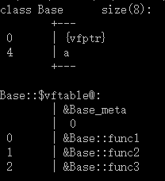

1. 在上面图中，**第一个位置**上存放**虚函数表指针**，接下来才是**Base的成员变量**
2. **另外存在着虚函数表(不占用大小)，该表里存放着Base类的所有virtual函数**


**Base类的内存布局：**         
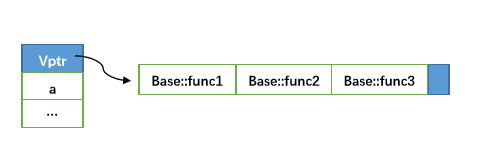

虚函数表中存在在一个**结束结点**，用以标识虚函数表的结束(具体实现与编译器有关)

**既然虚函数表指针通常放在对象实例的最前面的位置，可以通过代码来访问虚函数表**      

```
int main()
{
    typedef void(*pFunc)(void);

    cout << "virtual function testing:" << endl;
    Base b;
    cout << "虚函数表地址：" << (int *)(&b) << endl;
    pFunc pfunc;
    pfunc = (pFunc)*((int *)(*((int *)(&b))));
    pfunc();
    pfunc = (pFunc)*((int *)(*((int *)(&b))) + 1);
    pfunc();
    pfunc = (pFunc)*((int *)(*((int *)(&b))) + 2);
    pfunc();
}
```

**输出结果**：  
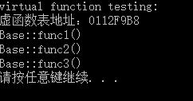     

------ 

## 4. 单继承环境下的虚函数
假设存在下面的两个类Base和A，A类继承自Base类

```
class Base
{
public:
    // 虚函数func1
    virtual void func1() { cout << "Base::func1()" << endl; }
    // 虚函数func2
    virtual void func2() { cout << "Base::func2()" << endl; }
    // 虚函数func3
    virtual void func3() { cout << "Base::func3()" << endl; }

    int a;
};

class A : public Base
{
public:
    // 重写父类虚函数func1
    void func1() { cout << "A::func1()" << endl; }
    void func2() { cout << "A::func2()" << endl; }
    // 新增虚函数func4
    virtual void func4() { cout << "A::func3()" << endl; }
};
```

**类Base的内存布局图**       


**类A的内存布局图**        
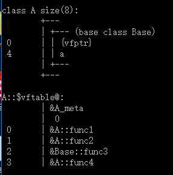

1. 在单继承中，**A类覆盖了Base类中的同名虚函数**，在虚函数表中体现为**对应位置被A类中的新函数替换**，而没有被覆盖的函数则没有发生变化
2. 对于子类自己的虚函数，直接添加到虚函数表后面

类A和类Base中都只有一个vfptr指针，该指针指向虚函数表，分别输出类A和类Base的vfptr:
```
int main()
{
    typedef void(*pFunc)(void);

    cout << "virtual function testing:" << endl;
    Base b;
    cout << "Base虚函数表地址：" << (int *)(&b) << endl;
    A a;
    cout << "A类虚函数表地址：" << (int *)(&a) << endl;
}
```
**结果：**       
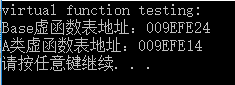

**类A和类B分别拥有自己的虚函数表指针vptr和虚函数表vtbl，每一个实例对象中都存在一个vptr指针 ==> 编译器会先取出vptr的值(这个值就是虚函数表vtbl的地址) ==> 再根据这个值来到vtbl中调用目标函数**         
**所以，只要vptr不同，指向的虚函数表vtbl就不同，而不同的虚函数表中存放着对应类的虚函数地址，这样就实现了多态的效果**     

**单继承下的虚函数实现**       
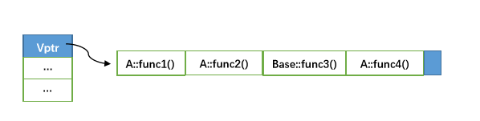

------
## 5. 多继承环境下的虚函数
```
class Base
{
public:
    // 虚函数func1
    virtual void func1() { cout << "Base::func1()" << endl; }
    // 虚函数func2
    virtual void func2() { cout << "Base::func2()" << endl; }
    // 虚函数func3
    virtual void func3() { cout << "Base::func3()" << endl; }
};

class A : public Base
{
public:
    // 重写父类虚函数func1
    void func1() { cout << "A::func1()" << endl; }
    void func2() { cout << "A::func2()" << endl; }
};

class B : public Base
{
public:
    void func1() { cout << "B::func1()" << endl; }
    void func2() { cout << "B::func2()" << endl; }
};

class C : public A, public B
{
public:
    void func1() { cout << "D::func1()" << endl; }
    void func2() { cout << "D::func2()" << endl; }
};
```

**类C的内存布局**      
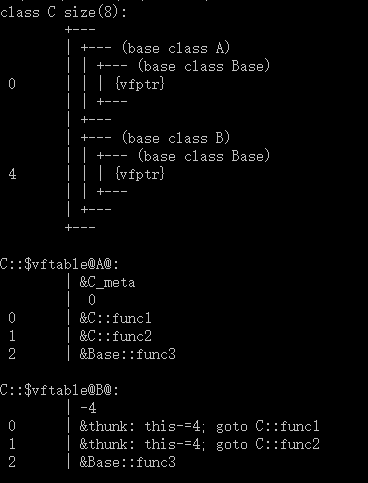

1. 类C中拥有两个虚函数表指针vptr
2. 类C中覆盖了类A的两个同名函数，在虚函数表中体现为对应位置替换为C中新函数
3. 类C中覆盖了类B中的两个同名函数，在虚函数表中体现为对应位置替换为C中新函数(注意，这里使用跳转语句，而不是重复定义)

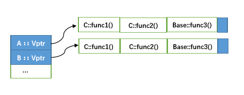
