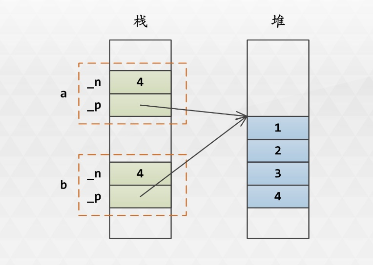
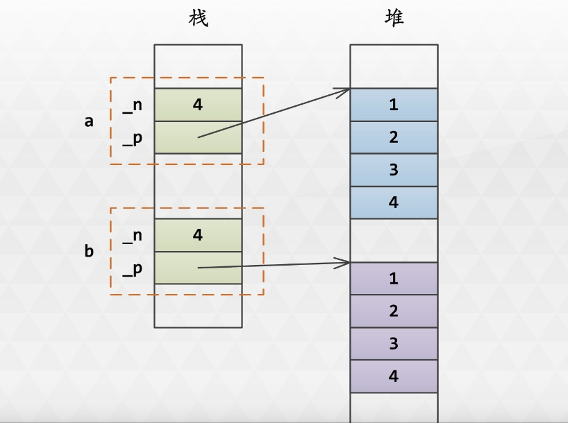
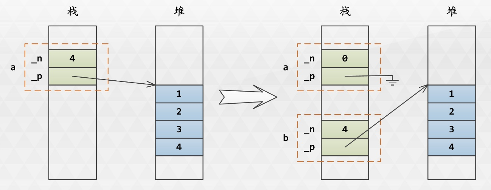

# 1. 操作符重载
1. 操作符重载是什么？ ===> 自定义的类，重载相关的运算符
2. 为什么有操作符重载？ ===> 为了对自定义的类进行操作
3. 如何实现操作符重载？ ===> 函数重载

# 2. 四则运算符重载
1. 尽量不要使用带默认值的的参数，这样会导致编译器无法知道到底调用哪个构造函数
2. 如果带默认参数，则从最后向前依次给默认参数，如可以只设置b=0，但是不能只设置a=0===>函数的参数传递顺序
3. 参数可以不是**Couple类对象的常引用**===>可以不是，但是推荐是类对象常引用
> 不使用引用，则会产生对象copy动作，降低效率
> 不使用常引用，就无法限制函数内部对参数的修改；使用指针，就和常规数学公式不符合

4. 返回值可以不是**Couple类对象** ===> **不建议使用引用类型的返回值**
> 可以返回引用，但是必须是**全局对象**，或是通过**参数传递进去的Couple对象的引用**，**不能引用函数内部的**局部变量; 

5. 需要把右操作数累加到左操作数上，并返回左操作数时，应该重载+=, -=, *=, /=, %=等操作符===> 需要重载什么样的操作符

6. 四则运算符可以重载为**友元函数**或者是**普通函数**，但是普通函数无法访问**类的私有成员**，因此**建议重载为友元函数**
**优点**：显式具有双操作数，且格式一致；操作不局限于当前对象本身，且不要求左操作数必须为本类对象      
**缺点**：显式具有双操作数，不能省略左操作数      

## 2.1 重载为成员函数
```
#include <iostream>

using namespace std;

class Couple
{
public:
    //Couple(int a = 0, int b = 0):m_a(a), m_b(b) {}
    Couple(int a, int b):m_a(a), m_b(b) {}
    Couple() {}
    Couple operator+(const Couple &c);
    Couple operator*(const Couple &c);
    void printValue();
private:
    int m_a;
    int m_b;
};

// 1. 隐含传递this指针===>这个指针指向啥? 
// 2. return不能是局部对象的指针或者引用，但是可以是传递的参数的
// 3. 后面有个string类的要好好研究下
Couple Couple::operator+(const Couple &c)
{
    Couple _temp; 
    _temp.m_a = this->m_a + c.m_a;
    _temp.m_b = this->m_b + c.m_a;
    return _temp; ===> 返回的是个局部对象，这个应该是有个copy的动作???
}

Couple Couple::operator*(const Couple &c)
{
    Couple _temp; 
    _temp.m_a = this->m_a * c.m_a;
    _temp.m_b = this->m_b * c.m_a;
    return _temp;
}

void Couple::printValue()
{
    // 默认会传递调用当前函数的对象，即this指针指向当前调用函数的那个对象
    cout << this->m_a << endl;
    cout << this->m_b << endl;
}

int main()
{
    Couple t_a(10, 20);
    Couple t_b(30, 30);
    Couple t_c, t_d;
    t_c = t_a + t_b;  // 等价于t_a.operator+(t_b);
    t_d = t_a * t_b;  // 等价于t_a.operator*(t_b);

    t_c.printValue();
    t_d.printValue();    
    return 0;
}
```

## 2.2 重载为友元函数
1. 友元函数实现的时候**一定不要加friend关键字**, 此时的函数是friend函数，不是在类的成员函数，因此**不需要加类域名**
2. 实现的时候不需要加friend关键字 ===> 定义的时候**一定不能**加friend
3. 使用explicit修饰的构造函数，隐式类型转换会被禁止===>什么时候隐式类型转换？？ 
```
class Couple
{
    public:
        Couple(){} // 函数定义
        Couple(int a, int b):m_a(a), m_b(b){} // 函数定义
        friend Couple operator+(const Couple &a, const Couple & b); // 函数声明
        friend Couple operator*(const Couple &a, const Couple & b); // 函数声明
        
        // 参数次序类型不同，也是函数重载，因为函数签名不同，所以需要实现两个===>重载的概念
        friend Couple operator*(const Couple &a, const int &b); // 函数声明
        friend Couple operator*(const int &a, const Couple & b); // 函数声明

    private:
        int m_a;
        int m_b;
};

// 实现的时候一定不要加friend关键字, 此时的函数是friend函数，不是在类的成员函数，因此不需要加名字===>是否要加类限定名字
Couple operator+(const Couple &a, const Couple &b)
{
    Couple _temp(a.m_a+b.m_a, a.m_b+b.m_b);
    return _temp;
}

Couple operator*(const Couple &a, const Couple &b)
{
    Couple _temp(a.m_a*b.m_a, a.m_b*b.m_b);
    return _temp;
}

Couple operator*(const Couple &a, const int &b)
{
    Couple _temp(a.m_a*b, a.m_b*b);
    return _temp;
}

Couple Couple::operator*(const int &a, const Couple &b)  // 错误，不需要Couple::
{
    Couple _temp(a*b.m_a, a*b.m_b);
    return _temp;
}

int main()
{
    Couple a(10, 20);
    Couple b(30, 40);
    Couple c = a+b;   // 等价于c = operator+(a,b)
    Couple d = a*b;   // 等价于d = operator*(a, b)
    Couple e = 10*a;  // 等价于e = operator*(10,a)
    Couple f = a*10;  // 等价于f = operator*(a,10)

    return 0;
}
```

## 2.3 关系操作符重载
关系操作符包含大于(>、>=)、小于(<、<=)、等于(==)、不等于(!=)
```
class Couple
{
    public:
        Couple(int a = 0, int b = 0):m_a(a),m_b(b) {}
        friend bool operator>(const Couple &a, const Couple &b);
        friend bool operator>=(const Couple &a, const Couple &b);
        friend bool operator<(const Couple &a, const Couple &b);
        friend bool operator<=(const Couple &a, const Couple &b);
        friend bool operator==(const Couple &a, const Couple &b);
        friend bool operator!=(const Couple &a, const Couple &b);

    private:
        int m_a;
        int m_b;
};

bool operator>(const Couple &a, const Couple &b)
{
    //
}
bool operator==(const Couple &a, const Couple &b)
{
    return (a.m_a == b.m_a) && (a.m_b == b.m_b);
}

bool operator!=(const Couple &a, const Couple &b)
{
    return (a.m_a != b.m_a) || (a.m_b != b.m_b);
}
```

## 2.4 下标操作符重载
#### 场合：
对象有数组成员，且该成员为主要成员，则可以重载下标操作符合
> 什么样的叫做主要成员？

#### 目的：
允许在对象上通过数组下标的方式访问数组中的成员

#### 下标操作符必须重载两个版本，常函数版本用于处理常量，并且可以在重载函数中处理数组下标越界错误，或者使用异常处理机制
> 什么叫做常函数版本?

```
class Couple
{
    public:
        Couple(int a = 0, int b = 0)
        {
            m_a[0] = a;
            m_a[1] = b;
        }

        int & operator[](int index);    // 并不是friend版本
        const int& operator[](int index) const;  // 返回的是指向const int的引用，只能处理const量
    private:
        int m_a[2];  // 需要指定处理的个数？可以不指定个数，但是最好指定个数，方便初始化
};

int & Couple::operator[](int index)
{
    if(index > 1 || index < 0)
    {
        throw std::out_of_range("Index is out of range!");
    }
    return m_a[index];
}

const int & Couple::operator[](int index) const
{
    if(index > 1 || index < 0)
    {
        throw std::out_of_range("Index is out of range!");
    }
    return m_a[index];     // 返回索引对应的数组元素
}

int main()
{
    Couple a(1,2), b(3, 4);
    cin >> a[0] >> a[1];
    cout << b[0] << " " << b[1] << endl;
    return 0;
}
```

## 2.5 赋值操作符重载
赋值操作符=重载的一般形式
```
class Couple
{
    public:
        Couple(int a = 0, int b = 0):m_a(a), m_b(b) {}
        Couple(const Couple &c):m_a(c.a),m_b(c.b) {}
        Couple & operator=(const Couple & a);
        Couple & operator+=(const Couple & a);  // 和赋值类似，不过不需要判断*this是否和形参相同
        Couple & operator*=(const Couple & a);

        Couple & operator++();  // 前缀++
        Couple operator++(int);  // 后缀++

    private:
        int m_a;
        int m_b;
};

Couple & Couple::operator=(const Couple & a)
{
    if (*this == a)   // 这种方式比较规范
        return *this;

    this->m_a = a.m_a;  
    this->m_b = a.m_b;    // this可以省略

    return *this;
}

// 前缀递增
Couple & Couple::operator++()
{
    ++a, ++b;
    return *this;
}

// 后缀递增，这个好像有点问题啊
Couple Couple::operator++(int)
{
    Couple temp(*this);
    this->m_a++, this->m_b++;
    return temp;
}
```
**除了后缀递增递减外，其他的应返回对象引用，和C++本身语义相符合**     
**返回对象需要额外的对象构造，会降低效率**    
**如果返回值设置为void，则不能进行连续赋值，此时和C++语义不符合，因此不推荐**

# 3. 总结
赋值也是构造，因此通常一个类有：**缺省构造函数**，**重载的构造函数**，**copy构造函数**，**赋值操作符重载**，**析构函数**
1. 缺省赋值构造和copy构造都是**浅拷贝**
2. 如果对象没有指针成员，缺省的可以满足需求，不需要实现或重载**copy构造**，**赋值构造**和**析构**这三个函数
3. 如果对象有指针成员，则需要重载这三个函数 ===> 三个重载

# 4. 浅拷贝

```
// 浅拷贝
class A
{
    public:
        // 无参数构造
        A():m_n(0), m_p(NULL) {} 

        // 单参数的构造函数，不允许隐式转换
        explicit A(int n):m_n(n), m_p(new int[n]) {} 
    
        // 双参数构造
        A(int n, int *p):m_n(n), m_p(p) {}

        // copy构造，为已存在的对象构造副本
        A(const A &that):m_n(that.m_n), m_p(that.m_p) {} 
    
        // 赋值构造
        A & operator=(const A &that)  
        {
            if (*this = that)
                return *this;

            this->m_n = that.m_n; 
            this->m_p = that.m_p; 
            return *this;
        }

        // 析构函数， 析构函数为何做成virtual的函数
        virtual ~A()
        {
            if(m_p)
            {
                delete [] m_p;
                m_p = NULL;   // 指针删除以后，必须要设置为NULL
            }
        }

    public:
        // 重载了下标操作符
        int & operator[](int i);
        const int &operator[](int i) const;

    private:
        int m_n;
        int* m_p;    
};

int & A::operator[](int i)
{
    if (i < 0 || i > 4)
    {
        throw std::out_of_range("Out of range....");
    }
    return this->m_p[i];
}

const int & A::operator[](int i) const
{
    if (i < 0 || i > 4)
    {
        throw std::out_of_range("Out of range....");
    }
    return this->m_p[i];    
}

int main()
{
    A a(4), b;

    for (int i = 0; i < 4; ++i)
    {
        a[i] = i + 1;   // 因为重载了下标操作符
    }

    for (int i = 0; i < 4; ++i)
    {
        std::cout << a[i] << " ";
    }
    std::cout << std::endl;
    b = a;  // 赋值构造，只是简单的copy了指针
    for (int i = 0; i < 4; ++i)
    {
        std::cout << b[i] << " ";
    }
    std::cout << std::endl;
    return 0;  // 程序结束时，系统崩溃   
}
```

# 5. 深拷贝

```
       // copy构造，为已存在的对象构造副本
        A::A(const A &that) 
        {
            this->m_n = that->m_n;
            this->m_p = new int[this->m_n];

            for (int i = 0; i < this->m_n; ++i)
            {
                this->m_p[i] = that.m_p[i]; 
            }
        } 
    
        // 赋值构造
        A& A::operator=(const A &that)  
        {
            if (*this = that)
                return *this;
            this->m_n = that.m_n; 

            if (this->m_p)
                delete [] p;  // 要先删除以前的内存===>清除之前内存
            
            this->m_p = new int[m_n];
            for (int i = 0; i < this->m_n; ++i)
            {
                this->m_p[i] = that.m_p[i];  // 深copy
            }

            return *this;
        }
```

# 6. 移动语义


## 6.1 基本概念
1. C原始定义

#### 左值
可以出现在=号的**左边**或者**右边**===>赋值运算符=          
#### 右值
只能出现在**赋值号的右边**===>比如数值          

2. C++定义
#### 左值
用于标识**非临时对象**或者**非成员函数的表达式**    
#### 右值
用于表示**临时对象的表达式**或者**与任何对象无关的值(纯右值)**，或者**用于标识即将失效的对象的表达式(失效值)**  

3. 左值引用&和右值引用&&  ===> 作为参数
- 深拷贝需要频繁分配和释放内存，效率低下
- 移动语义的目的：**所有权移交，不需要重新构造和析构** 
- 为了与构造函数兼容，移动语义**必须为引用**，而不能是指针或者普通量===> 构造函数如何兼容????     
- 普通引用传递**左值**，**以允许函数内部修改目标数据对象** ===> 作为函数参数，传进去的是个指针，而且是个指针的copy

- 为了区分左值引用，实现**移动语义时必须传递为*右值引用***  ===> 啥叫右值引用？？？

- 为了保证能够修改目标数据对象，**在函数内部必须把*右值引用*作为*左值引用*对待** ===> 啥叫右值引用当左值引用对待？？？


4. 移动赋值和移动构造
```
// 声明
A(A && that); // 参数为非const右值引用
A& operator=(A && that); // 参数为非const右值引用，返回值为左值引用

// 实现copy构造
A::A(A&& that)
{
    this->m_n = that.m_n;
    this->m_p = that.m_p;

    // 把传入的值转移到新定义的对象上面，然后传入的值设置为空
    that.m_n = 0;
    // nullptr:C++预定义的空指针类型，nullptr_t的常对象，可以隐式转换为任意指针类型和bool类型，但是不能转换为整数类型，用来取代NULL
    that.m_p = nullptr;
}

A & A::operator=(A && that)
{
    if(this->m_p)  // 在非定义的时候，一定要确认是否删除之前保存的内容了
        delete[] this->m_p; // 用来防止内存泄漏

    this->m_n = that.m_n;
    this->m_p = that.m_p;
    that.m_n = 0;
    that.m_p = nullpltr;

    return *this;  
}
```

## 6.2 右值引用的意义
- 避免编写过多的构造和赋值函数 
- 不管是左值引用还是右值引用，如果同时提供移动copy语义和移动语义，需要2对(4个)构造和赋值函数
- 如果通过单独提供成员值的方式构造对象，单成员至少需要2对(4个)构造和赋值函数，双成员至少需要4对(8个)构造和赋值函数
- 使用右值引用，通过函数模板可以缩减代码编写量
- 实现完美转发 ===> 啥概念？？

## 6.3 流操作符重载

# 7. 总结
## 7.1 不可以重载操作符
```
// 作用域操作符::
// 三元操作符?:
// .操作符
// .*操作符
// sizeof操作符
// # 和 ##
// typeid操作符
```
## 7.2 操作符重载原则
- 只能使用已有的操作符，不能创建新的操作符
- **操作符也是函数，重载遵循函数重载原则**
- 重载操作符不能改变优先级和结合性，也不能改变操作数个数和语法结构
- 不能改变其用于内部类型对象的含义，它只能和用户自定义类型的对象一起使用，或者两者混合使用
- 在功能上，应当和原有功能一致，即保持一致的语义

## 7.3 操作符重载类型：成员函数或者友元函数
- 重载为类的成员函数：**少一个参数**(隐含this，表示二元表达式的左参数或一元表达式的参数)
- 重载为友元函数的时候：没有隐含参数this
- 一般**全局常用操作符(关系操作符，逻辑操作符，流操作符)**重载为**友元函数**，涉及到对象特殊运算的操作符重载为**成员函数**
- 单目操作符重载为**成员函数**，双目操作符重载为**友元函数**
- 部分双目运算符不能重载为友元函数："=", "()", "[]", "->"
- 类型转换操作符只能重载为成员函数， 什么叫类型转换？那四种？

## 7.4 重载操作符参数：一般采用引用形式，主要与数学运算协调
- 示例: Couple a(1,2), b(3, 4), c; c = a + b;
- 若有定义: Couple Couple::operator+(const *, Couple *) {......}
- 则需要调用: Couple a(1, 2), b(3, 4), c; c = &a + &b;


# 8. 操作符重载的函数原型列表(推荐)
#### 普通四则运算
- friend A operator+(const A& lhs, const A &rhs);
- friend A operator-(const A& lhs, const A &rhs);
- friend A operator*(const A& lhs, const A &rhs);
- friend A operator/(const A& lhs, const A &rhs);
- friend A operator%(const A& lhs, const A &rhs);
- friend A operator*(const A& lhs, const int &rhs); // 标量运算，如果存在
- friend A operator*(const int& lhs, const A &rhs); // 标量运算，如果存在

#### 关系操作符
- friend bool operator==(const A& lhs, const A &rhs);
- friend bool operator!=(const A& lhs, const A &rhs);
- friend bool operator<(const A& lhs, const A &rhs);
- friend bool operator<=(const A& lhs, const A &rhs);
- friend bool operator>(const A& lhs, const A &rhs);
- friend bool operator>=(const A& lhs, const A &rhs);

#### 逻辑操作符
- friend A operator||(const A& lhs, const A &rhs);
- friend A operator&&(const A& lhs, const A &rhs);
- bool A::operator!(); // 类成员函数

#### 正负操作符
- A A::operator+();  // 取正
- A A::operator-();  // 取负

#### 递增递减操作符
- A& A::operator++();  // 前缀
- A A::operator++();  // 后缀
- A& A::operator--();  // 前缀
- A A::operator--();  // 后缀

#### 位操作符
- friend A operator|(const A &lhs, const A &rhs); // 位或
- friend A operator&(const A &lhs, const A &rhs); // 位与
- friend A operator^(const A &lhs, const A &rhs); // 位异或
- A A::operator << (int n); // 左移
- A A::operator >> (int n); // 右移
- A A::operator ~ (int n); // 位反

#### 动态存储管理：全局或者成员函数都可以
- void * operator new(std::size_t size) throw(bad_alloc);
- void * operator new(std::size_t size, const std::nothrow_t &) throw();
- void * operator new(std::size_t size, void *base) throw();
- void * operator new[](std::size_t size) throw(bad_alloc);
- void operator delete(void *p);
- void operator delete[](void *p);


#### 赋值操作符
- A & operator=(A &rhs)；
- A & operator=(const A &rhs)；
- A & operator+=(A &&rhs)；
- A & operator-=(const A &rhs)；
- A & operator*=(const A &rhs)；
- A & operator/=(const A &rhs)；
- A & operator%=(const A &rhs)；
- A & operator&=(const A &rhs)；
- A & operator&=(const A &rhs)；
- A & operator|=(const A &rhs)；
- A & operator^=(const A &rhs)；
- A & operator <<= (int n);
- A & operator >>= (int n);

#### 下标操作符
- T & A::opeartor[](int i);
- const T & A::opeartor[](int i) const;

#### 函数调用操作符
- T A::opeartor()(...); // 参数可选

#### 类型转换操作符
- A::operator char *() const;
- A::operator int() const;
- A::opeartor double() const;

#### 逗号操作符
- T2 operator, (T1 t1, T2 t2);

#### 指针和选员操作符
- A * A::operator &(); // 取地址操作符
- A & A::operator*(); // 取指针操作符
- const A & A::opeartor*() const; // const版本
- C * A::opeartor->(); // 选员操作符
- const C* A::operator->() const; // 选员操作符
- C & A::operator->*(...); // 选员操作符，指向类成员的指针

#### 流操作符
- friend ostream & operator <<(ostream &os, const A &a);
- friend ostream & operator >>(istream &is, A &a);
