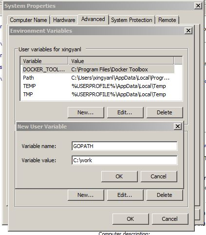
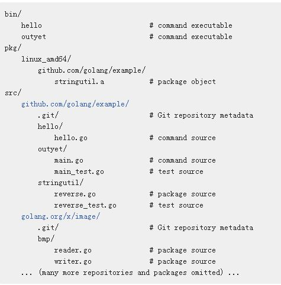
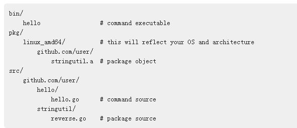
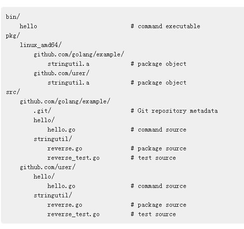

# go语言环境安装
> 以ubuntu 16.04LTS为例
------
## 1. 安装流程
### 1.1 下载
- 需要梯子，链接如下[Go安装包下载](https://golang.org/dl/)

### 1.2 解压安装
```
# 解压
asb@docker:~$ sudo tar -C /usr/local -xvzf go1.8.5.linux-amd64.tar.gz

# 添加GO路径到$HOME/.bashrc文件中
asb@docker:Desktop$ vi $HOME/.bashrc
export PATH=$PATH:/usr/local/go/bin

# 更新
asb@docker:Desktop$ source $HOME/.bashrc

# 测试
asb@docker:Desktop$ go version
go version go1.10 linux/amd64
```
- 另外，go的默认安装目录是/usr/local目录, 如果安装在其他目录，则需要另行设置
> 以安装在$HOME目录为例

```
asb@docker:Desktop$ vi $HOME/.bashrc
export GOROOT=$HOME/go1.X
export PATH=$PATH:$GOROOT/bin
```

### 1.3 GOPATH环境变量设置
- Linux环境
> 在编写代码时，首先要设置环境变量GOPATH，如果没有设置，在linux中默认设置为$HOME/go；自定义的目录需要重新设置(bash和zsh使用各自配置文件)，以$HOME/work目录为例

```
asb@docker:go$ vi $HOME/.bashrc
// 添加命令，生成可执行文件
export GOPATH=$HOME/work

// 生成二进制文件
export GOBIN=$HOME/work/bin

// 重新source一下
asb@docker:Desktop$ source $HOME/.bashrc
```
- Windows环境
> 在windows上，默认设置为%USERPROFILE%\go, 自定义目录以C:\work目录为例



------
## 2. GO目录结构
### 2.1 简介
1. 所有的Go code放在一个特定的*workspace*目录中
2. *workspace*包含多个版本控制的*repositories*(如git)
3. 每个repository包含一个或者多个packages
4. 每个packages包括一个或多个Go resource文件
5. package的目录决定了*import path*
> 和其他的编程不同的是每个项目都有一个单独的*workspace*， 并且和版本控制紧密相连

### 2.2 Workspace
> workspace目录结构主要包含三个：
+ *src*目录包含Go的源文件
+ *pkg*目录包括package对象
+ *bin*目录包括executalbe命令

**Go工具编译源文件目录，并在pkg和bin目录中生成可执行文件**

**workspace示例：**
> 以下示例中，包含两个仓库(*example*和*image*)，其中*example*包含两个命令(*hello*和*outyet*)，一个*library*(stringutil)；*image*仓库包括一个bump package和其他的



------
## 3. 编写测试代码

### 3.1 搭建workspace
```
asb@docker:~$ mkdir -p $GOPATH/src/github.com/liustarsun
asb@docker:~$ mkdir $GOPATH/src/github.com/liustarsun/hello
```

### 3.2 编写hello.go代码
```
asb@docker:work$ vi hello.go
package main

import "fmt"

func main() {

        fmt.Printf("Hello, world\n")
}

// 可执行文件生成
asb@docker:work$ go build -o hello.out     
asb@docker:work$ ls
hello.go  hello.out
asb@docker:work$ ./hello.out
Hello, world

asb@docker:work$ go install   
// 执行命令，如果$GOPATH/bin加入到PATH里面，可以直接输入hello
asb@docker:work$ $GOPATH/bin/hello  
Hello, world
```

### 3.3 加入版本控制
```
asb@docker:work$ cd /home/asb/work/src/github.com/liustarsun/hello
asb@docker:hello$ git init
Initialized empty Git repository in /home/asb/work/src/github.com/liustarsun/hello/.git/
asb@docker:hello$ git add hello.go
asb@docker:hello$ git commit -m "initial commit"
[master (root-commit) 4aad486] initial commit
 1 file changed, 8 insertions(+)
 create mode 100644 hello.go
asb@docker:hello$
```
------
## 4. library库

### 4.1 选择package路径
```
asb@docker:hello$ mkdir /home/asb/work/src/github.com/liustarsun/stringutil
```

### 4.2 创建文件
```
asb@docker:stringutil$ vi reverse.go
```

### 4.3 build // 生成pkg目录下的library
```
asb@docker:stringutil$ go build github.com/liustarsun/stringutil
```

### 4.4 使用library
```
asb@docker:hello$ vi hello.go
import (
        "fmt"
        "github.com/liustarsun/stringutil"
)
// go install把stringutil.a对象放在pkg/linux_amd64下面，建立和源文件相对应的目录
asb@docker:hello$ go install
// pkg目录
asb@docker:liustarsun$ cd /home/asb/work/pkg/linux_amd64/github.com/liustarsun
asb@docker:work$ ls
bin  pkg  src
```

**hello仓库目录结构如下：**



----
## 5. Go测试框架

### 5.1 轻量级测试框架
> go test命令和testing package

### 5.2 创建测试文件
> 在stringutil package添加测试文件

```
// 测试文件名以_test.go结尾
asb@docker:stringutil$ cat reverse_test.go
package stringutil

// 导入测试
import "testing"

// 名字以TestXXX命令，参数为：t *testing.T
func TestReverse(t *testing.T) {
        cases := []struct {
                in, want string
        }{
                {"Hello, world", "dlrow ,olleH"},
                {"Hello, 世界", "界世 ,olleH"},
                {"", ""},
        }
        for _, c := range cases {
                got := Reverse(c.in)
                if got != c.want {
                       // 调用t.Error或者t.Fail，测试就会被认为failed掉了
                        t.Errorf("Reverse(%q) == %q, want %q", c.in, got, c.want)
                }
        }
}
asb@docker:stringutil$
```

### 5.3 执行测试
```
asb@docker:stringutil$ go test
PASS
ok      github.com/liustarsun/stringutil        0.002s
asb@docker:stringutil$
```

-----
## 6. Remote packages
> 从remote运行一个package

```
// 获取远端的库
asb@docker:stringutil$ go get github.com/golang/example/hello
```
### 6.1 获得新的目录结构

