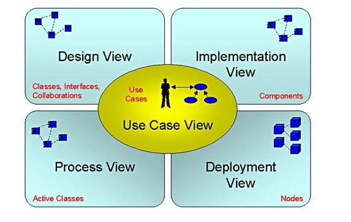

# 1. 理念 ==>来自知乎
正确地学UML=学UML建模，不应该只学语言、模型的表示方法，还应该学建模的方法和技术；学会了UML建模，自然就会建模了
理由：
1. 软件开发本质上是一种思维游戏（张恂：Software development is a mind game.），程序代码的好坏其实是开发者思维的体现。普通码农与编程高手的主要差别正是在于思维，尤其在抽象思维、空间思维、逻辑思维等方面

2. UML建模方法通过多种图形（Diagram）和视图（View）提供了多个层次、多个角度分析、观察软件架构的丰富手段和灵活表现形式，例如著名的“4+1 视图”（Use Case View, Logical/Design View, Process View, Implementation View, Deployment View）等。基于这样的思考，软件架构的设计才是全方位、系统化和高质量的

 

3. UML 最大的价值，在于帮助开发者对软件设计进行敏捷的思考（Agile thinking in UML）。针对一个具体、复杂的软件设计问题，编程高手在开始编码之前常常善于利用各种模型、图形与方法论在自己的大脑中进行深入思考和建模（Mind Modeling），明确需求，评估方案的可行性和有效性，衡量各种可选方案的利弊，必要时也会利用白板、图纸等建模工具进行设计，做到胸有成竹后才动手，结果往往效率高、质量高而差错和返工少。这就是专家们常说的 Quality Before Code

4. 编程高手与普通码农的一大区别就在于掌握软件设计经验和知识的多少，而高手精通大量的软件设计模式，不但脑存储量大，可以信手拈来、随用随取，而且往往能用得恰到好处

------
# 2. 介绍

## 2.1 结构图 ===> structure diagrams
从不同的抽象和实现程度上描述了一个系统和系统构建的静态结构，并且描述了他们直接是如何关联到一起的

## 2.2 行为图 ===> behavior diagrams
展示了一个系统中的对象的动态行为，它描述了一个系统中的对象如何随着时间变化而变化

------
# 3. 组件

## 3.1 类
下面的图表示的 UML 类，该图被分为四个部分：
顶端部分被用来命名类。
第二个是用来显示类的属性。
第三部分是用来描述由类执行的操作。
第四部分是可选的显示附加组件

## 3.2 对象
和类的唯一的区别是有下划线的名称

# 4. 

# 5.  工具
Visual Paradigm