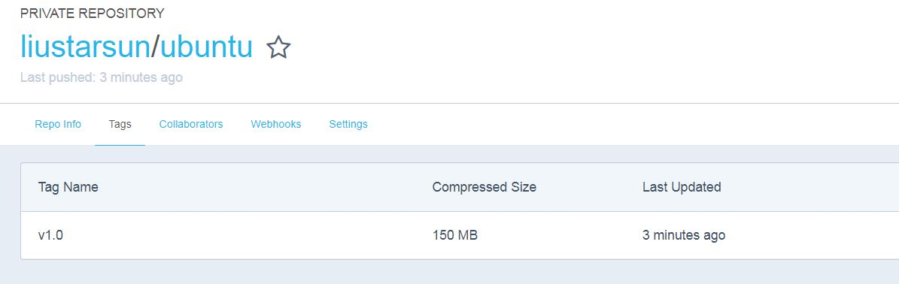

# 搭建自己的docker开发环境
------
## 1. docker启动过程
#### 1.1 Docker客户端执行**docker run**命令     
#### 1.2 Docker daemon发现本地没有镜像    
#### 1.3 daemon从Docker Hub下载镜像    
#### 1.4 下载完成，镜像被保存在本地     
#### 1.5 Docker daemon启动容器    

## 2. docker常用命令
```
//获取指定仓库镜像
asb@HP8300:~$ docker pull liustarsun/ubuntu:v1.0

// 查看images
asb@HP8300:~$ docker image list
REPOSITORY                             TAG                 IMAGE ID            CREATED             SIZE
ubuntu                                 16.04               0458a4468cbc        20 hours ago        112MB

// 显示运行的容器
asb@HP8300:~$ docker ps
CONTAINER ID        IMAGE               COMMAND             CREATED             STATUS              PORTS               NAMES
d71700c29011        ubuntu              "/bin/bash"         15 seconds ago      Up 14 seconds                           elated_montalcini

asb@HP8300:~$ docker container ls
CONTAINER ID        IMAGE               COMMAND             CREATED             STATUS              PORTS               NAMES
d71700c29011        ubuntu              "/bin/bash"         22 seconds ago      Up 20 seconds                           elated_montalcini

// 删除镜像
asb@HP8300:~$ docker image rm f9c15bfc31de


// 强制性删除
asb@HP8300:~$ docker rmi -f 074462fa1a0b
Untagged: ubuntu-with-vim:latest
Deleted: sha256:074462fa1a0b058319a6aadfeab17adb225f36d92a9b77a7851b31afdb621fba
asb@HP8300:~$ 

// 查看所有的container
asb@HP8300:~$ docker ps -a
CONTAINER ID        IMAGE               COMMAND             CREATED             STATUS                           PORTS               NAMES
ca92d84c20e2        074462fa1a0b        "/bin/bash"         16 minutes ago      Exited (0) 16 minutes ago                            heuristic_wescoff
d05f71e9e90e        074462fa1a0b        "/bin/bash"         About an hour ago   Exited (0) 23 minutes ago                            eager_hypatia

// 删除container
asb@HP8300:~$ docker rm ca92d84c20e2 
asb@HP8300:~$ docker rm $(docker ps -aq)


// 删除所有的image
asb@HP8300:~$  docker rmi $(docker images -q)

```  

------
## 3. 构建新的镜像的步骤
### 3.1 使用docker commit方法
```
// 1.运行容器
asb@HP8300:~$ docker run -it ubuntu
root@661f6ffb9f1e:/# 

// 1.1 配置上网代理，
root@661f6ffb9f1e:/# export http_proxy=http://135.245.48.34:8000/
root@661f6ffb9f1e:/# export https_proxy=http://135.245.48.34:8000/

// 1.2 下载vim等软件

// 2.修改容器
root@661f6ffb9f1e:/# apt-get install vim
root@661f6ffb9f1e:~# vi .bashrc 

// 3.保存为新的容器
// 3.1 在新窗口查看当前运行的容器
asb@HP8300:~$ docker ps 
CONTAINER ID        IMAGE               COMMAND             CREATED             STATUS              PORTS               NAMES
661f6ffb9f1e        ubuntu              "/bin/bash"         11 minutes ago      Up 11 minutes                           eager_mccarthy

// 3.2 使用docker commit命令把容器保存为新的镜像
asb@HP8300:~$ docker commit eager_mccarthy ubuntu-with-vim
sha256:822acb17637a42ef577376fdacd0f6979993bcfce6afd74ab6ae66f51f804e16

// 4.从新的镜像启动验证


```

### 3.2 使用dockerfile方法
```


```


### 3.3 上传到docker hub上去
```
// 查看镜像
asb@HP8300:~$ docker image list
REPOSITORY                             TAG                 IMAGE ID            CREATED             SIZE
ubuntu-with-gcc                        latest              f9c15bfc31de        15 minutes ago      358MB

// 打标签
asb@HP8300:~$ docker tag ubuntu-with-gcc liustarsun/ubuntu:v1.0

// 登录到docker hub上去
asb@HP8300:~$ docker login
Login with your Docker ID to push and pull images from Docker Hub. If you don't have a Docker ID, head over to https://hub.docker.com to create one.
Username (liustarsun): liustarsun
Password: 
Login Succeeded

// 上传到docker hub
asb@HP8300:~$ docker push liustarsun/ubuntu:v1.0
The push refers to repository [docker.io/liustarsun/ubuntu]
c685a2e1564c: Pushed 
f5827a67ed02: Pushed 
86e688b189c7: Pushed 
6f4ce6b88849: Mounted from library/ubuntu 
92914665e7f6: Mounted from library/ubuntu 
c98ef191df4b: Mounted from library/ubuntu 
9c7183e0ea88: Mounted from library/ubuntu 
ff986b10a018: Mounted from library/ubuntu 
v1.0: digest: sha256:b7b884d1dd80e5912dc13f5601d3f55558ae7b5cdf62ec2a71b555b7d72252d7 size: 1992

// 验证是否成功
asb@HP8300:~$ docker inspect liustarsun/ubuntu:v1.0
[
    {
        "Id": "sha256:f9c15bfc31dec9cf9f6e8ea8fcbbdffa547ed909283695113ec09b5f85f5222d",
        "RepoTags": [
            "ubuntu-with-gcc:latest",
            "liustarsun/ubuntu:v1.0"  // 上传成功了
        ],

```
### 3.4 到网站查看


### 3.5 上传到aliyun hub上
```
# 登陆aliyun账户
liu:~ xingyanl$ docker login --username=liustarsun@gmail.com registry.cn-hangzhou.aliyuncs.com
Password: 
Login Succeeded

# pull版本
liu:~ xingyanl$ docker pull registry.cn-hangzhou.aliyuncs.com/liustarsun/ubuntu:v1.1
v1.1: Pulling from liustarsun/ubuntu
1be7f2b886e8: Pull complete 
6fbc4a21b806: Pull complete 
c71a6f8e1378: Pull complete 
4be3072e5a37: Pull complete 
06c6d2f59700: Pull complete 
4b8974fb0c44: Pull complete 
c0537dd66802: Pull complete 
Digest: sha256:8aaca26f3493eb218636f659ffbe3e61257aa7123420d039a5894d7cf9ce234a
Status: Downloaded newer image for registry.cn-hangzhou.aliyuncs.com/liustarsun/ubuntu:v1.1

# 查看最新的
liu:~ xingyanl$ docker ps -q
1aa290312503
liu:~ xingyanl$ docker commit 1aa290312503 registry.cn-hangzhou.aliyuncs.com/liustarsun/ubuntu
sha256:122bf8ee8ea761cdc1fb91fe27e4c050175009606317cf4d35971146b0731441

# 登陆
liu:~ xingyanl$ docker login --username=liustarsun@gmail.com registry.cn-hangzhou.aliyuncs.com
Password: 
Login Succeeded

# 只读第一行
liu:~ xingyanl$ docker image list -aq
122bf8ee8ea7
57b04187390e

# 打标签
liu:~ xingyanl$ docker tag 122bf8ee8ea7 registry.cn-hangzhou.aliyuncs.com/liustarsun/ubuntu:v1.2

# 列镜像
liu:~ xingyanl$ docker image list    
REPOSITORY                                            TAG                 IMAGE ID            CREATED             SIZE
registry.cn-hangzhou.aliyuncs.com/liustarsun/ubuntu   latest              122bf8ee8ea7        4 minutes ago       540MB
registry.cn-hangzhou.aliyuncs.com/liustarsun/ubuntu   v1.2                122bf8ee8ea7        4 minutes ago       540MB
registry.cn-hangzhou.aliyuncs.com/liustarsun/ubuntu   v1.1                57b04187390e        4 hours ago         540MB

# 递交代码
liu:~ xingyanl$ docker push registry.cn-hangzhou.aliyuncs.com/liustarsun/ubuntu:v1.2
The push refers to repository [registry.cn-hangzhou.aliyuncs.com/liustarsun/ubuntu]
d4d61ab2e854: Layer already exists 
1181590b4685: Layer already exists 
6f4ce6b88849: Layer already exists 
92914665e7f6: Layer already exists 
c98ef191df4b: Layer already exists 
9c7183e0ea88: Layer already exists 
ff986b10a018: Layer already exists 
v1.2: digest: sha256:222659a8bd946c4f0ce798cc8caf0e4d586d2e9818f07392511af2c93e830143 size: 1782
liu:~ xingyanl$ 
```

### 3.6 attach到已经登陆的container
```
liu:~ xingyanl$ docker attach 36637a20099f
liu:~ xingyanl$ docker exec -it vigorous_galileo /bin/bash(这个没试过)
root@36637a20099f:~/C# ls
myprintf.c  myprintf.o  test.c  test.h  test.o

```

### 3.7 给docker 配置代理，使用http-proxy文件的方式
```
// 切换到root用户
asb@IoT:~$ sudo su -

// 测试helloworld
root@IoT:~# sudo docker pull hello-world

// 单独配置docker代理===> 这种方式有些问题
asb@HP8300:~$ sudo vi /etc/default/docker      
DOCKER_OPTS="--dns 8.8.8.8 --dns 8.8.4.4"
export http_proxy="socks5://135.251.123.122:9900"
export https_proxy="socks5://135.251.123.122:9900"
```

------
## 4. error getting credentials问题
```
liu:~ xingyanl$ docker login --username=liustarsun@gmail.com registry.cn-hangzhou.aliyuncs.com
error getting credentials - err: exit status 1, out: `User interaction is not allowed.`
```
解决方案: 
```
取消 "Securely store docker logins in macOS keychain"   
```


