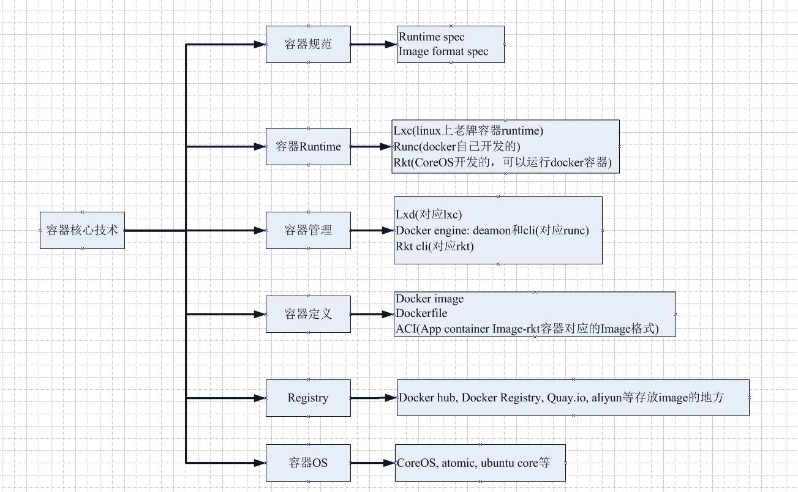
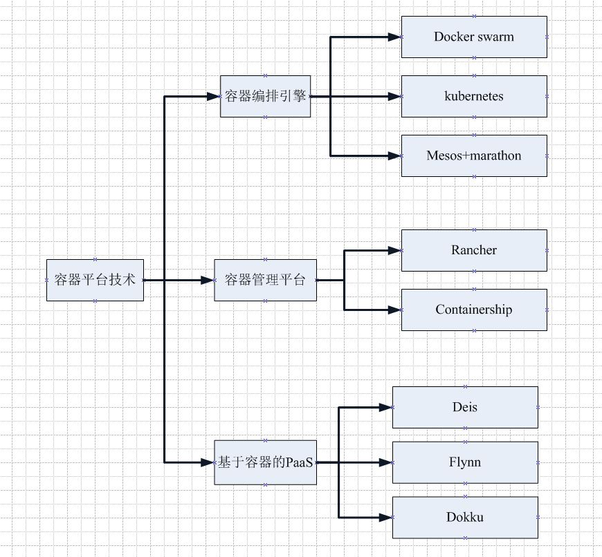
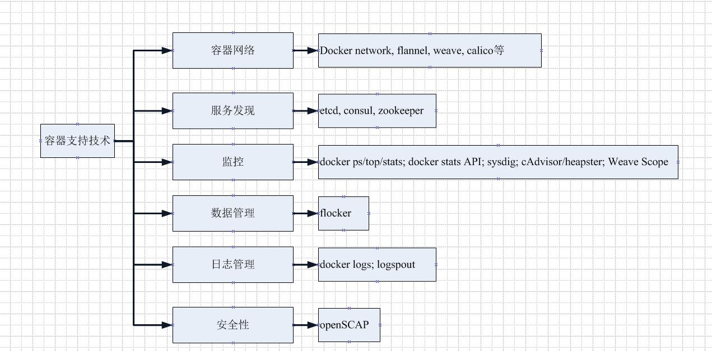

## 概览
容器生态系统大致分为三大部分：容器核心技术；容器平台技术；容器支持技术

### 容器核心技术

### 容器平台技术

**微服务架构:**在微服务架构下，应用被划分为**不同的组件**，并以**服务**的形式运行在各自的**容器中**，通过API对外提供服务。为了保证应用高可用性，每个组件都可能运行多个相同的容器，这些容器组成集群，集群中的容器会根据业务需要**动态地创建**、**迁移**和**销毁**

**容器编排引擎:**通过对容器管理、调度、集群定义和服务发现等，把容器有机组成微服务应用，实现业务需求

**容器管理平台:**在容器编排引擎之上的一个更为通用的平台，通过容器管理平台能够支持多种编排引擎，抽象编排引擎的底层实现细节，为用户提供更方便的功能，如一键应用部署等

### 容器支持技术

**服务发现:**动态变化是微服务应用的一大特点，当负载增加时，集群会自动创建新的容器；负载减小时，多余的容器会被销毁；容器也会根据host的资源使用情况在不同host中迁移，容器的IP和端口也会随之改变；而服务发现会保存容器中所有微服务最新的信息，比如IP和端口，并对外部提供API和服务查询功能

## 3. Compose简介
### 3.1 简介
- 负责对Docker容器集群快速编排，定位是**定义和运行多个Docker容器**