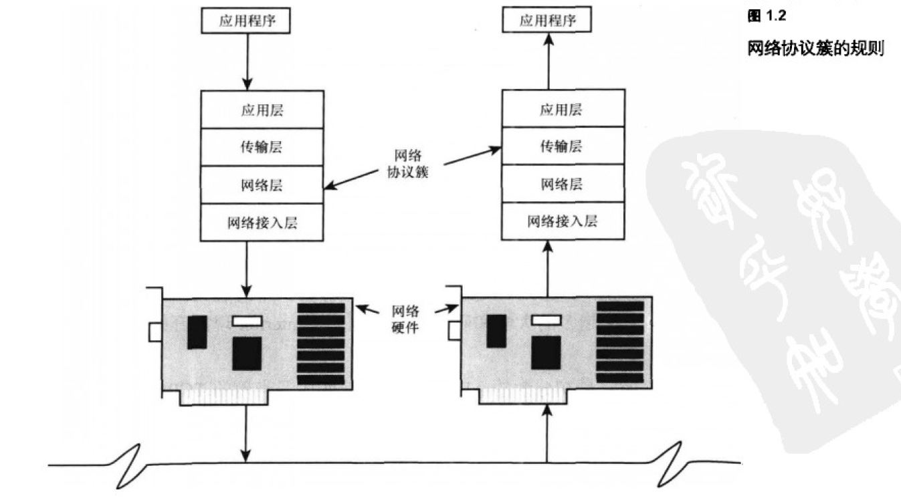
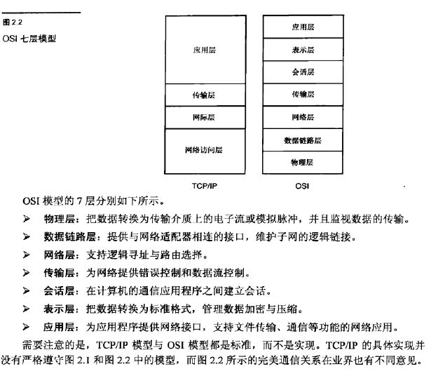
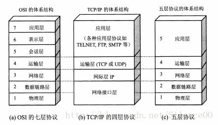
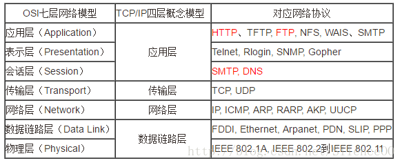

# 1. 分层
  

# 2. OSI7层结构的区别
  

# 3. 协议
  
  

# 4. 各层作用
## 4.1 物理层
定义物理设备标准，如网线的接口类型、光纤的接口类型、各种传输介质的传输速率等            
主要作用是传输比特流(即由01转化为电流强弱来进行传输,到达目的地后在转化为01，即常说的数模转换与模数转换)       
> 物理层数据称为**比特**

## 4.2 数据链路层
OSI中数据链路层执行两个独立的任务，相应的划分为：    
1. MAC(介质访问控制)层：提供了网络适配器连接的接口，工厂烧录到网卡中的物理硬件地址通常称为MAC地址
2. LLC(逻辑链路控制)层：对经过子网传递的帧进行错误检查，并且管理子网通信设备之间的链路

## 4.3 网络层

## 4.4 传输层

## 4.5 会话层

## 4.6 表示层

## 4.7 应用层