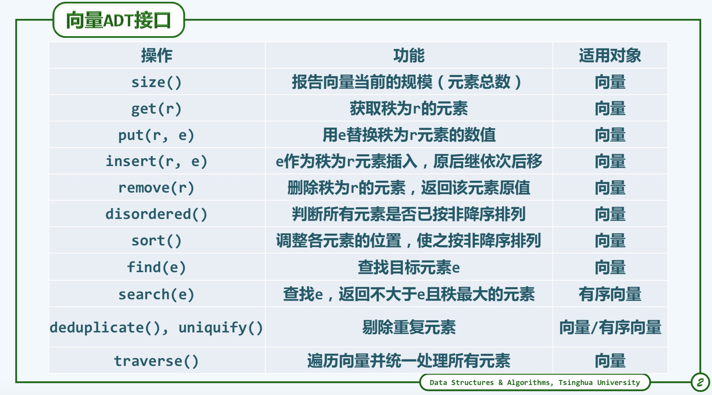

# 1. 概念
1. 在C/C++中，数组A[]中的元素与[0，n)内的编号以**一一对应**，即每个元素都由(非负)编号唯一指代，**并且可以直接访问**
1. 线性结构的序列，**根据统一的接口来定制和实现一个数据结构，设计算法，使得这些对外接口能够更有效的工作**      
2. 向量是高级语言中对数组的推广，是数组的抽象和泛化，**它是由一组元素线性封装而成**      
3. **数组的下标称为秩(rank)，元素的类型不限于基本类型，可以是自定义类类型**

## 1.1 定义
1. 错误1==>忘记了把vector<T>看做一个整体
2. 错误2==>缺少模板的思想

```
// 构造函数的目的就是给类的变量进行初始化
#define DEFAULT_CAPACITY 4
template <typename T>
class vector
{
    public:
    // 默认构造函数===>这是定义
    vector(){};

    // 自定义构造函数==>可以带点参数===>参数是向量的容量===>default代表C++11风格，默认构造函数会生成
    vector(int c = DEFAULT_CAPACITY)=default;  

    // 数组区间复制
    vector(const T * A, Rank lo, Rank hi);

    // 向量区间复制
    vector(const vector<T> &other, Rank lo, Rank hi);

    // 向量整体复制==>copy构造函数
    vector(const vector<T> & other);

    // 重载赋值操作符   
    vector<T> & operator=(const vector<T> &rhs);

    // 析构函数
    virtual ~vector();

    // 只读接口

    // 可写接口

    // 遍历接口

    // 类的方法
    protected:
    // copy函数
    void copyFrom(const T* A, Rank lo, Rank hi);

    private:
    // 类的变量
    Rank _size;  // 当前实际规模
    int _capacity; // 总的容量
    T * _elem; // 向量是封装了的数组
};
```


# 2. 操作

## 2.1 创建
```
template <typename T>
vector<T>::vector(int c = DEFAULT_CAPACITY)
{
    // 给类的变量初始化
    _size = 0;
    _capacity = c;
    _elem = new T[_capacity];
}

template <typename T>
vector<T>::vector(const T * A, Rank lo, Rank hi)
{
    copyFrom(A, lo, hi);
}


template <typename T>
vector<T>::vector(const vector<T> &other, Rank lo, Rank hi)
{
    copyFrom(other._elem, lo, hi);
}

template<typename T>
vector<T>::vector(const vector<T> & other)
{    
    copyFrom(other._elem, 0, other.size); // 始终要有3个参数
}

template<typename T>
vector<T> & vector<T>::operator=(const vector<T> &rhs)
{

}

template<typename T>
vector<T>::~vector()
{
    if(_elem)
        delete [] _elem;
}

// 数组copy的方法
template<typename T>
void vector<T>::copyFrom(const T* A, Rank lo, Rank hi)
{
    _size = 0;
    _capacity = 2*(hi-lo);
    _elem = new T[_capacity];

    // 数组复制，还是要用循环，不过我没有搞清楚，最后size也出来了
    while(lo < )
        _elem[_size++] = A[lo++];
}

template <typename T>
vector<T> & vector<T>::operator=(const vector<T> &rhs)
{
    if(_elem)
        delete [] _elem;
    copyFrom(rhs._elem, 0, rhs._size);
    return *this;
}
```


## 2.2 扩容/缩容
向量实际规模_size与其内部数组容量_capacity的比值，称为装填因子，设计的目标是**装填因子即不能超过1，也不至于太接近于0**      
```
template<typename T>
void vector<T>::expand()
{
    if(_size < _capacity) return;
    if(_capacity < DEFAULT_CAPACITY) _capacity = DEFAULT_CAPACITY;

    _capacity = 2*_capacity;
    T *_oldelem = _elem;
    _elme = new T[_capacity];

    for(int i= 0; i < _size; i++)
    {
        _elem[i] = _oldelem[i]; // 主义这个时候已经重载了=操作符号
    }    
    delete [] _oldelem; // 删除指针
}

```

## 2.3 


------
# 3. 资源句柄

# 4. ping不同，如何查问题

https://blog.csdn.net/f2006116/article/details/51159895/