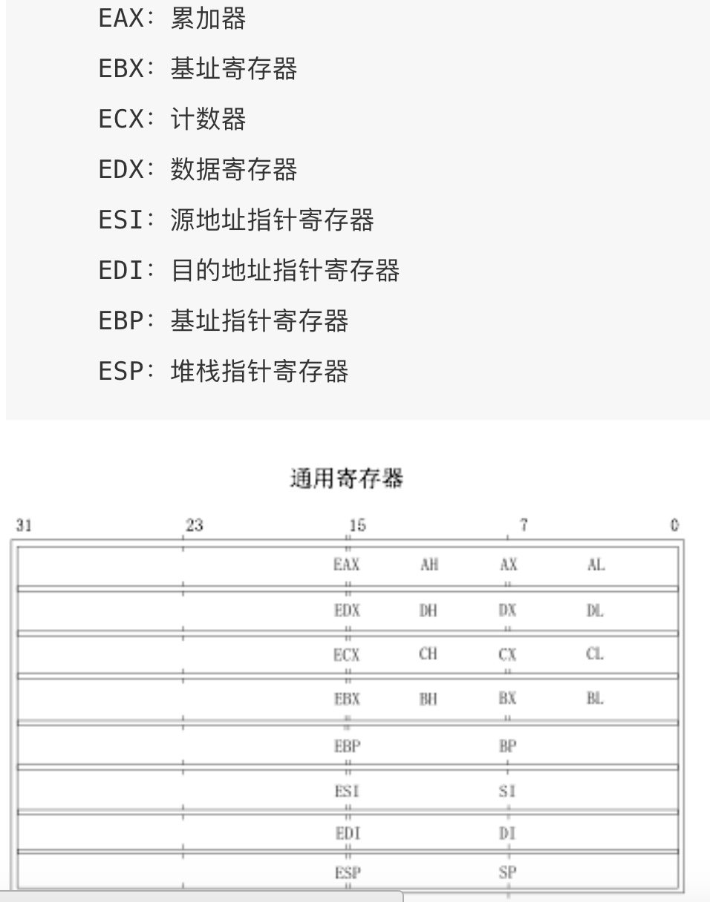
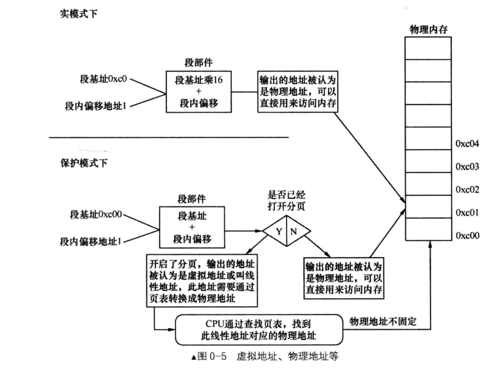

# 1. 操作系统(以下均表示X86)
最具有影响力的操作系统论文：SIGOPS Hall-of-Fame Awards [链接地址](http://www.sigops.org/award-hof.html)

------
# 2. 硬件
## 2.1 CPU
## 2.2 内存

## 2.3 外设
1. 外设连接在系统I/O总线上，通过I/O控制器和CPU交互
2. I/O控制器**在物理上**包含三个层次：I/O地址空间，I/O接口设备，设备控制器

#### I/O地址空间
每个连接到I/O设备上的设备都有自己的I/O地址空间(I/O端口)，即CPU可以直接访问的地址===>**CPU看到的地址就是逻辑地址**，**内存RAM也属于外设**       
> CPU支持I/O地址空间访问，即通过特定的I/O访问指令访问;也支持基于内存的I/O地址空间，即通过一般的访存指令访问，这些I/O访问请求通过I/O总线传递给I/O接口===> 汇编指令?   

#### I/O接口设备
I/O接口是位于一组I/O端口和对应的设备控制器之间的一种硬件电路，它把I/O访问请求中的特定值转换成设备所需要的命令和数据，检查设备变化，及时将各种状态信息写回到特定I/O地址空间，供操作系统通过I/O访问指令访问      
> I/O接口包括键盘接口、图形接口、usb接口，网络接口SCSI等

#### 设备控制器
设备控制器不是所有的I/O设备所必须的，少数复杂设备才有；它负责解释从I/O接口接收到的高级命令，并将其以适当的方式发送到I/O设备，并且对I/O设备发送的消息进行解释并修改I/O端口的状态寄存器
> 典型的是磁盘控制器，它将CPU发送过来的读写数据指令转换成底层的磁盘操作===> 解析高级指令

操作系统对硬件的控制方式主要有三种    
1. **程序循环检测方式(Programmed I/O, PIO)**
2. **中断驱动方式(Interrupt-driver I/O)**
3. **直接访问内存方式(DMA，Direct Memory Access)**

## 2.4 寄存器
### 2.4.1 通用寄存器 - general registers    

### 2.4.2 段寄存器 - segment registers(16位)     

### 2.4.3 指令指针寄存器 - instruction pointer
EIP的低16位就是8086的IP，它存储的是**下一条要执行指令的内存地址**；在分段地址转换中，表示**指令的段内偏移地址**      

### 2.4.4 状态寄存器 - flag register

1. CF(Carry Flag)：进位标志位      
2. PF(Parity Flag)：奇偶标志位      
3. AF(Assistant Flag)：辅助进位标志位      
4. ZF(Zero Flag)：零标志位      
5. SF(Singal Flag)：符号标志位      
6. IF(Interrupt Flag)：中断允许标志位,由CLI，STI两条指令来控制；设置IF位使CPU可识别外部（可屏蔽）中断请求，复位IF位则禁止中断，IF位对**不可屏蔽外部中断**和**故障中断的识别**没有任何作用      
7. DF(Direction Flag)：向量标志位，由CLD，STD两条指令来控制      
8. OF(Overflow Flag)：溢出标志位      
9. IOPL(I/O Privilege Level)：I/O特权级字段，它的宽度为2位,它指定了I/O指令的特权级。如果当前的特权级别在数值上小于或等于IOPL，那么I/O指令可执行。否则，将发生一个保护性故障中断      
10. NT(Nested Task)：控制中断返回指令IRET，它宽度为1位。若NT=0，则用堆栈中保存的值恢复EFLAGS，CS和EIP从而实现中断返回；若NT=1，则通过任务切换实现中断返回。在ucore中，设置NT为0      

### 2.4.5 系统地址寄存器

### 2.4.6 控制寄存器

### 2.4.7 调试寄存器

### 2.4.8 测试寄存器

------
# 3. CPU模式
## 3.1 实模式
80386在实模式下初始化控制寄存器(GDTR, LDTR, IDTR, TR等管理寄存器)以及页表        

## 3.2 保护模式
通过**设置CR0寄存器**使得保护模式使能位置位，从而进入保护模式        
**保护模式特点**：      
1. 支持内存分页机制，提供对虚拟内存的良好支持
2. 32位地址线都可供寻址，物理寻址空间4GB
3. 支持多任务，优先级机制，能够在任务间实现数据的安全共享和隔离

------
# 4. 操作系统
## 4.1 目标
1. 建立抽象，让上层软件和用户更方便使用
2. 管理软硬件资源，确保系统安全可靠，高性能
3. 节能，易用，可移植性，实时等

## 4.2 接口
如果把操作系统看做一个函数库，其接口就是函数名称和它的参数；在操作系统中，实际的接口为**系统调用接口(System Call Interface)**，应用程序通过系统调用接口请求获得操作系统的服务，但不直接调用操作系统的函数和全局变量；操作系统提供完服务后，返回应用程序继续执行===>留出来统一的向上向下的接口         
通过接口，应用程序就不用考虑底层硬件细节，在操作系统的支持和管理下完成功能       

## 4.3 中断(Interrupt)
### 4.3.1 外设中断(Device Interrupt)

### 4.3.2 陷阱中断(Trap Interrupt)

### 4.3.3 故障中断(Fault Interrupt, 也称异常:exception)

## 4.4 进程(Process)
**进程是一个具有一定独立功能的程序在一个数据集合上的一次动态执行的过程**  
进程管理需要协调多道程序之间的关系，解决对处理器分配调度策略、分配实施和回收等问题，从而使得处理器资源的到充分的利用

## 4.5 虚拟内存(Virtual Memory)
**操作系统通过CPU中的MMU硬件的支持给用户提供一个大的(超过物理内存容量)、一致的(连续的地址空间)、私有的(其他应用程序无法破坏)的存储空间**
> 操作系统把内存和硬盘结合起来管理，并且操作系统中的虚存管理和处理器的硬件MMU密切相关===> 和硬盘结合      

**编译器和链接器并不知道每个符号对应的地址应该放在未来程序运行时的哪个物理地址，因此一个简单的处理方式是指定一个固定的地址作为起始地址，开始存放代码.text，接着存放数据(全局数据.data/.bss段)，所有的符号都在这个起始地址之后的某个固定偏移位置；局部变量放在堆栈中，动态变化；到物理地址的映射则交给操作系统完成**

## 4.5 文件(File)
**存放在持久存储介质(硬盘等)上，方便应用程序和用户读写的数据；处理器需要访问文件时，通过操作系统把它们装入内存；文件管理的任务是有效地支持文件的存储、检索和修改等操作；硬盘等外设以文件系统的形式呈现给应用程序，因此文件系统可以看成是操作系统对硬盘的虚拟化**

----
# 5. 启动过程

计算机启动后，CPU到一个**特定的地址开始执行指令**，这个特定地址存放了**系统初始化软件**，负责初始化基本硬件，这是系统加电后的**第一段软件代码**；大多数计算机系统，操作系统和应用软件是存放在**硬盘等掉电可以继续保持的存储介质上**      
### X86系统初始化软件组成：
#### 1. BIOS(basic input output system，即基本输入输出系统)===> 固化在计算机ROM(只读存储器)**芯片上的一个特殊的软件
计算机一上电，先执行**BIOS，初始化基本的硬件，提供最直接的硬件控制和支持**      

#### 2. 位于硬盘引导扇区中的BootLoader   
硬件准备完成后，**BIOS会加载bootloader到内存RAM**，移交系统控制权===>在BIOS的时候，**已经知道了物理内存的相关信息**        

#### 3. 加载内核镜像
Bootloader**把系统内核映像加载到内存RAM**，移交系统控制权===>初始化某些信息，然后加载**内核镜像**         

------
# 6. BIOS加载
## 6.1 等待供电稳定
计算机上电后，电源首先向主板和其他设备供电，但因电压不稳定，主板上的控制芯片组会向CPU发出**保持一个RESET(重置)信号**，让CPU内部自动恢复到**初始状态**，但CPU不会马上执行指令。当芯片组检测到电源已经**开始稳定供电了(从不稳定到稳定的过程只是一瞬间的事情)**，CPU便撤去RESET信号(如果是手工按下计算机面板上的Reset按钮来重启机器，那么松开该按钮时芯片组就会撤去RESET信号)，**CPU开始执行第一条指令**

## 6.2 执行第一条指令===>这个时候CPU看到的就是物理内存
CPU从物理地址0XFFFFFFFF0(由初始化的CS:EIP确定，此时CS为0XF00，IP为0XFFF0)开始执行，这个地址只存放了一条跳转指令，通过跳转指令**跳转到BIOS程序的起始点**===>CPU芯片手册规定的      
计算机刚上电的时候，RAM(内存条)是没有内容的，因此第一条指令**是在EPROM(固化在主板中)里**===>CPU芯片手册规定了EPROM的地址        
> **即使PC机只有2G内存也无所谓，因为并没有用内存，使用的只是地址空间**；简单来说，就是**把那块地址分配给了EPROM**===>**逻辑地址**

## 6.3 BIOS执行
BIOS进行硬件自检和初始化，然后**选择一个启动设备**，并且读取该设备的第一个扇区(即主引导扇区)===>到内存一个特定的地址0x7c00处，也就是BootLoader的入口地址===>跳转到那个地址继续执行，至此BIOS的初始化就结束了===>这个时候物理内存已经被探测出来了？？？             

## 6.4 背景引申 ===> 找个时间研究一下   

### 6.4.1 
16位的CPU时代(=>**CPU内部寄存器是16位的**)，内存限制在1M内(=>**地址总线是20位**)，BIOS的代码固化在EPROM中，**EPROM被编址在1M内存地址空间的最高64KB中**(=>芯片手册规定的EPROM的地址)
> **多少位CPU，是指CPU内部的通用寄存器是多少位的; 0~0x9FFFF为DRAM，也就是插拔的内存条，有640KB**      

### 6.4.2
0xF0000~0xFFFFF，这64KB是ROM，储存的是BIOS代码      
BIOS主要做：**检测初始化硬件和建立中断向量表**            
> 建立中断向量表，这样其他程序就能通过中断调用BIOS已经实现的硬件控制函数===>**BIOS实现硬件控制函数**

### 6.4.3
PC加电后，CS寄存器初始化为0XF000(=>段寄存器厂商定义好的)，IP寄存器初始化为0xFFF0 ===> CPU要执行第一条指令的地址位CS:IP(0xFFFF0，被固化在EPROM)，指令则是一个长跳转指令JMP FOOO:EO5B，开启BIOS的执行过程         
> 64KB=2的16次方，1MB=2的20次方，则起始地址为：0xFFFF-0xFFF也即是0xF0000？这边会有点问题，没有问题===>还是要整理清楚一些===>因为BIOS是计算机的第一程序，它不可能自己加载自己，所以它是由硬件加载===>**CPU在上电后会跳到0xFFFF0的位置**===>**因为CS:IP两个寄存器的初始值是0XF000:OXFFF0**===>**因为在实模式下的地址映射是：段寄存器X16+偏移量**

### 6.4.4 32位CPU时代和16位CPU时代兼容
1. 32位CPU时代，内存空间扩大到4G，多了段机制和页机制，如果按照8086的约定，就会把内存分为0xF000以前的地址，和1MB以后的地址，为了避免这个问题，在80386中，默认把BIOS ROM编址在32位内存地址空间的最高端，也就是4GB空间的最后一个64KB中===>**因为有64KB的地址是给BIOS用的**          
2. PC开机复位，CPU进入实模式，CS设置为0xF000，将它的shadow register的base值初始化为0xFFFF0000，EIP的值初始化为0X0000FFF0，所以第一条指令始终是0xFFFFFFF0===> **使用了shadow寄存器的值？？？**          
3. 80386的BIOS代码也要和之前8086的BIOS代码兼容，因此0xFFFFFFF0处的指令还是一条长跳转指令jmp FOOO:E05B，**注意，这个长跳转指令会触发更新CS寄存器和它的shadow Register，即此时CS的值将被更新为0XF000，虽然表面上看CS其实没有变化，但CS的shadow register的base值被更新为了0X000F0000**，此时形成的物理地址位BASE+EIP=0x000FE05B=====>**这是CPU执行的第二条指令地址，此时这条指令的地址已经是1M以内的了，且地址不再位于BIOS ROM中，而是位于RAM空间中**                 
4. Inter设计一种映射机制，**将内存高端的BIOS ROM映射到1MB以内的RAM空间里**，并且可以使得这一段被映射的RAM空间和ROM类似，只有只读属性，所以PC机启动时将开启这种映射机制，让4GB地址空间的最高一个64KB的内容等同于1MB地址空间的最高的64KB的内容，从而使得执行了长跳转指令后，回到早期的8086CPU初始化控制流，保证了向下兼容===> **简单来说就是把32位CPU的最高64KB的内容映射到16位的时候的最高的64KB的地址，实现向下兼容**       

# 7. BootLoader加载
BIOS通过读取硬盘主引导扇区(**每个扇区是512字节**)到内存，并跳转到对应内存中的位置执行bootloader，而bootloader负责:      
1. 切换到保护模式，启用分段机制
> 只有在保护模式下，才可以充分发挥强大的功能，提供更好的保护机制和更大的寻址空间     
> 分段机制一直存在，无法屏蔽或避免
> 从实模式跳转到保护模式

2. 读磁盘中ELF可执行文件格式的操作系统到内存
3. 把控制权交给操作系统

# 8. 内核启动
内核启动过程描述
