# 1. CPU架构
如果要深入了解软件，就需要了解支撑软件运行的硬件环境：**处理器体系结构**(即硬件对软件带来的影响)和**机器指令集**(读懂软件的汇编)        

## 1.1 X86运行模式
CPU通常只有一种运行模式，能够支持多个程序在各自独立的内存空间中并发执行，程序区分**用户态和内核态**，从而避免**一般应用破坏操作系统内核和执行特权指令**
> **运行模式，不是内核态和用户态的概念，而是实模式和保护模式的概念**

X86有4种运行模式：**实模式，保护模式，SMM模式和虚拟8086模式**

## 1.2 实模式
早期X86采用的一种简单模式，当时的MS-DOS操作系统就是运行在X86的实模式下，加电启动后处于实模式运行状态：
1. 软件可访问的**物理内存地址空间不能超过1MB**(=>因为只有20根地址线)，无法发挥**32位CPU的4GB内存管理能力**
2. 把整个物理内存看成分段的区域，**代码(指令)段和数据段**位于不同区域，没有区别对待，每个指针**指向实际的物理地址**==> 指向物理地址
3. **用户代码指向内核区域或其他的用户区域，并修改了内容，后果就很可能是灾难性的**
4. X86d的兼容性需要，才会导致**实模式**一直存在，在**ARM或者MIPS等架构的CPU中，没有实模式，只有类似保护模式这样的CPU模式**

## 1.3 保护模式
主要目的就是确保**应用程序无法对操作系统进行破坏**：      
1. **实模式下初始化控制寄存器**(GDTR,LDTR,IDTR和TR等管理寄存器)
2. **实模式下初始化页表** ===> 页表也是实模式下初始化的???      
3. **设置CR0寄存器，使能其中的保护模式位，进入保护模式**

**特点**：      
1. 32根地址线都是可以访问，物理地址空间为4GB
2. **支持内存分页机制**，提供了对虚拟内存的良好支持
3. 支持**多任务，优先级机制**，不同的程序运行在**不同的特权级上**
> 特权级分为0-3共4个级别，操作系统运行在最高的0级，应用程序运行在低优先级上，配合良好的检查机制，可以在**任务间实现数据的安全共享，并很好的隔离各个任务**

------
# 2. 内存架构
逻辑地址-线性地址-物理地址
在bootloader中，完成了**对物理内存资源的探测工作**，内核在后续执行中**根据探测到的结果**进行物理内存管理；地址是**访问内存空间的索引**，分为：      
1. **物理地址(physical address)**: CPU提交到总线上用于访问内存和外设的最终地址===>具体硬件地址，一个计算机系统中只有一个物理地址空间      
2. **逻辑地址(logical address)**: 编写程序用到的地址===> 逻辑地址48位==>CPU看到的地址 
3. **线性地址(linear address， 又称为虚拟地址)**: 通过**段(Segment)机制控制下形成的地址就称为线性地址(虚拟地址)**， linux默认的段基地址是0，即逻辑地址=线性地址

## 2.1 段机制
1. **OS通过建立全局描述符表(GDT)来初始化和配置段机制**===>段功能单元把程序中用到的逻辑地址转换成线性地址
2. 缺点：对大量应用程序分散地使用大内存能力较弱，为解决这问题，引入了**页机制**

## 2.2 页机制
1. **OS通过建立页表初始化和配置页机制**===>段功能先把逻辑地址映射成线性地址(虚拟地址)===>页功能再把线性地址转换成物理地址
> 页机制和段机制有一定的功能重复，但是Intel公司为了向下兼容，一直保持两者共存

**总结**：     
1. 段机制启动，页机制未启动：逻辑地址==>段机制===>线性地址=物理地址
2. 段机制启动，页机制启动:逻辑地址===>段机制===>线性地址===>页机制处理===>物理地址 
3. 在操作系统的管理下，**每个运行的应用程序有相对独立的一个或多个内存空间段**，其中**每个段都有各自的起始地址和长度属性，大小不固定**，从而可以让**多个运行的应用程序之间相互隔离，实现对地址空间的保护**      
4. 在多个CPU的情况下，因为RAM芯片是要串行执行，**所以由仲裁器决定哪个CPU访问**==>仲裁器插在**内存总线和每个RAM芯片之间**

------
# 3. 段
把内存划分为以**起始地址和长度限制的二维参数表示的内存块**，这些内存块就称为**段(segment)**      
> 编译器把源程序编译成可执行文件时用到的代码段，数据段，堆和栈是和这里的段概念一致的

## 3.1 段描述符(segment descriptor)
**每个段描述符长度为8字节===>64bit**，它描述了段的属性特征，**linux中段描述符中的基地址被设置为0**；保存在全局描述符表GDT或者局部描述符表LDT中       

### 3.1.1 段描述符组成
1. 段界限(limit)：20位
> 规定段的大小，长20位，可以是**以字节为单位**，或是**以4K字节为单位**      

2. 段基地址(base Address)：32位
> 段的**起始地址**，长32位；因为基地址长度和寻址地址长度相同，所以任何一个段都可以从32位线性地址空间中的**任何一个字节开始**，而不像**实模式下规定的边界必须被16整除**===>因为CPU是32为寻址的，64位就有可能不同了？？

3. 段属性：12位长
> 确定段的各种性质
**类型(TYPE)**，用T表示；代表是**数据段还是代码段**，段是否是可读/写/执行，以及段的扩展方向等，该字段依赖于S字段             
**描述符类型S(Descriptor type flag)**：用于指明一个段描述符是**系统段描述符(S=0)**，还是**代码/数据段描述符**               
**描述符特权级(Descriptor Privilege level, DPL)**：用来实现保护机制，特权级从0到3           
**段存在位(segment-present bit)**，用P表示：为0，则此描述符为非法的，不能用来实现地址转换，如果一个非法描述符被加载进**一个段寄存器**，处理器为立即产生异常        
**第20位AVL**：可以供系统软件使用        
**第21位是保留位**                    
**D/B**(Default operation size/default statck point size and/or upper bound),默认操作大小，默认栈指针大小，和/或上界限：根据段描述符描述的是一个可执行代码段，下扩数据段还是一个堆栈段，这个标志有不同的功能        
**粒度位(granularity)**，用G表示；为0代表段界限以**字节位为单位**，20位的界限可以表示为**1字节到1M字节**，增量为**1字节**；为1表示段界限以**4K字节为单位**，可表示范围是**4K字节到4G字节**，增量为**4k字节**                    

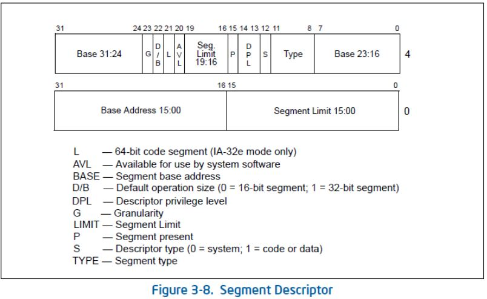

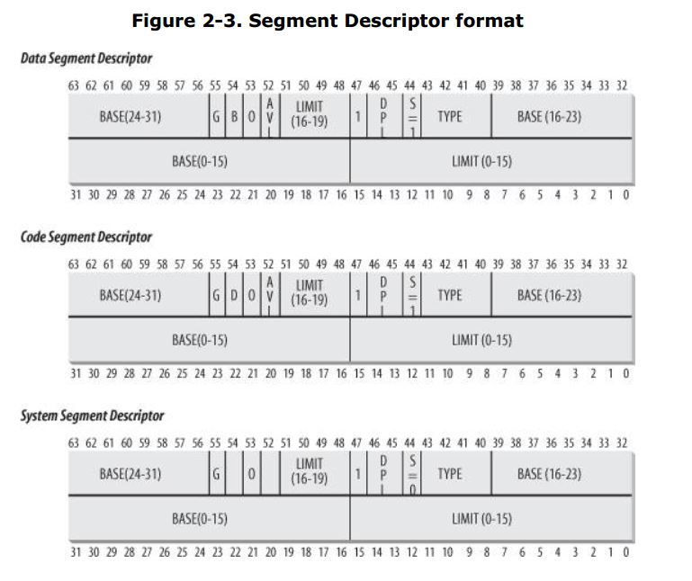

### 3.1.2 段描述符类型
#### 1. 数据段描述符(data segment descriptor) 
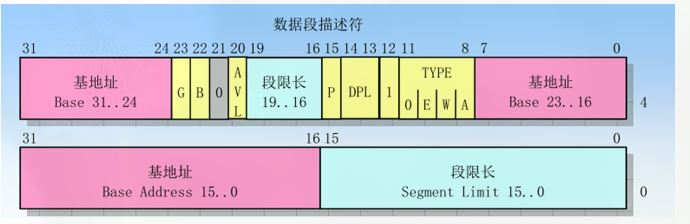    
[需要后续参考更新的源文章](https://www.cnblogs.com/longintchar/p/5224405.html)       

#### 2. 代码段描述符(code segment descriptor)
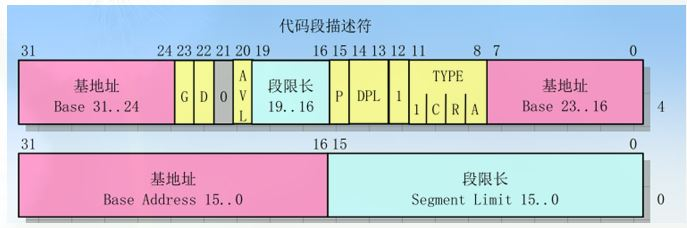

#### 3. 状态段描述符(task state segment descriptor)
TSS(Task State Segment)任务状态段，**它是处理器在硬件上原生支持多任务的一种实现方式，用于存储任务的环境，每个任务都要这个结构，相当于任务的标识符；在没有操作系统的情况下，可以认为进程就是任务；在有了操作系统以后，一个任务可以被看做是用户程序+内核程序**      
TSS中保存了3个栈，给特权级0，1，2使用，**在从低特权级向高特权级切换的时候，这3个栈用来作为高特权级的栈使用，因为3是最低的特权级，不会有更低的向它切换，因此只有3个栈**      
**TSS起始地址保存在TR(Task Register)寄存器中，CPU执行不同的任务时，让TR加载为不同任务的TSS即可**                   
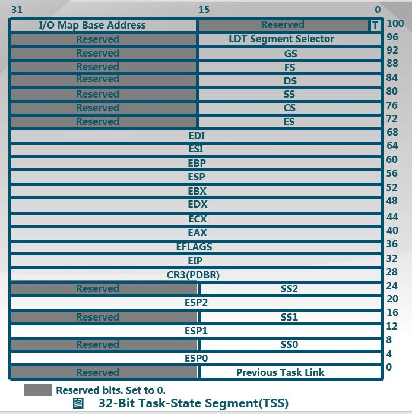

#### 4. 快速访问段描述符(fast access to segment descriptor)   
1. **为了加速逻辑地址到线性地址的转换，处理器提供一类附加的非编程寄存器(即不能被程序员设置)供6个段寄存器使用**
2. 每个非编程寄存器含**8个字节的段描述符**，当每个**段选择符**被装入**段寄存器时**，相应的段描述符被内存装入**对应的非编程CPU寄存器**，此时逻辑地址转线性地址就不需要访问内存中的GDT/LDT，直接引用**存放段描述符的非编程CPU寄存器即可**，段寄存器内存改变时，要访问GDT/LDT===>**只有当段寄存器更新时，才会访问GDT/LDT**

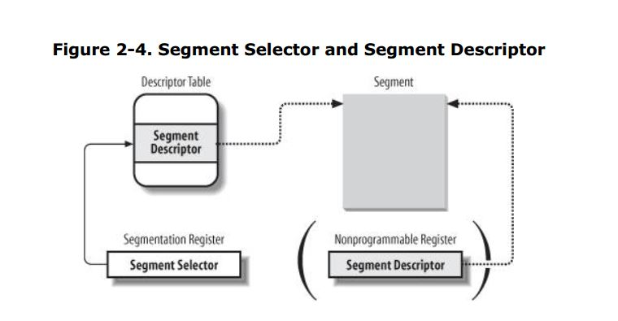

------
## 3.2 全局描述符表(global descriptor table, GDT)
即段描述符表, 存放**段描述符**的数组           

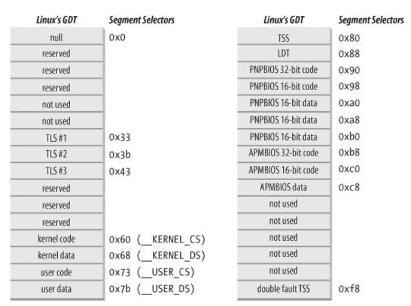

### 3.2.1 全局描述符表寄存器(GDTR)
1. GDTR长48位，其中**高32位是基地址**，**低16位是段界限**；由于GDT不能用GDT本身之内的描述符进行描述，所以系统采用GDTR这一特殊的系统段寄存器，尤其要注意的一点是**全局描述符表的第一个段描述符设定为空段描述符**===>**确保空段选择符的逻辑地址无效**    
2. GDTR中的段界限是以**字节为单位**，对于含有N个描述符的描述符表的段界限通常可以设置为8N-1===>所谓的段界限也就是段的大小===>可以理解为数组的大小      
3.  每个CPU对应一个GDT， linux中每个GDT保存18个段描述符，14个空位，共32字节

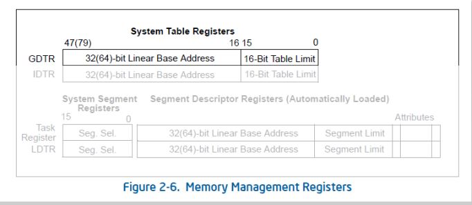

------
## 3.3 局部描述符表(local descriptor table, LDT)
存放段描述符的数组；LDT起始地址保存在LDTR中

### 3.3.1 局部描述符表寄存器(LDTR)
保存LDT起始地址的48位寄存器      

**GDT中段的个数+LDT中段的个数=保护模式下理论的总的段数**      
**注意**：
虽然保护模式下有那么多段，虚拟空间看起来很大，但实际上段并不能扩展物理空间，很大程度上各个段的地址空间是相互重叠的    
> 目前所谓的64TB(2的14次方X2的32次方(offset)=2的46次方)虚拟空间是一个理论值，没有实际意义，在32位保护模式下，真正的物理空间仍然只有2的32次方字节那么大===>还要继续看  

------
## 3.4 段选择子(段寄存器，segmentation register)
16位长度的寄存器，存放段选择符，段选择符用来选择哪个描述符表，以及在该表中的哪个索引，选择子可以作为指针变量的一部分，从而对程序员可见，但通常是由链接加载器来设置的

### 3.4.1 组成 
#### 索引(index) ===> 13位
指定了放在GDT或LDT中的对应段的索引，占**13位**；由于GDT[0]总是0，因此GDT能保存的最大段描述符为2的**13次方-1**(8191个)描述符，LDT同理(第一项是不是为0，待定)？     
处理器会自动将这个索引值乘以8(描述符的长度)，再加上**描述符表的基地址来索引描述符表**，从而选择一个合适的描述符      

#### 表指示位(Table indicator, TI) ===> 1位
选择应该访问哪一类描述符表，0代表访问GDT，1代表访问LDT         

#### 请求特权级(Requested Privilege Level, RPL)R ===> 2位
保护机制，用来指定**请求者特权级**

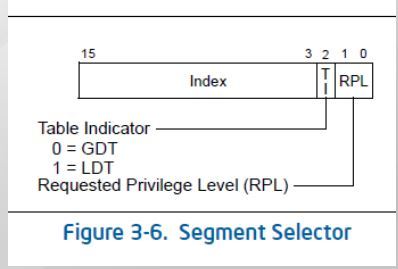

### 3.4.2 空选择子
GDT中的第一项是不能被CPU使用的，所以当一个段选择子的索引(Index)部分和表指示位(TI)都为0时，可以当做一个空的选择子； 当一个段寄存器被加载一个空选择子时，处理器并不会产生一个异常，但是当一个空选择子去访问内存时，就会产生异常       
 
### 3.4.3 段寄存器种类
主要有：cs(代码段，指向程序指令段), ss(栈段，指向程序栈段), ds(数据段，指向程序静态数据/全局数据段), es, fs, gs， 共6个段寄存器     
> 其中cs，ss，ds是专用的，其余的是一般用途

**注意**：
##### cs寄存器中含有两位的CPL(current privilege level)字段，用来表示当前CPU的特权级，0代表内核态，3代表用户态

##### 特权级发生改变时，段寄存器要做相应的改变===>CPL(3)：DS包含用户数据段，SS包含用户堆栈段===>CPL(0)：DS包含内核数据段，SS包含内核堆栈段 

------
# 4. 页(page)
**线性地址**被分成以**固定长度为单位的组**，这个固定长度称为**页(page)**，通常**页的大小设置为4KB，即12位**===> **逻辑概念**

## 4.1 页框(page frame)
**物理地址**被分成固定长度的页框(page frame，物理页)，通常也是4KB ===> **物理的RAM**

#### **页内部连续地址被映射到页框中**，内核可以指定一个页的物理地址和其存取权限；区分页和页框很重要，页是数据块，可以放置任何页框(内存)或磁盘中(外存)      

## 4.2 页表(page table, PT)
1. 保存页到页框**映射关系**的数据结构，**存放在主存**===>这个数据结构还要放在页框中 
2. 页表放在主存中，**启用分页单元前由内核对页表进行初始化**
3. 设置**CR0寄存器**的PG标志为1时启用页机制，PG为0时，线性地址直接被解释为物理地址  
4. 页表的起始地址保存在**页表基址寄存器(PTBR, Page Table Base Register)中**===>**又是一个寄存器PTBR**

## 4.3 页表项索引
1. 线性地址中间10位保存的是**页表项索引**，共**1024个页表项**===>可以理解为数组下标

## 4.4 页表项(page table entry, PTE)
页表的元素===>可以理解为数组成员          

## 4.5 页目录表(page directory table， PDT) 
1. 保存PT的数据结构===>保存的应该是页表的地址，而且应该也是个数组
2. 设置CR3寄存器保存**PDT起始物理地址**===> ===> 所以这个地址是保存在寄存器CR3中的？？？保存的是物理地址？？？

## 4.6 页目录表索引
1. 线性地址最高10位保存的是PDTE索引===> 在PDT中的位置，即下标

## 4.7 页目录表项(page directory entry, PDE)
PDT的元素===>可以理解为数组成员===>每一项都是一个PT    

## 4.8 快表(Translation Look-aside Buffer, TLB)
1. 根据局部性原理，引入和硬件高速缓存来解决CPU和RAM之间存取周期的巨大差异；**高速缓存放在主存和分页单元之间，包括一个高速缓存==>存放RAM内的行和一个高速缓存控制器===>表项数组，对应高速缓存的行**    
2. 每个CPU都有一个高速缓存模块：**读操作==>直接在高速缓存中读，并送到CPU的寄存器**；**写操作==>全写(RAM和缓存都写)和回写(先写缓存，最后一次性写入到RAM))两种**

**主要是用来缓存近期访问的页表项**      
1. TLB使用关联存储(associative memory)实现，具备快速访问性能
2. 如果TLB命中，物理页号可以很快被获取
3. 如果TLB未命中，对应的表项被更新到TLB中
4. 每个CPU一个TLB，而且当CR3寄存器更新时，因为页目录表更新了，所以TLB会失效

## 4.9 进程和页
1. 每个进程都有自己的页全局目录表和页表集，当发生进程切换时，linux把CR3寄存器的值保存在前一个进程的描述符中==>装入新进程的描述符==>新进程执行时，就可以使用自己的页表

------
# 5. 段式管理
**只有在保护模式下可以使用**===>主要任务是生成线性地址        

#### 再议逻辑地址
**段选择子(segment selector, 16bits)+偏移offset(32bits)**，其中偏移指定**从段开始的地方到实际地址之间的距离**
> **selector:offset格式，selector是段寄存器的值，负责从全局段描述符表中找到对应索引的基地址，offset是EIP的值** 

**步骤**：    
1. **在GDT表找到对应的段描述符**===>CPU把**逻辑地址的段选择子**作为GDT表的索引
2. **找到段描述符中保存的段基地址**
3. **找到逻辑地址的段偏移offset值**
4. **线性地址=段基地址+offset偏移地址**===>32位线性地址

> 如果不启用页存储管理机制，则线性地址就是物理地址，**再次强调，linux中段基地址为0**
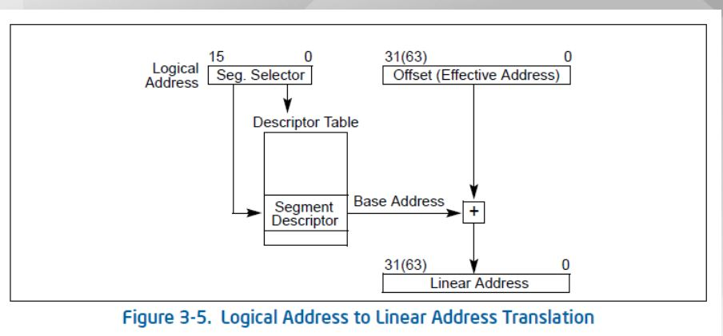
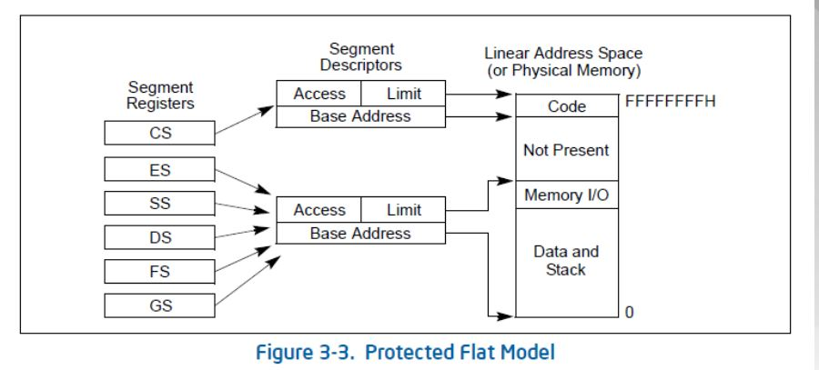
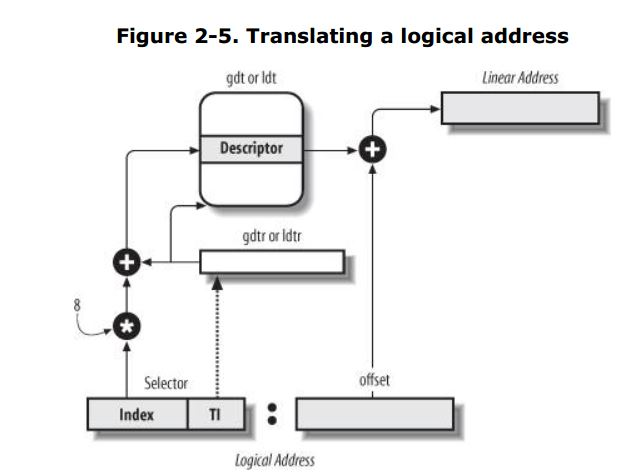

**总结**：    
段机制管理在linux只起到了一个过渡作用，它将**逻辑地址不加转换直接映射成线性地址**===>因为所有的**段描述符的基地址都是0**，逻辑地址中的**offset就是线性地址**    
**CPU(32位)看到的地址是4G的地址，而内存控制器(即物理内存条)实际上只占用一部分的地址，因此即使物理内存只有1G，CPU也可以访问1G以上的地址，最终通过MMU把CPU看到的地址转换为实际的物理地址**

------
# 6. 页式管理===>这个时候已经经过了GDT拿到了线性地址
CR0中的PG标志为0则线性地址就是物理地址；为1时启动页机制， 会进一步把线性地址转换为物理地址, **线性地址**分成三部分：     
### PDE索引 ===> 到页目录表中找对应的成员
### PTE索引 ===> 到页表中找对应的成员
### Offset部分 ===> 也就是在对应的物理页框中的位置    
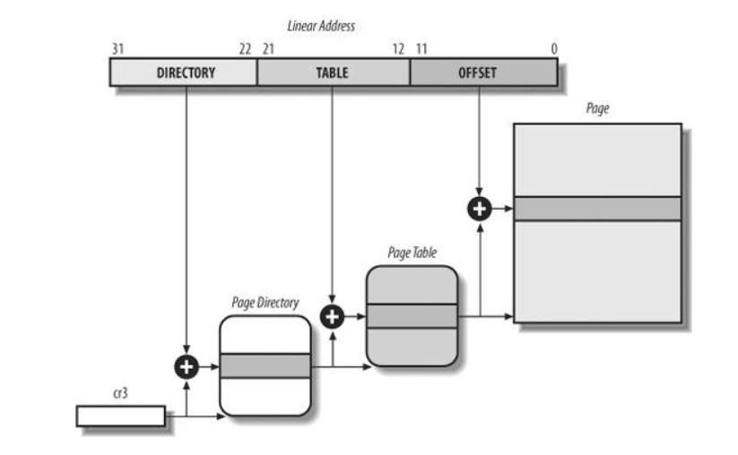

**PDET表的起始物理地址存放在CR3寄存器中**，此地址是一个页对齐的地址，即低12位为0===> 这个地址谁给的？？？      
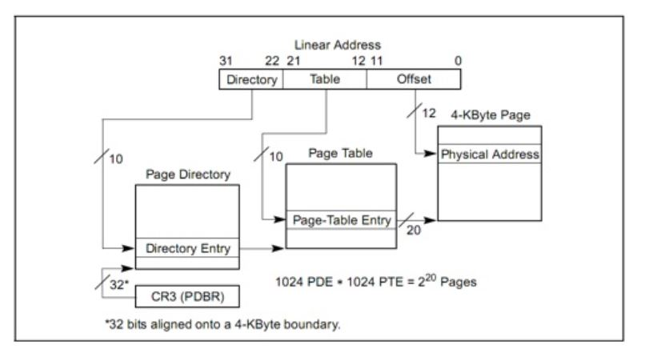

**步骤**：===>**其中的几个表是如何生成的**      
1. 根据CR3的值找到PDET表
2. 以线性地址22-31位的值为索引查找到PT表的地址
3. 以12-21位的值为索引查找PTE的地址
4. 以PTE为基地址，以0-11位的值为页内偏移地址找到实际的物理地址

------
# 7. 段页式管理
1. **内存管理单元(MMU)通过分段单元(segmentation unit)的硬件电路把逻辑地址转换成线性地址**
2. **然后分页单元的(paging unit)的硬件电路把线性地址转换成物理地址**   
3. 和80x86允许段机制使用4中特权不同，页和页表只可以使用两种，即用户态和内核态

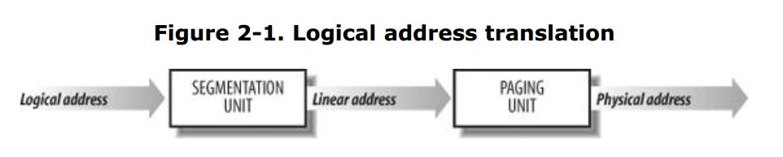
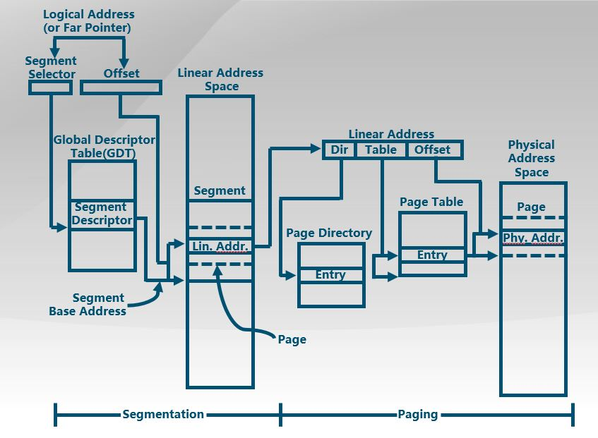

------
# 8. 特权级管理
在保护模式下，特权级有4个，0是最高，3为最低； 特权级主要保护3种资源：**内存、I/O端口和执行特殊机器指令的能力**， 并且在任一时刻，CPU都是在一个特定的特权级上运行的，从而决定了代码能做什么，不能做什么      

**步骤**：      

#### 当一个数据段选择符(DS)被加载时： ===> 注意是数据段，目的是看看这个数据段的地址能不能被访问 ===> 还要继续看          
1. 检查当前的CS中的CPL
2. 查看当前的DS中的RPL
3. 从段描述符中查看DPL，代表**段本身能被访问的真正特权级**
4. 如果MAX(CPL, RPL) <= DPL，则映射的线性地址可以被访问，否则不可以被访问，产生保护exception

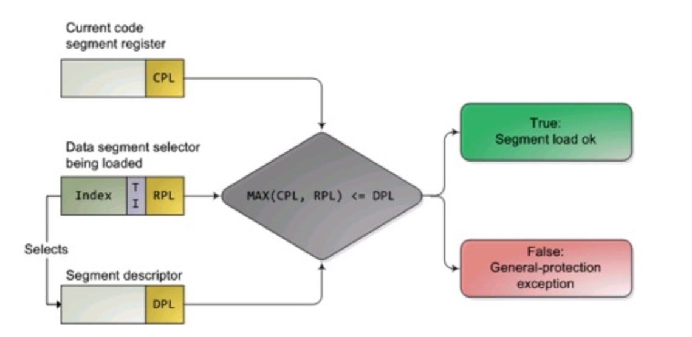

-----
# 9. 内存分配
RAM中某些部分永久的分配给内核，用来存放内核代码和静态内核数据结构，其余的则称为动态内存，尽量做到按需分配      
## 9.1 连续内存分配===>一次性分配所有的内存
当程序被加载时，**分配给进程一块不小于指定大小的地址连续的物理内存区域**           

### 9.1.1 分配策略
#### 1. 最先分配
假设分配n个字节，使用找到的第一个比n大的内存区域            

#### 2. 最佳分配
假设分配n个字节，使用找到的不小于n的最小的内存区域            

#### 3. 最差分配
假设分配n个字节，使用找到的不小于n的最大的内存区域            

### 9.1.2 缺点
1. 物理内存地址必须连续
2. 存在内外碎片
3. 动态修改困难
4. 内存利用效率低

## 9.2 非连续内存分配===>提高内存利用效率和管理灵活性
### 9.2.1 内存共享
通过指向相同的页表基地址，实现进程间的段共享===>**共享段描述符中的offset偏移要相同**      

### 9.2.2 优点
1. 允许程序使用非连续的物理内存地址
2. 允许共享代码和数据
3. 支持动态加载和动态链接

-----
# 10. 内存碎片
## 内存碎片
空闲的不能使用的内存，分为外部碎片和内部碎片；

### 外部碎片
页碎片

### 内部碎片
页内碎片

## 碎片整理

## 一致性访问

## 非一致性访问

------
# 11. 伙伴系统
把所有的空闲页框分为11个块链表，每个块链表分别包含大小为1，2，4，8...1024个连续的页框。对1024个页框的最大请求对应4MB大小的连续RAM块，**每个块的第一个页框的物理地址是该块大小的整数倍**      

**算法工作原理**：假设请求一个256个页框的块(1MB)      
1. 先在256页框的链表中检查是否有一个空闲块，如果没有则在512个页框的链表中查找
2. 如果存在，内核就把512个页框的块链表分为两等份，一个用于满足要求，另一个插入256的块链表中
3. 如果没有，则继续在1024的中查找，把剩下的512放在512块链表中，256放在256块链表中
4. 如果还是没有，则报错      

**满足以下条件的两个块称为伙伴**：    
1. 两个块具有相同大小b
2. 它们的物理地址是连续的
3. 第一块的第一个页框的物理地址是2xbx212次方的倍数

**该算法是迭代的，如果能成功合并所释放的块，则会试图合并2b的块，以再次试图形成更大的块**    