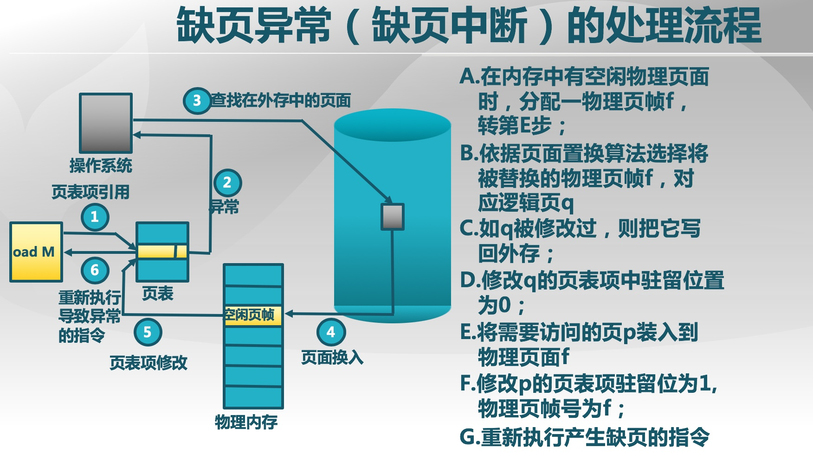

# 1. 概念
虚拟内存的目：**在有限容量的内存中，以页为单位自动装入更多更大的程序**===>将不常用的部分内存块暂存到外存===>物理内存+磁盘=虚拟内存     

## 1.1 局部性原理
**程序在执行过程中的一个较短时期，所执行的指令地址和指令的操作数地址，分别局限于一定区域**===>这也是能够实现的，而且可取得满意的效果的原因         

### 1. 时间局部性
一条指令的一次执行和下次执行，一个数据的一次访问和下次访问都集中在一个较短时期内      

### 2. 空间局部性
当前指令和邻近的几条指令，当前访问的数据和邻近的几个数据都集中在一个较小区域内      

### 3. 分支局部性
一条跳转指令的两次执行，很可能跳到相同的内存位置      

## 1.2 实现原理
**装载程序时，只将当前指令执行需要的部分页面或段装入内存，如果指令执行中需要的指令或数据不在内存(称为缺页或缺段)时，处理器通知OS将相应的页面或段调入内存，将内存中暂时不用的页面或段保存到外存**      
> **其中硬件负责段页式地址转换；OS负责管理内存和外存间页面或段的换入和换出**

## 1.3 虚拟页式存储之外存
1. 未被存储的页应能方便地找到在外存中的页面内容==>交换空间(磁盘或者文件)==>采用特殊格式存储未被映射的页面
2. 外存选择:**代码段==>可执行二进制文件**； **动态加载的共享库程序段==>动态调用的库文件**；**其它段==>交换空间**

**虚拟内存是指程序员或CPU使用的内存**，它有以下几个特点：      
1. **虚拟内存单元不一定有实际的物理内存单元对应，即实际的物理内存单元可能不存在；如果虚拟内存单元对应有实际的物理内存单元，那二者的地址一般是不相等的(因为会经历段页式映射)**===>在硬盘或者磁盘上?
2. **OS通过段页式映射可建立虚拟内存与物理内存的对应关系，使虚拟内存地址会自动转换为一个物理内存地址，此时程序员或CPU看到的地址已经不是实际的物理地址了，这已经有一层虚拟化，可简称为内存地址虚拟化，虚拟内存其实包含多个虚拟层次，在不同的层次体现了不同的作用**
> 有了内存地址虚拟化，**可以通过设置页表项来限定软件运行时的访问空间，确保软件运行不越界，完成内存访问保护的功能**

3. 通过内存地址虚拟化，**可以使得软件在没有访问某虚拟内存地址时不分配具体的物理内存，而只有在实际访问某虚拟内存地址时，操作系统再动态地分配物理内存，建立虚拟内存到物理内存的页映射关系，这种技术称为按需分页(demand paging)**
4. **把不常访问的数据所占的内存空间临时写到硬盘上，从而腾出更多的空闲内存空间给经常访问的数据；当CPU访问到不常访问的数据时，再把这些数据从硬盘读入到内存中，这种技术称为页换入换出(page swap in/out)**，这种内存管理技术给了程序员更大的内存空间，可以让更多的程序在内存中并发运行===>内存中并发执行

------
# 2. 页替换算法
**当发生缺页异常，需调入新页面而内存已满时，置换算法选择被置换的物理页面，并尽可能减少页面的调入调出次数，把未来不再访问或短期内不访问的页面调出**    

## 2.1 页面锁定(frame locking)===>这部分不能置换?
1. 描述必须常驻内存的逻辑页面
2. 操作系统的关键部分
3. 要求响应速度的代码和数据
4. 页表中的锁定标志位(lock bit)

## 2.2 局部页面置换算法
**置换页面的选择范围仅限于当前进程占用的物理页面内**，主要分为以下几种：      
     
### 1. 最优页面置换算法(OPT, optimal)
**缺页时，计算内存中每个逻辑页面的下一次访问时间，选择未来最长时间不访问的页面进行置**，特性如下：      
1. 缺页最少，是理想情况
2. 实际系统中无法实现
3. 无法预知每个页面在下次访问前的等待时间
4. **作为置换算法的性能评价依据**===>在模拟器上运行某个程序，并记录每一次的页面访问情况，第二遍运行时使用最优算法

### 2. 先进先出算法（First-In First-Out, FIFO）
**缺页时，选择在内存驻留时间最长的页面进行置换，通过维护一个记录所有位于内存中的逻辑页面链表，链表元素按驻留内存的时间排序，链首最长，链尾最短，出现缺页时，选择链首页面进行置换，新页面加到链尾**，特性如下：
1. 实现简单
2. 性能较差，调出的页面可能是经常访问的
3. 进程分配物理页面数增加时，缺页并不一定减少(Belady现象===>**分配的物理页面数增加，缺页次数反而升高的异常现象**) 
4. 很少单独使用

### 3. 最近最久未使用算法 (Least Recently Used, LRU)
**缺页时，计算内存中每个逻辑页面的上一次访问时间，选择上一次使用到当前时间最长的页面进行置换，如某些页面长时间未被访问，则它们在将来还可能会长时间不会访问, 是最优置换算法的一种近似**

**LRU算法的可能的实现方法**：      
#### 页面链表：系统维护一个按最近一次访问时间排序的页面链表
1. 链表首节点是最近刚刚使用过的页面
2. 链表尾节点是最久未使用的页面
3. 访问内存时，找到相应页面，并把它移到链表之首
4. 缺页时，置换链表尾节点的页面

#### 活动页面栈：
1. 访问页面时，将此页号压入栈顶，并将栈内相同的页号抽出==>**相同页号抽出**
2. 缺页时，置换栈底的页面
3. 开销比较大

### 4. 时钟(clock)页替换算法
**仅对页面的访问情况进行大致统计，在页表项中增加访问位，描述页面在过去一段时间的内访问情况，各页面组织成环形链表，指针指向最先调入的页面，访问页面时，在页表项记录页面访问情况；缺页时，从指针处开始顺序查找未被访问的页面进行置换，它是时钟算法是LRU和FIFO的折中**      

**时钟置换算法的实现**：      
1. 页面装入内存时，访问位初始化为0
2. 访问页面(读/写)时，访问位置1
3. **缺页时，从指针当前位置顺序检查环形链表：访问位为0，则置换该页；访问位为1，则访问位置0，并指针移动到下一个页面，直到找到可置换的页面**

###  改进的Clock算法
**减少修改页的缺页处理开销，在页面中增加修改位，并在访问时进行相应修改；缺页时，修改页面标志位，以跳过有修改的页面**      

### 5. 最不常用算法（Least Frequently Used, LFU）
**每个页面设置一个访问计数，访问页面时，访问计数加1；缺页时，置换访问次数最少的页面，即计数最小的页面**，特性如下:
1. 算法开销大
2. 开始时频繁使用，但以后不使用的页面很难置换===>解决方法：计数定期右移

**LRU和LFU的区别**：
1. LRU关注多久未访问，时间越短越好
2. LFU关注访问次数，次数越多越好

### Belady现象
**采用FIFO等算法时，可能出现分配的物理页面数增加，缺页次数反而升高的异常现象**==>**主要是因为FIFO算法的置换特征与进程访问内存的动态特征矛盾，被它置换出去的页面并不一定是进程近期不会访问的**==>**LRU没有belady现象**      

**总结**：    
LRU/FIFO/CLOCK：
1. LRU算法和FIFO本质上都是先进先出的思路，它依据页面的最近访问时间排序，需要动态地调整顺序；算法性能较好，但系统开销较大
2. FIFO依据页面进入内存的时间排序，页面进入时间是固定不变的；算法系统开销较小，会发生Belady现象
3. 页面进入内存后没有被访问，最近访问时间与进入内存的时间相同，则LRU退化成FIFO
4. Clock算法是它们的折衷：页面访问时，不动态调整页面在链表中的顺序，仅做标记；缺页时，再把它移动到链表末尾
5. 对于未被访问的页面，Clock和LRU算法的表现一样好
6. 对于被访问过的页面，Clock算法不能记录准确访问顺序，而LRU算法可以

**局部置换算法没有考虑进程访存差异**

## 2.3 全局置换算法
**CPU利用率与并发进程数存在相互促进和制约的关系**：      
1. 进程数少时，提高并发进程数，可提高CPU利用率
2. 并发进程导致内存访问增加；并发进程的内存访问会降低了访存的局部性特征；局部性特征的下降会导致缺页率上升和CPU利用率下降  

**全局置换算法为进程分配可变数目的物理页面，置换页面的选择范围是所有可换出的物理页面，算法根据进程在不同阶段对内存的不同需求，动态的调整分配给进程的物理页面数** 主要有两种：

### 1. 工作集置换算法：
  
### 2. 缺页率置换算法（PFF, Page-Fault-Frequency）
**缺页率：(缺页次数/内存访问次数)或者缺页平均时间间隔的倒数；页面置换算法，分配给进程的物理页面数目，页面大小，程序的编写方法都会对缺页率造成影响**  

**通过调节常驻集大小，使每个进程的缺页率保持在一个合理的范围内**：      
1. 若进程缺页率过高，则增加常驻集以分配更多的物理页面
2. 若进程缺页率过低，则减少常驻集以减少它的物理页面数

**实现**：
访存时，设置引用位标志；缺页时，计算从上次缺页时间tlast到现在tcurrent的时间间隔：
1. 如果tcurrent – tlast>T, 则置换所有在[tlast,  tcurrent ]时间内没有被引用的页
2. 如果tcurrent – tlast≤T, 则增加缺失页到工作集中

## 2.4 抖动问题
**随着驻留内存的进程数目增加，分配给每个进程的物理页面数不断减小，缺页率不断上升，进程物理页面太少，不能包含工作集，从而造成大量缺页，频繁置换，导致进程运行速度变慢，因此OS需要选择一个适当的进程数目和进程需要的物理页面数，在并发水平和缺页率之间达到一个平衡**       
> 局部置换算法可以在一定范围内改善抖动问题

## 2.5 负载控制
通过调节并发进程数(MPL)来进行系统负载控制      

## 2.6 虚拟内存中的页和硬盘上的扇区的映射关系

------
# 3. 执行流程

**在页式存储管理的基础上，增加请求调页和页面置换**：    
1. 当用户程序要装载到内存运行时，只装入部分页面，就启动程序运行
2. 进程在运行中发现有需要的代码或数据不在内存时，则向系统发出缺页异常请求
3. 操作系统在处理缺页异常时，将外存中相应的页面调入内存，使得进程能继续运行

------
# 4. Page Fault异常处理===>异常
## 4.1 缺页异常
程序的执行过程中由于某种原因(页框不存在/写只读页等)，**CPU无法最终访问到相应的物理内存单元，即无法完成从线性(虚拟)地址到物理地址映射，会产生一次页访问异常**===>页框是物理页的概念       

## 4.2 异常处理
**产生缺页异常后，执行对应的中断服务例程**；这个缺页处理的时机被操作系统充分利用来完成虚存管理，**即实现按需调页/页换入换出处理的执行时机**，当相关处理完成后，**中断服务例程返回到产生异常的指令处重新执行，使得应用软件可以继续正常运行下去**       
> 产生页面page fault(#PF)异常的时候，**CPU会把产生异常的线性地址存储在CR2中，并且把表示页访问异常类型的值(简称页访问异常错误码，errorCode)保存在中断栈中**===>**CR2寄存器的用处是保存PG时候的线性地址**

## 4.3 可以被换出的页
**并非所有的物理页都可以交换出去，只有映射到用户空间且被用户程序直接访问的页面才能被交换，而被内核直接使用的内核空间的页面不能被换出**       
> **操作系统是执行的关键代码，需要保证运行的高效性和实时性，如果在操作系统执行过程中，发生了缺页现象，则操作系统不得不等很长时间(硬盘的访问速度比内存的访问速度慢2~3个数量级)，这将导致整个系统运行低效。而且，不难想象，处理缺页过程所用到的内核代码或者数据如果被换出，整个内核都面临崩溃的危险**
