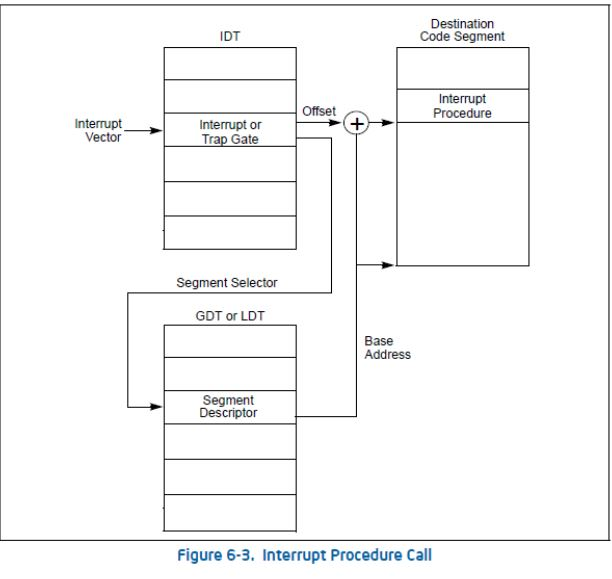

**中断的基本概念见嵌入式开发章节，但是PC机和嵌入式不同，要切记===>不是嵌入式和PC不同，而是保护模式和实模式下的不同**   
# 中断和异常

------         
# 1. 中断
**中断是个事件，改变CPU的执行顺序，这个事件和CPU内外部产生的电信号对应，中断信号通知CPU暂停当前的事情，去处理中断产生的事件**         

## 1.1 同步(synchronous)==>后续称为异常
**由CPU控制单元产生**；之所以称为同步，**是因为只有在一条指令终止执行后CPU才会发出中断**      

## 1.2 异步(asynchronous)==>后续称为中断
**由其他硬件设备按照CPU时钟信号，间隔定时器随机产生的，简称中断(interrupt)或硬中断**==>**I/O设备或者间隔定时器产生IRQ(Interrupt ReQuese)**            

## 1.3 中断特性
1. 来自硬件设备的处理请求===>**源头**
2. 异步===>**响应方式**
3. 持续的，对用户应用程序是透明的===>**处理机制**

## 1.4 硬件流程
每个能够发出中断请求的设备都有一个名为IRQ的输出线，也可能有几个，**所有的IRQ线都和一个名为可编程中断控制器PIC(Programable Interrupt Controller)的硬件电路的输入引脚相连，监测IRQ线，检测产生的线号，多条IRQ线相连时，选择引脚编号小的那个**           

如果有线号出现在IRQ线上：      
1. 把接收的引发信号转成对应的向量
2. 把向量放在PIC的I/O端口，允许CPU通过数据总线读取
3. 把引发的信号送到CPU的INTR引脚，即产生一个中断
4. 等待，直到CPU通过把信号写入PIC的一个I/O端口来确认它，然后清INTR线
5. 重新等待IRQ信号

**APIC高级可编程中断控制器**      

## 1.5 可屏蔽中断==>所有的IRQ请求==>屏蔽/非屏蔽状态
1. 不同硬件中断源可能在处理硬件中断时出现
2. 执行硬件中断服务例程中需要临时禁⽌中断请求
3. 中断请求会保持到CPU做出响应 

## 1.6 不可屏蔽中断==>由CPU来辨认

------
# 2. 异常
内核为异常提供专门的异常处理程序，**某些异常，CPU在开始执行异常处理程序前会产生一个硬件errorcode，并且压入内核栈中**
## 2.1 产生条件
1. 程序错误==>内核发送信号来处理异常
2. 内核必须处理的异常条件==>内核执行恢复异常所需要的所有步骤==>如缺页，对内核请求

## 2.2 分类
根据内核栈EIP的值可以分为三组：      
1. 故障==>有signal给对应进程
**EIP保存引起故障的指令地址，异常处理程序中止时，那条指令重新执行**==>**缺页**          
2. 陷阱==>有signal给对应进程
**EIP保存下一条要执行的程序，从异常的下一条指令开始**==>**只有编程异常才称为软中断，而系统调用是软中断的一种用途**      

3. 异常中止(没有signal))/编程异常(当陷阱处理)
**异常中止代表CPU出问题，不能保存引起异常的指令所在的确切位置，异常处理程序中止进程**==>不正常或非法条件(如除0，地址访问越界)，这个更新是异常中止         
**编程异常是由int/int3指令触发的，控制单元把编程异常当作陷阱来处理，编程异常通常也称为软中断**==>**软中断**        
> 主要用途：a. 执行系统调用；b. 给调试程序通报一个特定的事件(把一个unix信号发送到引起异常的进程来处理）     

## 2.3 系统调用
1. 应用程序主动向OS发出的服务请求
2. 异步或同步
3. 等待或者持续

## 2.4 系统调用和普通函数调用区别
1. 系统调⽤有**堆栈切换和特权级的转换**==>**INT和IRET指令用于系统调⽤**
2. 普通函数调用**没有堆栈切换**==>**CALL和RET⽤于常规调⽤**

### 总结：
中断和异常用0-255之间的数来标识，8位的无符号整数叫做一个向量：    
1. 非屏蔽中断的向量和异常的向量是固定的
2. 可屏蔽中断通过对中断控制器(PIC)的编程来改变

------
# 3. 中断描述符(IDT)
任务门描述符可以放在GDT、 LDT 和 IDT (中断描述符表，后面章节在介绍中断时大伙儿就清楚了) 中，调用门可以位于 GDT、 LDT 中，中断门和陷阱门仅位于 IDT 中      
和GDT一样，IDT也是一个8字节的描述符数组，但是不同的是IDT第一项可以包含一个描述符；IDT有三种类型(**Type字段表示描述符类型**)===>**注意任务门的特殊性**

## 3.1 任务门==>和异常对应
中断信号发生时，把取代当前进程的**新进程的TSS选择符**存放在任务门中

## 3.2 中断门===>对应中断
CPU清IF标志，关闭将来可发生的可屏蔽中断，包含**段选择符和中断/异常处理程序的段内偏移量**       

## 3.3 陷阱门===>对应异常==>系统调用用的是陷阱门
和中断门类似，只是不处理IF标志      
     
## 3.4 中断门和陷阱门的区别
1. **中断门中**，CPU跳转到硬中断的地址时，**在将EFLAGS保存到栈上之后，清除EFLAGS里的IF位，以避免重复触发中断**===>中断会被CPU自动禁止  
2. **陷阱门中**，如果在到达OS kernel后禁止EFLAGS里的IF位，会导致某些中断得不到及时响应，因此**CPU不会禁止中断**===>CPU保留中断原来的样子   

------
# 4. 中断描述符表(interrupt descriptor table，IDT)VS中断向量表
1. 表中每一项对应一个中断描述符，**也称中断/异常向量(第一项也可以包含有效向量)，每个中断/异常向量由8字节组成**===>实际上还是把64位划分多个用途
2. **保护模式下，最多会有256项中断向量**
> [0,31]内的32个向量被异常和NMI使用，但是并不是所有都用，有的是保留的       
> [32,255]内的向量被保留给用户定义的额Interrupt，用户可以将它们作为外部中断**8259A IRQ**，或者系统调用(system call， software interrupt等) 

3. IDT最大是256x8=2048个字节      
4. **中断向量里面保存有每个中断/异常和相应的中断/异常处理程序的入口地址的映射关系???**这个有点不太理解**===> 保存的是中断/异常处理程序的入口??
5. **IDT的起始地址保存在IDTR中**

## 中断向量表和中断描述符的区别
**低端1M的内存空间布局中，地址0~0x3FF保存的是中断向量表IVT，它是实模式下用于保存中断服务例程入口地址的表；由于实模式运行比较死板，因此它的位置是固定的，必须位于最低端，共1024个字节，容纳了256个中断向量，因此每个中断向量用4字节描述**    
对比中断向量表，中断描述符表：    
1. **地址不限制，保存在IDTR寄存器中**
2. **每个描述符使用8个字节描述**

------
# 5. 中断描述符表寄存器(IDTR)
1. 保存IDT的48位寄存器，**高32位保存IDT起始地址，后16位保存IDT大小**
2. LIDT(load IDT register)指令：**使用一个包含线性地址基址和界限的内存操作数来加载IDT，操作系统创建IDT的时候，需要执行它来设定IDT的起始地址，这个指令只能在内核态下执行**===>也就是把IDTR的内容加载到内存？
3. SIDT(store IDT register)指令：**拷贝IDTR的基址和界限到一个内存地址，可以在任何特权级执行** ===> 也是把IDTR的内容加载到内存吧？

------
# 6. 处理流程
假定内核已经初始化，CPU保护模式下，执行下一条指令前，CS:EIP先装入下一条指令的逻辑地址，CPU检测前一条指令是否发生着中断/异常，如果有：     
1. CPU收到中断后，确定中断号，暂停执行当前的程序
2. CPU把中断号**乘以8作为IDT的索引(中断门，陷阱门)找到中断向量(中断描述符)，从中拿到段选择子和偏移值**
> IDT可以位于内存的任意位置，CPU通过IDT寄存器(IDTR)的内容来寻址IDT的起始地址

3. **根据段选择子在GDT表中找对应的项，获得基地址，即中断/异常处理程序所在段的基地址** ===> 中断向量由段选择子+偏移地址组成===>这是获得的逻辑地址===>最终还是要转换成物理地址

4. 根据是中断还是编程异常(系统调用)进行优先级检测：
**中断**：检查当前CS中的CPL，如果优先级小于GDT中段描述符中的DPL，则处理，否则产生General protection异常==>**要求中断处理程序优先级高**      
**编程异常**：a. 先比较CPL和中断描述符的DPL，**要求CPL的优先级要高，才允许陷阱门/中断门**; b: 检查CPL和GDT中的段描述符的DPL，**CPL的优先级要小**       

5. CPL优先级低于中断服务程序优先级时，则使用新的相关栈：
a. 读TR寄存器，访问TSS段      
b. 把TSS中保存的和新特权级相关的栈段和栈指针装入SS和ESP寄存器    
c. 在新栈中保存老的SS和ESP的值，这些值对应和老的特权极相关的栈的逻辑地址      

6. 故障已发生，把引起故障的指令再次装入CS:EIP，使故障指令再次被执行    

7. 在栈中保存EFLAGS，CS和EIP的内容，如果有硬件出错码，入栈

8. 算出中断/异常处理程序的入口地址，执行中断处理程序

9. 中断处理结束后，使用原来保存在栈上的值加载CS，EIP，EFLAGS寄存器，如果有硬件出错码，先弹出错误码

**注意**：
1. 中断处理程序执行的代码不是一个进程，**只是一个内核控制路径，和进程切换区分开**
2. 中断要尽可能的快，中断程序要尽可能的短，分两步：关键部分立即执行，其余部分稍后执行
3. 应该允许中断嵌套
4. **在临界区，中断必须被禁止**

------
# 7. 中断处理中硬件完成的工作 
     
1. **通过中断门和陷阱门，提升CPU的特权级**
2. **只能通过调用返回降低CPU的特权级** ===> **这代表了CPL只能比目标段代码描述符的DPL优先级低，也即是数值高**

**中断服务例程中有两个过程是由硬件完成的**：    
## 7.1 硬件处理过程1(起始)：
从CPU收到中断事件后，打断当前程序的执行，**根据IDT表跳转到中断服务例程去执行的过程**：      
### 1. 获取中断号
CPU在执行完当前程序的每一条指令后，都会去确认在执行刚才的指令过程中**中断控制器8259A**是否发送中断请求过来，**如果有CPU就会在相应的时钟脉冲到来时从总线上读取中断请求对应的中断号**  

### 2. 根据中断描述符获取逻辑地址 
**CPU根据得到的中断号到IDT中查询对应的描述符，中断描述符里保存着段选择符和偏移地址**       

### 3. 获取中断服务例程的物理地址
**到GDT中取得相应的段描述符**==>**从段描述符中获取段起始地址和属性信息**==>**再加上偏移地址获得中断服务程序的起始地址**==>**CPU把起始地址加载到CS和EIP寄存器中**==>**开始执行中断服务程序**    

### 4. 特权级判断
**检查是否发生了特权级转换**：      
1. **CPU查看当前执行程序的CPL**      
2. **查看中断服务例程段描述符的DPL**===>**中断服务例程对应的代码段描述符**===>**CS段里面的特权级描述**         
3. 确认是否发生了特权级的转换

**发生特权级转换**：      
**当前程序运行在用户态，中断服务例程是运行在内核态的，则代表了特权级的转换**， 则：      
1. **CPU会从TSS中取得该中断服务例程的内核栈地址**===>**内核态的SS(栈)和ESP的值**
2. **立刻将系统当前使用的栈切换成新的内核栈(切换栈)**===>**切换到即将运行的中断服务例程要使用的栈**
3. **将当前程序使用的用户态的SS和ESP压到新的内核栈中保存起来** 

**没发生特权级转换**：    
**不切换栈**

### 5. 保存中断上下文
**CPU需要保存当前程序的中断上下文，以便在恢复被打断的程序时，继续执行**       
**发生特权级切换时：利用内核栈来保存上下文**===>**即依次压入当前被打断程序使用的EFLAGS/CS/EIP/errorCod到内核栈中**        
        
        
        
  

## 7.2 硬件处理过程2(结束): 
中断处理完成后，**中断服务例程通过iret指令恢复被打断的程序**：===> **通过iret来恢复**

### 1. 恢复现场 ===> 执行iret指令          
**首先从内核栈里弹出先前保存的上下文(也就是寄存器的值)，即EFLAGS/CS/EIP等的值，重新开始执行**                   

### 2. 有特权级转换(从内核态转换到用户态)
**还需要从内核栈中弹出用户态栈的SS和ESP**===>**即切换回用户态的栈**      

### 3. 带有错误码的异常
**在处理带有错误码的异常的时候，在恢复中断上下文时，并不会主动弹出errorCode，需要通过软件完成**===>**即要求中断服务例程在调用iret返回之前，添加出栈代码主动弹出错误码**

### 4. 三种段特权级
1. **当前代码特权级CPL**
2. **中断门描述符的特权级DPL**
3. **目标代码段描述符的特权级DPL**

**其中1的特权级大于等于2的特权级**===>才允许中断门执行    
**其中1的特权级小于3的特权级**===>才允许特权级提升===>还不能是等于

**总结**:      
1. **产生中断后，CPU一定不会从高特权向低特权转换，特权级要么保持不变(内核自己被中断)，或被提升(用户态程序被中断)，无论哪一种情况，作为结果的CPL必须等于目标代码段的DPL** ===> **当前代码段CPL和目标代码段DPL**        
2. **如果CPL发生了改变，堆栈切换操作(通过TSS完成)就会发生**
3. **如果中断是被用户态程序中的指令所触发的(比如执行INT n产生的中断)，还会增加一个额外的检查**:   
**门的DPL必须具有与CPL相同或更低的特权。从而防止了用户代码随意触发中断，如果以上检查失败，会产生一个一般保护异常(general-protection exception)**===>**这个有问题，理论上应该是当前的优先级比目标优先级等级低，目标的才可以打断当前的执行**====>**没有问题，这个是代表中断触发的条件，也就是当前的CPL特权级要大于等于门的DPL的特权级**                    

------
# 8. 特权级比较
## 8.1 检查是否允许中断 
**由用户进程中主动发起的软中断int N，处理器要检查当前特权级CPL和门描述符DPL，即检查进门的特权下限，如果CPL权限大于等于DPL，即数值上CPL小于等于门描述符DPL，特权级“门槛”检查通过，进入下一步的“门框”检查。否则， 处理器抛出异常**      

## 8.2 检查是否允许特权级切换
**这一步检查特权级的上限(门框):处理器要检查当前特权级CPL和门描述符中所记录的选择子对应的目标代码段DPL，如果CPL权限小于目标代码段DPL，即数值上CPL大于目标代码段DPL，检查通过。否则CPL若大于等于目标代码段DPL，处理器将引发异常，也就是说，除了用返回指令从高特权级返回，特权转移只能发生在由低向高**===>**没有等于，这个要特别注意**

## 8.3 外部中断和异常
**若中断是由外部设备和异常引起的，只直接检查CPL和目标代码段的DPL，即要求CPL优先级小于目标代码段DPL，即数值上CPL大于目标代码段DPL，否则处理器引发异常**===> **没有等于，要特别注意**      