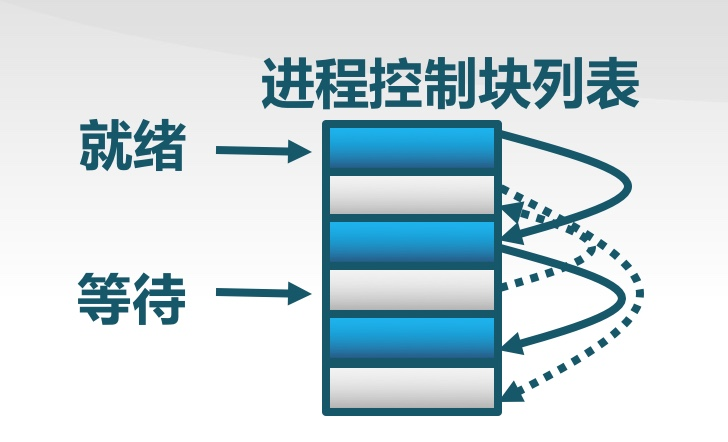
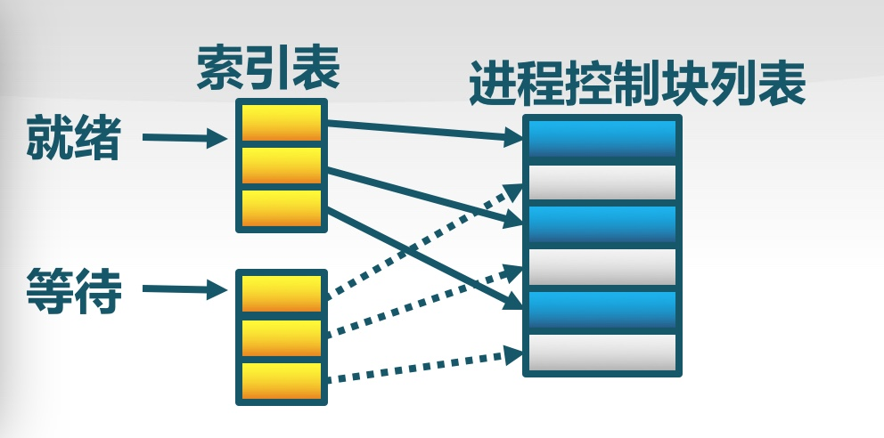

# 1. 原理
进程**具有一定独立功能的程序(指令)在一个数据集合(代码)上的一次动态执行过程**      
> OS负责管理进程，从程序加载到内存开始运行，直到程序运行结束的全过程

## 1.1 进程属性
- PCB进程控制块，记录、描述和管理程序执行的动态变化过程，**和进程一一对应**
- 从CPU的角度来看：
1. 程序就是**一段特定的指令机器码序列**。CPU会一条一条地取出在**内存中程序的指令**并按照指令的含义执行各种功能         
2. 数据集合就是**使用的内存**       
3. 执行就是**让CPU工作**        
4. 这个数据集合和执行其实体现了**进程对资源的占用**      
5. 动态执行过程**体现了程序执行的不同生命阶段：诞生、工作、休息/等待、死亡**       
6. 如果这一段指令执行完毕，也就意味着进程结束了。从**开始执行到执行结束是一个进程的全过程**        

- 内核栈和进程描述符放在一起可以提高效率；内核会跟踪系统中各个进程

- 为了协调各进程对系统资源的使用，进程管理需要做一些与进程协调有关的管理工作:
1. **进程调度**
2. **进程间的数据共享**
3. **同步互斥关系**

### 1.2 资源管理
- 进程占用**内存**和**CPU**, OS需要管理这些有限的资源, 协调各个进程的关系，负责给**用户进程**提供**运行所需的资源**    
- 多个进程存在的情况下，**通过进程调度**选择可用进程，**通过进程分派和进程切换让不同的进程分时复用CPU，执行各自的工作**
> 对于共享资源，如果管理不当，多个进程会出现**死锁**或**饥饿现象**, 它们之间会有制约关系

### 1.3 进程生命周期
#### a. 创建  ===> 就绪
- 引起创建的情况：
1. 系统初始化的时候
2. 用户请求创建一个新的进程
3. 正在执行的进程执行了创建进程的系统调用      

> 创建PCB，用来记录进程的相关状态信息===>进程描述符？    

#### b. 就绪 ===> 运行
- 当进程准备好各种资源，**就等能够使用CPU时**，进程处于**就绪**状态===>就差CPU资源的时候处于**就绪的状态**
> 更改PCB的某个属性，来保存进程的状态    

#### c. 运行 ===> 等待
- 当进程终于占用CPU，程序的指令被CPU一条一条执行的时候，这个进程就进入了**运行**状态，这时**除了继续占用内存资源外，还占用了CPU资源**
- 进入**等待**(阻塞)状态的情况
1. 请求并等待系统服务，无法完成       
2. 启动某种操作，无法马上完成
3. 需要的数据没有到达 

> 只有进程自身才能知道何时需要等待某个事件发生      

#### d. 等待 ===> 抢占
- 当进程由于等待某个资源而无法继续执行时，进程可放弃CPU使用，即释放CPU资源，进入**等待**状态 ==> **差资源**
- 进入**抢占**状态的情况
1. 高优先级进程就绪
2. 当前进程时间片执行完毕

#### e. 抢占 ===> 唤醒
- 唤醒条件
1. 被阻塞的进程的请求资源被满足
2. 被阻塞的进程的等待事件到达

> 只能是别的进程或者OS唤醒阻塞进程

#### f. 结束
- 结束情况
1. 正常退出(自愿)
2. 错误退出(自愿)
3. 致命错误(强制性)
4. 被其他进程杀死(强制性)
- 当程序指令执行完毕，由操作系统回收进程所占用的资源时，进程进入了**死亡**状态====> 回收内存
> 回收PCB

- 进程状态的转换时机需要OS管理起来，而且进程的创建和清除等服务必须由操作系统提供，而且在**运行**与**就绪**/**等待**状态之间的转换，涉及到**保存和恢复进程的执行现场**，也就是**进程上下文**，这是**确保进程即使断断续续地执行，也能正确完成工作的必要保证**

#### 进程上下文切换

#### 进程控制块PCB(Process Control Block)
OS管理控制进程运行时的信息的集合      
描述进程的基本情况以及运行变化的过程，进程存在的唯一标识，一个进程对应唯一的一个PCB      

#### PCB的组织方式
1. 同一状态进程的PCB放在一个链表中，多个不同的状态对应不同的链表，如就绪链表，等待链表等    
2. 进程链表把所有的进程描述符链接在一起，表头是init_task描述符，即0进程或swapper进程的进程描述符，其中定义了for_each_process宏来扫描整个进程链表
3. 建立多个可运行进程链表，每种进程优先级对应一个链表(0-139级)，通过复杂的数据结构来提高效率，把运行队列链表拆分成140个不同的队列
4. 进程0和进程1是内核创建的，**进程1(init进程)是所有的进程的祖先**，如果用户运行一个后台进程而且退出shell，后台进程就会成为init进程的子进程
5. 通过PID可以查到进程描述符，为了加速PID的查找，引入了4个不同类型的散列表，分别对应不同类型PID的字段
> pid<==>进程PID；tgid<==>线程组领头进程PID；pgid<==>进程组领头进程PID；session<==>会话领头PID

   

同一状态进程的PCB放在一个索引表中，不同状态的进程对应不同的索引表    

#### 三态切换
进程在整个生命周期分为：运行，就绪，阻塞状态
阻塞状态不能直接到运行状态，只能到就绪状态  

#### 等待挂起
- 处在挂起状态的进程映像在磁盘上，目的是减少内存占用

#### 就绪挂起
- 虽然进程映像在外存磁盘上，但是只要进入内存，就可以到就绪状态，然后等待调用执行

**挂起**把一个进程从内存转移到外存中

#### 状态队列
进程状态变化时，会从一个队列转换到另外一个进程队列      

#### 进程和其他进程的关系
一个进程可能是一个进程组或登录会话的领头进程，一个线程组的领头进程，跟踪其他进程的执行      

#### 等待队列
1. 表示一组睡眠的进程，当某一条件满足时，由内核唤醒放入某一个运行队列，希望等待特定事件的进程把自己放入合适的等待队列，并放弃控制权
2. 等待队列是中断处理程序和主要内核函数修改的，因此需要加锁来避免同步问题

## 1.4 进程和线程
#### 线程引入的目的
进程存在的问题:
1. 进程间如何通信，共享数据
2. 进程系统开销比较大：创建，切换，销毁

**解决方案**：
在进程内部引入一类实体：
1. 实体间可以并发执行    
2. 实体间共享相同的地址空间    

**线程概念**
线程是进程的一部分，描述**指令流执行状态**。它是进程中的指令执行流的最小单元，是**CPU调度的基本单位**      

**进程的资源分配角色**：进程由一组相关资源构成，包括地址空间（代码段、数据段）、打开的文件等各种资源       
**线程的处理机调度角色**：线程描述在进程资源环境中的指令流执行状态        
> 线程的**寄存器和堆栈的信息是独享的**

**一个线程崩溃，会导致其所属进程的所有线程崩溃**

#### 进程和线程的区别
进程是资源分配单位，线程是CPU调度单位
进程拥有一个完整的资源平台，而线程只独享指令流执行的必要资源，如寄存器和栈
线程具有就绪、等待和运行三种基本状态和状态间的转换关系
线程能减少并发执行的时间和空间开销
1. 线程的创建时间比进程短
2. 线程的终止时间比进程短
3. 同一进程内的线程切换时间比进程短
4. 由于同一进程的各线程间共享内存和文件资源，可不通过内核进行直接通信

#### 用户线程
在用户空间实现，主要通过
1. POSIX Pthreads
2. Mach C-threads
3. Solaris threads

由一组用户级的线程库函数来完成线程的管理，包括线程的创建、终止、同步和调度等

**特点**：
1. 不依赖于操作系统的内核：内核不了解用户线程的存在；可用于不支持线程的多进程操作系统
2. 在用户空间实现的线程机制：每个进程有私有的线程控制块(TCB)列表;TCB由线程库函数维护
3. 同一进程内的用户线程切换速度快:无需用户态/核心态切换
4. 允许每个进程拥有自已的线程调度算法

**不足**：
1. 线程发起系统调用而阻塞时，则整个进程进入等待
2. 不支持基于线程的处理机抢占：除非当前运行线程主动放弃，它所在进程的其他线程无法抢占CPU
3. 只能按进程分配CPU时间：多个线程进程中，每个线程的时间片较少

#### 内核线程
在内核中实现
1. Windows
2. Solaris
3. Linux

**特点**：
由内核维护PCB和TCB：由内核通过系统调用实现的线程机制，由内核完成线程的创建、终止和管理
1. 线程执行系统调用而被阻塞不影响其他线程
2. 线程的创建、终止和切换相对较大：通过系统调用/内核函数，在内核实现
3. 以线程为单位进行CPU时间分配：多线程的进程可获得更多CPU时间

#### 轻量级线程
在内核中实现，支持用户线程
Solaris       (LightWeight Process)

内核支持的用户线程。一个进程可有一个或多个轻量级进程，每个轻权进程由一个单独的内核线程来支持。（Solaris/Linux）

- 一个进程拥有一个**存放程序和数据的的虚拟地址空间以及其他资源**，一个进程基于程序的指令流执行，其执行过程可能与其它进程的执行过程交替进行。因此，一个具有执行状态(运行态、就绪态等)的进程是一个被操作系统**分配资源**(比如分配内存)并**调度**(比如分时使用CPU)的单位
- 在大多数操作系统中，以上两个特点是进程的主要本质特征。但这两个特征相对独立，操作系统可以把这两个特征分别进行管理。这样可以把**拥有资源所有权的单位通常仍称作进程**，对资源的管理成为进程管理；**把指令执行流的单位称为线程**，对线程的管理就是线程调度和线程分派
- 对属于同一进程的所有线程而言，这些线程**共享进程的虚拟地址空间和其他资源**，但**每个线程都有一个独立的栈，还有独立的线程运行上下文，用于包含表示线程执行现场的寄存器值等信息**
- 在多线程环境中，进程被定义成**资源分配与保护的单位**，与进程相关联的信息主要有**存放进程映像的虚拟地址空间**等
- 在一个进程中，可能有一个或多个线程，**每个线程有线程执行状态(运行、就绪、等待等)，保存上次运行时的线程上下文、线程的执行栈等**
- 考虑到CPU有不同的特权模式，参照进程的分类，线程又可进一步细化为**用户线程**和**内核线程**
- 从本质上看，线程**就是一个特殊的不用拥有资源的轻量级进程**

### 1.5 
------
# 2. 内核线程
- 内核线程是一种**特殊的进程**，它和**用户进程**的区别：    
1. 内核线程**只运行在内核态**，用户进程会在**用户态和内核态交替运行**
2. 所有内核线程**共用ucore内核内存空间**，不需为每个**内核线程维护单独的内存空间**；用户进程需要维护**各自的用户内存空间**
> 所谓的内存空间**不包括使用时候的堆栈，使用的堆栈需要每个线程自己维护**

- 当一个程序加载到内存中运行时，首先通过**内存管理子系统分配合适的空间**，然后需要考虑如何**分时使用CPU**来并发执行多个程序，让每个运行的程序感到它们各自拥有自己的CPU     
- 通过**调度器(scheduler)**来让不同的内核线程在不同的时间段占用CPU执行，实现**对CPU的分时共享**

问题：如何映射到内存地址空间？

-------
# 3. 进程其他概念
1. 进程是有资源限制的，比如想要多少内存，堆，栈都是有规定的
2. 内核要有能力挂起CPU上运行的进程，并恢复之前挂起的某个进程的执行，这个称为进程切换，任务切换，上下文切换
3. 进程拥有属于自己的地址空间，但是所有的进程要共享CPU的寄存器，因此在恢复一个进程前，**CPU要保证每个寄存器要装入挂起进程的一组数据，即硬件上下文**==>**一部分保存在TSS段中，剩下的保存在内核栈中**
4. 进程在用户态上执行in/out指向访问I/O端口时，**CPU会访问存放在TSS中的I/O许可权位图来确定进程是否有访问的权限**
