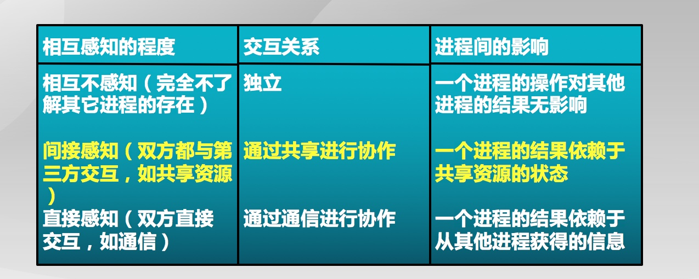

# 1. 概念
## 1.1 独立进程
1. 不和其他进程共享资源或状态
2. 确定性==>输入状态决定结果
3. 可重现==>能够重现起始条件
4. 调度顺序不重要

## 1.2 并发进程
1. 在多个进程间有资源共享
2. 不确定性
3. 不可重现性

## 1.3 并发进程的正确性
1. 执行过程是不确定性和不可重现的
2. 程序错误可能是间歇性发生的

## 1.4 优点
并发执行：进程和其他进程或设备协作
1. 资源共享
2. 加速：I/O和CPU操作可以并行；程序划分为多个模块在不同的CPU上执行
3. 模块化
**1,2提高速度； 3是模块化**      

------
# 2. 原子操作
原子操作是指一次不存在任何中断或失败的操作：要么操作成功完成，或者操作没有执行，不会出现部分执行的状态       
**操作系统需要利用同步机制在并发执行的同时，保证一些操作是原子操作**       

## 2.1 进程间关系


## 2.2 互斥
一个进程占用资源，其它进程不能使用

## 2.3 死锁
多个进程各占用部分资源，形成循环等待

## 2.4 饥饿
其他进程可能轮流占用资源，一个进程一直得不到资源

------
# 3. 临界资源
## 3.1 临界区
进程中访问临界资源的一段需要互斥执行的代码       

## 3.2 进入区
检查可否进入临界区的一段代码，如果可以进入，则应当设置“正在访问临界区标志”

## 3.3 退出区
清除"正在访问临界区标志"

## 3.4 剩余区
其他代码      

## 3.5 访问规则
1. 空闲则入：没有进程在临界区时，任何进程可进入
2. 忙则等待：有进程在临界区时，其他进程均不能进入临界区
3. 有限等待：等待进入临界区的进程不能无限期等待
4. 让权等待(可选)：不能进入临界区的进程，应释放CPU（如转换到阻塞状态）==>可选

## 3.6 实现方法
1. 禁用中断：没有中断，没有上下文切换，因此没有并发
> 硬件将中断处理延迟到中断被启用之后, 现代计算机体系结构都提供指令来实现禁用中断
> 进入临界区:禁止所有中断，并保存标志; 离开临界区: 使能所有中断，并恢复标志 

缺点：
禁用中断后，进程无法被停止：整个系统都会为此停下来，可能导致其他进程处于饥饿状态       
临界区可能很长：无法确定响应中断所需的时间(可能存在硬件影响)            

2. 软件方法
缺点：
复杂：需要两个进程间的共享数据项==>共享变量                  
需要忙等待：浪费CPU时间      


3. 更高级的抽象方法==>信号量和管程
硬件提供了一些同步原语：中断禁用，原子操作指令等      
OS提供更高级的编程抽象来简化进程同步：例如：锁、信号量； 用硬件原语来构建      

#### 锁是一个抽象的数据结构
一个二进制变量(锁定/解锁):使用锁来控制临界区访问      
Lock::Acquire() ===> 锁被释放前一直等待，然后得到锁==>原子操作                   
Lock::Release() ===> 释放锁，唤醒任何等待的进程==>原子操作              
```
breadlock.Acquire(); // 进如临界区
if(nobread)
{
    buy bread;      // 临界区资源
}
breadlock.Release(); // 出临界区

```

#### 进程相互感知程度
1. 独立
2. 共享第三方内容
3. 直接通讯

#### 原子操作指令锁的特征==>TS指令，测试和置位指令==>交换指令
**优点**：      
- 适用于单处理器或者共享主存的多处理器中任意数量的进程同步
- 简单并且容易证明
- 支持多临界区

**缺点**：
- 忙等待消耗处理器时间
- 可能导致饥饿：进程离开临界区时有多个等待进程的情况
- **死锁**：拥有临界区的低优先级进程；请求访问临界区的高优先级进程获得处理器并等待临界区

**锁是一种高级的同步抽象方法：互斥可以使用锁来实现；需要硬件支持**

### 3.7 比较
性能：并发级别       
禁用中断（仅限于单处理器）      
软件方法（复杂）       
原子操作指令（单处理器或多处理器均可）      

## 3.8 自旋锁
```
class lock {
    int value = 0;
    WaitQueue q; // 等待队列
}

Lock::Acquire()
{
    // 如果锁被释放，那么TS指令读取0并将值设置为1==>锁被设置为忙，并且需要等待完成
    // 如果锁是忙，那么TS指令读取1并将值设置为1==>不改变锁的状态并且需要循环
    while(test-and-set(value))
    {
        add the TCB to the wait queue q;
        schedule();
    }
}

Lock::Release()
{
    value = 0;
    remove one therad t from q;
    wakeup(t);
}
```
------
# 4. 并发引起的问题
多线程并发导致共享资源竞争，同步的目的就是为了协调多线程对共享资源的访问；任何时刻只能有一个线程访问临界区资源；       
而实现同步是因为：
1. 底层硬件的原语操作
2. 高层的抽象机制===>锁

------
# 5. 信号量
1. OS提供的一种协调**共享资源访问的**方法，用信号量表示系统资源的数量==>由操作系统来协调各个进程的通讯        
2. 信号是一种抽象数据类型：由一个整型(semaphore)变量和两个**原子操作**组成==>**表示一类资源的数目**
- P()操作：semaphore减1，如果<0，进入等待，否则继续==>Prolaay荷兰语减少         
- V()操作：semaphore加1，如果<=0, 唤醒一个等待进程 ==>Verloog荷兰语增加
> 如果占用的是由1变成0的那个资源，后面的线程再来的时候就已经是负数，它在等待，那么这个时候+1以后，就把它唤醒

3. 信号量是被**保护的整数变量**
4. 信号量的值与相应资源的使用情况有关。**当它的值大于0时，表示当前可用资源的数量；当它的值小于0时，其绝对值表示等待使用该资源的进程个数。注意，信号量的值仅能由PV操作来改变。** ==>P可能阻塞，V不会阻塞，由OS来维护资源

```
class Semaphore {
    int sem;
    WaitQueue q;
}

Semaphore::P()
{
    sem--; // 小于0代表已经有等待的线程了
    if (sem < 0)
    {
        Add this thread t to q;
        block(p); // 等待
    }
}

Semphore::V()
{
    sem++;
    if (sem < 0 )
    {
        Remove a thread t from q;
        wakeup(t);
    }
}
```

## 5.1 互斥访问==>临界区的互斥访问控制
1. PV要成对出现
```
mutex = new Semaphone(1);

mutex->P(); // 完成申请
Critical Section;
mutex->V(); // 完成释放
```

## 5.2 条件同步==>线程间的事件等待
```
condition = new Semaphone(0); // 初值为0

// 线程A，两个模块M，N
// 线程B，两个模块X，Y
// 要求：B执行完X后，A才可以执行N模块
// A:
M
condition->P()；
N

// B：
X
condition->V()；
Y

// 如果是A先执行，需要等待B释放资源才可以

```

------
# 6. 生产者-消费者
1. 一个或多个生产者在生成数据后放在一个缓冲区
2. 单个消费者从缓冲区取出数据处理
3. 在任何时刻只能有一个生产者或者消费者访问缓冲区

## 6.1 问题分析
1. 任何时刻只能有一个线程操作缓冲区==>互斥访问
2. 缓冲区空时，消费者必须等待生产者==>条件同步
3. 缓存区满时，生产者必须等待消费者==>条件同步
```
// 信号量描述每个约束
// 二进制信号mutex描述互斥关系
// 资源信号量描述条件同步fullbuffers
// 资源信号量emptyBuffers==>空缓冲区大小
class BoundedBuffer {
    mutex = new Semaphore(1);
    fullBuffers = new Semaphore(0); // 不是满的
    emptyBuffers = new Semaphore(n); // 空的缓冲区的个数
};

// 生产者 
BounderBuffer::Deposit(c) {
    // 先查，再做
    emptyBuffers->P();
    mutex->P();
    Add c to the buffer;
    mutex->V();
    fullBuffers->V();
}


// 消费者
BounderBuffer::Remove(c) {
    fullBuffers->P();
    mutex->P();
    Remove c from buffer;
    mutex->V();
    emptyBuffers->V();
}

```


-----
# 7. 管程
1. 一种用于多线程互斥访问共享资源的程序结构，采用面向对象方法，简化了线程间的同步控制，共享资源相关PV操作放在一个线程中；它保证了任何时刻最多只有一个线程执行管程代码；**和临界区的区别：在管程中执行的线程可以临时放弃管程的互斥访问，等待事件出现时恢复，其他的线程可以进入管程==>而临界区必须执行到它退出临界区，才可能放弃临界区的互斥访问**
2. 在对象/模块中，**收集共享数据**==>定义访问共享数据的方法

## 7.1 条件变量
1. 管程内部的等待机制：进入管程的线程因为资源被占用而进入等待状态；每个条件变量表示一种等待原因，对应一个等待队列
2. Wait()操作：将自己阻塞在等待队列中；唤醒一个等待者或释放管程的互斥访问==>等待操作
3. Signal()操作：将等待队列的一个线程唤醒==>唤醒操作；如果等待队列为空，等同空操作

```
// 条件变量实现
class Condition {
    int numWaiting = 0;
    WaitQueue q;
};

Condition::Wait(lock)
{
    numWaiting++;
    Add this thread t to q;
    release(lock); // 释放管程调度权
    schedule(); // 线程调度
    require(lock);  // 回来以后再请求管程的访问权限
}

Condition::Signal()
{
    if (numWaiting>0)
    {
        Remove a thread t from q;
        wakeup(t);
        numWaiting--;
    }
}

// 生产者-消费者
class BoundedBuffer
{
    Lock lock;  // 一个入口的锁
    int count = 0; // 写入缓冲区的数目
    Condition notFull, notEmpty; // 两个条件变量
};

// 生产者
BoundedBuffer::Deposit(c)
{
    lock->Acquire();
    while(count == n)
        notFull.Wait(&lock);

    Add c to buffer;
    count++;
    notEmpty.Signal();
    lock->Release();
}

// 消费者
BoundedBuffer::Remove(c)
{
    lock->Acquire();
    while(count == 0)
        notEmpty.Wait(&lock);
    Remove c from buffer;
    count--;
    notFully.Signal();
    lock->Release();
}


```

