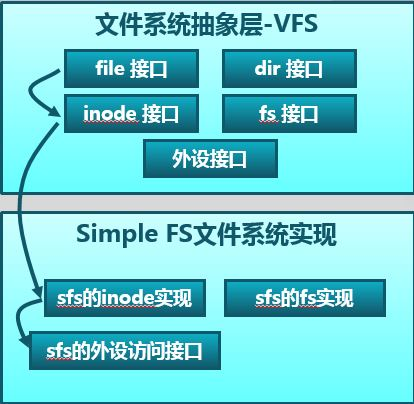

# 文件系统
-实现基于文件系统的**执行程序机制**(即改写do_execve)，完成**执行存储在磁盘上的文件和实现文件读写等功能**
------
## 1. 文件系统总体介绍


------
## 2. 通用文件系统访问接口


### 2.1 文件描述符
- 在读文件时碰上了文件结束符，会提前结束此次读操作
- 只有readdir需要调用获取目录内容的特殊系统调用sys_getdirentry。而且这里没有写目录这一操作。在目录中增加内容其实就是在此目录中创建文件，需要用到创建文件的函数
- 与文件相关的open、close、read、write用户库函数对应的是sys\_open、sys\_close、sys\_read、sys\_write四个系统调用接口。与目录相关的readdir用户库函数对应的是sys\_getdirentry系统调用
- 以上系统调用函数接口将通过syscall函数来获得ucore的内核服务。当到了内核后，再**调用文件系统抽象层的file接口和dir接口**


------
## 3. 文件抽象层

- 把不同文件系统的对外共性接口提取出来，形成一个函数指针数组
- file&dir接口层定义了进程在内核中直接访问的文件相关信息
- file数据结构
```


```
- 当创建一个进程后，该进程的files\_struct将会被**初始化或复制父进程的files_struct**
- 当用户进程打开一个文件时，将从fd_array数组中取得一个空闲file项，然后会把此file项的成员变量node指针指向一个**代表此文件的inode的起始地址**

### 3.1 inode接口
- index node是位于内存的索引节点，它是VFS结构中的重要数据结构，它负责把**不同文件系统的特定索引节点信息**(甚至不能算是一个索引节点)统一封装起来，**避免了进程直接访问具体文件系统**


------
## 4. 简单文件系统


### 4.1 常用类型文件
- **常规文件：**文件中包括的内容信息是由**应用程序输入**。SFS文件系统在普通文件上不强加任何内部结构，把**其文件内容信息看作为字节**
- **目录：**包含一系列的entry，每个entry包含**文件名和指向与之相关联的索引节点(index node)的指针**，目录是按层次结构组织的
- **链接文件：**实际上一个链接文件**是一个已经存在的文件的别名**
- **设备文件：**不包含数据，但是**提供了一个映射物理设备(如串口、键盘等)到一个文件名的机制。可通过设备文件访问外围设备**
- **管道：**管道是进程间通讯的一个基础设施。管道缓存了**其输入端所发送的数据**，以便在**管道输出端读的进程能一个先进先出的方式来接受数据**

### 4.2 索引节点
- 文件系统通常保存在磁盘上，磁盘的使用是以**扇区(Sector)为单位的**，但是为了实现简便，**SFS中以block(4K，与内存page大小相等)为**基本单位
- 文件信息存储在block中，那么还需要一个地方**存储文件的相关信息**，比如文件创建者、创建日期，大小等等，这种**存储文件元信息的区域就称为inode**
- inode里面有文件数据block的位置和链接数(即**多少个文件名指向这个inode**)，使用stat可以查看文件的inode信息，除了**文件名以外的所有文件的相关信息都存在inode中**
```
asb@docker:C$ stat main.c
  File: ‘main.c’
  Size: 59              Blocks: 8          IO Block: 4096   regular file
Device: 801h/2049d      Inode: 21758895    Links: 1
Access: (0664/-rw-rw-r--)  Uid: ( 1000/     asb)   Gid: ( 1000/     asb)
Access: 2018-03-09 18:23:23.026210106 +0800
Modify: 2018-03-09 18:23:15.594209911 +0800
Change: 2018-03-09 18:23:15.638209912 +0800
 Birth: -
```
- inode也消耗硬盘空间，因此硬盘格式化的时候，OS自动把硬盘分成两个区域。一个是**数据区，存放文件数据**；另一个是**inode区(inode table)，存放inode所包含的信息**
- 每个inode节点的大小，一般是128Byte或256Byte。inode节点的总数，在格式化时就给定，一般是每1KB或每2KB就设置一个inode。假定在一块1GB的硬盘中，每个inode节点的大小为128字节，每1KB就设置一个inode，那么inode table的大小就会达到128MB，占整块硬盘的12.8%
- 查看inode数
```
asb@docker:~$ df -i
Filesystem       Inodes  IUsed    IFree IUse% Mounted on
udev            2034760    465  2034295    1% /dev
tmpfs           2037949    461  2037488    1% /run
/dev/sda1      29491200 336717 29154483    2% /
none            2037949      2  2037947    1% /sys/fs/cgroup
none            2037949      3  2037946    1% /run/lock
none            2037949      6  2037943    1% /run/shm
none            2037949     27  2037922    1% /run/user
asb@docker:~$ 
```
- 查看单个inode的大小
```
asb@docker:~$ sudo dumpe2fs -h /dev/sda1 | grep "Inode size"   
dumpe2fs 1.42.9 (4-Feb-2014)
Inode size:               256
```
- Unix/Linux系统内部不使用文件名，而**使用inode号码来识别文件**。对于系统来说，文件名只是inode号码便于识别的别称
- 表面上，用户通过文件名，打开文件。实际上，系统内部这个过程分成三步：**首先，**系统找到这个文件名对应的inode号码；**其次，**通过inode号码，获取inode信息；**最后，**根据inode信息，找到文件数据**所在的block，读出数据**
- 查看文件的inode
```
asb@docker:C$ ls -i main.c
21758895 main.c
```

- 目录(directory)也是一种文件。打开目录，实际上就是打开目录文件
- 目录文件的结构非常简单，就是**一系列目录项（dirent）的列表**；每个目录项，由两部分组成：**所包含文件的文件名**，以及**该文件名对应的inode号码**
- 列出目录项的信息
```
asb@docker:C$ ls -i ./
21758899 enum    21758895 main.c  21758892 mylib.a  
```


------
## 5. 文件系统I/O

- 一个设备可以看成一个文件，通过访问文件的接口来访问设备
- 目前实现了stdin设备文件、stdout设备文件、disk0设备。stdin设备就是键盘，stdout设备就是CONSOLE(串口、并口和文本显示器)，而disk0设备是承载SFS文件系统的磁盘设备
- 虚拟文件系统定义一个设备链表来访问所有设备文件
- 通过某个数据结构，把device和inode进行关联


------
## 6. 关键数据结构
     
- 第0个块(4K)是超级块(superblock)，它**包含了关于文件系统的所有关键参数**，当计算机被启动或文件系统被首次接触时，超级块的内容就会被装入内存

- 第1个块是root-dir的inode，用来记录根目录的相关信息，它是SFS文件系统的根结点，通过这个root-dir的inode信息就可以定位并查找到根目录下的所有文件信息

- 然后是freemap区域，它占用若干个块空间，主要是根据SFS块的数量，用1个bit来表示一个块的**占用**和**未被占用**的情况
- 为了更好地记录和管理freemap区域，专门提供了两个文件kern/fs/sfs/bitmap.[ch]来**完成根据一个块号查找或设置对应的bit位的值**

- 最后的区域，存放了所有其他目录和文件的**inode信息**和**内容数据信息**。需要注意的是虽然inode的大小小于一个块的大小(4096B)，但为了实现简单，每个inode都占用一个完整的block

- 在sfs\_fs.c文件中的sfs\_do\_mount函数中，完成了加载位于硬盘上的SFS文件系统的超级块superblock和freemap的工作。这样，在内存中就有了SFS文件系统的全局信息

### 6.1 超级块(SuperBlock)
- 从文件系统的**全局角度**描述**特定文件系统的全局信息**，作用范围是**整个OS空间**
```
struct sfs_super {
    uint32_t magic;        // 魔数0x2f8dbe2a， 内核通过它来检查磁盘镜像是否是合法的 SFS img
    uint32_t blocks;       // 记录了SFS中所有block的数量，即 img 的大小
    uint32_t unused_blocks; // 记录了SFS中还没有被使用的block的数量
    char info[SFS_MAX_INFO_LEN + 1]; // 成员变量info包含了字符串"simple file system"
};
```

### 6.2 索引节点(inode)
- 从文件系统的**单个文件的角度**描述**文件的各种属性和数据所在位置**，它的作用范围是**整个OS空间**
- inode和文件是一一对应的(除了软硬链接)
```
struct sfs_disk_inode {
    uint32_t size;  // 如果inode表示常规文件，则size是文件大小
    uint16_t type;  // inode的文件类型
    uint16_t nlinks;  //  此inode的硬链接数
    uint32_t blocks;  //  此inode的数据块数的个数
    uint32_t direct[SFS_NDIRECT]; // 此inode的直接数据块索引值(有SFS_NDIRECT个)
    uint32_t indirect;  // 此inode的一级间接数据块索引值，此数据块实际存放的全部是数据块索引，这些数据块索引指向的数据块才被用来存放文件内容数据
};
```
- ucore里SFS_NDIRECT是12，即直接索引的数据页大小为 12 * 4k = 48k
- 当使用一级间接数据块索引时，ucore 支持最大的文件大小为 12 * 4k + 1024 * 4k = 48k + 4m。数据索引表内，0 表示一个无效的索引，inode里blocks表示该文件或者目录占用的磁盘的block
的个数。indiret 为 0 时，表示不使用一级索引块。(因为 block 0 用来保存 super block，它不可能被其他任何文件或目录使用，所以这么设计也是合理的)
- 对于**普通文件**，索引值指向的block中**保存的是文件中的数据**
- 对于**目录**，索引值指向的数据保存的是**目录下所有的文件名以及对应的索引节点所在的索引块(磁盘块)所形成的数组
```
struct sfs_disk_entry {
    uint32_t ino;    // 索引节点所占数据块索引值
    char name[SFS_MAX_FNAME_LEN + 1];       //  文件名
};
```

- 内存中的inode
```
struct sfs_inode {
    struct sfs_disk_inode *din;     // 硬盘inode信息
    uint32_t ino; 
    uint32_t flags; 
    bool dirty; 
    int reclaim_count; 
    semaphore_t sem;
    list_entry_t inode_link; 
    list_entry_t hash_link;
};
```
- **注意：**一个内存inode是在打开一个文件后才创建的，如果关机则相关信息都会消失。而硬盘inode的内容是保存在硬盘中的，只是在进程需要时才被读入到内存中，用于访问文件或目录的具体内容数据


### 6.3 目录项(dentry)
- 从文件系统的**文件路径的角度**描述**文件路径中的特定目录**，它的作用范围是**整个OS空间**

### 6.4 文件(file)
- 从**进程的角度**描述了**一个进程在访问文件时需要了解的文件标识，文件读写的位置，文件引用情况等信息**，它的作用范围是**某一具体进程**


### 6.5 设备
- 数据结构：
```
struct device {
    size_t d_blocks; //设备占用的数据块个数
    size_t d_blocksize; //数据块的大小
    int (*d_open)(struct device *dev, uint32_t open_flags); //打开设备的函数指针
    int (*d_close)(struct device *dev); //关闭设备的函数指针
    int (*d_io)(struct device *dev, struct iobuf *iob, bool write); //读写设备的函数指针
    int (*d_ioctl)(struct device *dev, int op, void *data); //用ioctl方式控制设备的函数指针 
};
```
- 使用vfs\_dev\_t数据结构把设备描述和表示文件的inode进行关联
```
typedef struct {
    const char *devname;
    struct inode *devnode;
    struct fs *fs;
    bool mountable;
    list_entry_t vdev_link;
} vfs_dev_t;
```
- 文件系统通过链接vfs\_dev\_t结构的双向链表找到device对应的inode数据结构，如果一个inode节点的成员变量in\_type的值是**0x1234**，则此inode的成员变量in\_info将成为一个device结构，从而把inode和device建立了映射关系

------
## 初始化流程

### 1. vfs_init
- vfs\_init主要建立了一个device list双向链表vdev\_list，为后续具体设备(键盘、串口、磁盘)以文件的形式呈现建立查找访问通道

### 2. sfs_init
- sfs_init是完成对Simple FS的初始化工作，并把此实例文件系统挂在虚拟文件系统中，从而让ucore的其他部分能够通过访问虚拟文件系统的接口来进一步访问到SFS实例文件系统

### 3. device_init
- dev\_init函数通过进一步调用disk0/stdin/stdout\_device\_init完成对具体设备的初始化，把它们抽象成一个设备文件，并建立对应的inode数据结构，最后把它们链入到vdev\_list中。这样通过虚拟文件系统就可以方便地以文件的形式访问这些设备了


------
## 7 实例
- 以一个用户进程打开硬盘上存储的文件为例，其中文件名为sfs_filetest1.c


### 7.1 调用main函数中的如下语句
```
int fd1 = safe_open("/test/testfile", O_RDWR | O_TRUNC);  // 返回一个代表文件的文件描述符fd1
```

### 7.2 通用文件访问接口层
- 处理流程：
- open->sys\_open->syscall，从而**引起系统调用进入到内核态**，到了内核态后，通过中断处理例程，会**调用到sys_open内核函数**，并进一步**调用sysfile_open内核函数**。到了这里，需要把位于用户空间的字符串"/test/testfile"拷贝**到内核空间中的字符串path中**，并进入到文件系统抽象层的处理流程完成**进一步的打开文件操作中**
> vectors.S ---> trapentry.S ---> trap.c -----> trap_dispatch

```
static int sys_open(uint32_t arg[])
{
	const char *path = (const char *)arg[0];
	uint32_t open_flags = (uint32_t) arg[1];
	return sysfile_open(path, open_flags);
}

```
### 7.3 虚拟文件系统层

```
// 分配一个file数据结构变量file
// 给这个即将打开的文件分配一个file数据结构的变量，即当前进程打开文件数组current->fs_struct->filemap[]中的一个空闲元素(即还没有用于一个打开的文件)，而这元素的索引就是最终要返回到用户进程并复制给变量fd，到目前为止只是给当前用户进程分配了一个file数据结构的变量，还没有找到对应的文件索引节点
filemap_alloc

// 找到path指出的文件所对应的基于inode数据结构的VFS索引节点node
vfs_open
{
    1. 通过vfs_lookup找到path对应文件的文件
        1.1 调用vfs_lookup函数找到SFS系统中的/test目录下的testfile文件
        1.2 vsf_lookup调用get_device函数----> 调用vfs_get_bootfs函数找到根目录对应的inode
        1.3 这个inode就是位于vfs.c中的inode变量bootfs_node
        1.4 bootfs_node变量在init_main函数(kern/process/proc.c)执行时获得赋值
        1.5 找到
    2. 调用vop_open函数打开文件
    	file->node = node;
	file->readable = readable;
	file->writable = writable;
	filemap_open(file);
}

vop_fstat

filemap_open

```


### 7.4 SFS文件系统层


### 7.5 硬件接口层