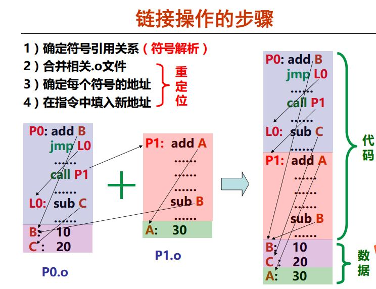

编译，汇编，链接，执行
------
## 1. 执行流程分解
#### 程序编译、链接、执行流程   


### 1.1 预处理
处理#开头的预编译指令，生成.i文件      
```
asb@HP8300:C++$ cpp main.c > main.i
asb@HP8300:C++$ gcc -E main.c > main.i
```

### 1.2 编译
生成人可阅读的汇编文件, .s文件       
```
asb@HP8300:C++$ gcc -S main.c -o main.s 
```

### 1.3 汇编
生成机器可以阅读的**可重定位文件**.o文件，linux下为ELF文件         
```
asb@HP8300:C++$ gcc -c main.s -o main.o
asb@HP8300:C++$ as main.s -o main.o
```

### 1.4 链接
合并多个**可重定位文件的相同节区**，生成.out文件，linux下为ELF文件       
```
asb@HP8300:C++$ gcc -static -o myproc main.o
```

#### 1.4.1 链接步骤
1. 确定符号的引用关系===>符号解析
2. 合并相关的可重定位ELF的.o文件===>重定位
3. 确定每个符号的地址===>绝对地址？
4. 在指令中填入新地址


#### 总结：
1. 源文件经过**预处理(替换其中包含的内容)**，**编译(生成汇编文件.s)**，**汇编(生成可重定位的目标文件.o)**，**链接(生成可以执行的目标文件.out)**，转换成CPU能认识的文件；其本质是文件格式不同，但是内容并没有变===>重点在只是形式的差别
2. 在shell中执行文件，是**通过fork===>execute===>load加载器映射.out文件===>PC指针指向entry入口**的方式把文件load到内存中，并且把**代码段**，**数据段**放在不同位置，等待CPU的执行
3. 在可重定位文件中，是一个个**单独的.o文件**，各个.o文件可能会相互引用其他.o文件中的某些定义的符号，链接的过程就是把各个文件中**相同的section进行合并**，具有**相同属性的section**将会组成可执行文件中的**各个段segment**

------
### 1.5 命令
#### 1.5.1 time -- 查看程序执行时间
```
root@c141f94d0817:~/C++# time ./Couple.o  
4
5

real    0m0.002s
user    0m0.000s
sys     0m0.000s
```
#### 1.5.2 file -- 查看文件类型
```
root@36637a20099f:~/C++# file Couple.s
Couple.s: assembler source, ASCII text

// 可执行文件
root@726c6cfac3a2:~/C++# file Couple.o
Couple.o: ELF 64-bit LSB executable, x86-64, version 1 (SYSV), dynamically linked, interpreter /lib64/ld-linux-x86-64.so.2, for GNU/Linux 2.6.32, BuildID[sha1]=1300ae94440a6c09f0defd4cc549efc17a54cd7d, not stripped

```

------
## 2 动态符号链接
linux支持动态链接库，不仅节省了磁盘、内存空间，还提高了程序运行效率； 但是同样也会带来很多问题，如**动态链接库的调试，升级更新和潜在威胁等**       

### 2.1 ELF文件结构
虽然ELF文件本身就支持3种不同的类型，但是它有一个统一的结构，它们对应着C语言中的一些结构体(elf.h中定义)   
    

#### 1. ELF Header(ELF文件头) 
描述文件**类型**、**大小**、**运行平台**、**程序头表**和**节区头表**的相关信息       

#### 2. Program Headers Table(程序头表)
**段表**，用于描述执行文件和可共享库         
> 描述可执行文件或者动态链接库，以便系统加载和执行它们

#### 3. Section 1(节区)
存放各种特定类型的信息，如**程序正文区(代码)**、数据区、调试信息、以及用于动态链接的一些节区，比如解释器(.interp)节区将**指定程序动态装载**/**链接器**ld-linux.so的位置，而过程链接表(plt)、全局偏移表(got)、重定位表则用于**辅助动态链接过程**
......

#### 4. Section Headers Table(节区头部表)
用于链接可重定位文件成可执行文件或共享库          
> 用于可重定位文件，以便描述各个节区的信息，这些信息包括**节区的名字**、**类型**、**大小等**

#### 5. 总结
ELF文件通过**文件头**组织整个文件的总体结构，通过**节区表**(SHT)和**程序头**(PHT,段表)分别描述**可重定位文件**和**可执行文件**，不管哪种类型，都需要各种节区
1. 在**可重定位文件**中，节区表描述的就是各种节区本身
2. 在**可执行文件**中，程序头描述的是由**各个节区组成的段(Segment)**，以便程序运行时**动态装载器**指定如何对它们进行内存映像，从而方便程序加载和运行
3. 对于**可重定位文件：PHT(程序头表)是可选的**    
4. 对于**可执行文件：SHT(节区头表)是可选的**     
5. 对于**共享库文件：SHT(节区头表)是可选的**

### 2.2 例子
#### 1. ELF头

```
root@36637a20099f:~/C++# readelf -h Couple.o
ELF Header:   ===>ELF头
  Magic:   7f 45 4c 46 02 01 01 00 00 00 00 00 00 00 00 00 
  Class:                             ELF64
  Data:                              2's complement, little endian
  Version:                           1 (current)
  OS/ABI:                            UNIX - System V
  ABI Version:                       0
  Type:                              EXEC (Executable file)   ===>可执行文件
  Machine:                           Advanced Micro Devices X86-64
  Version:                           0x1
  Entry point address:               0x400790  ===>入口地址
  Start of program headers:          64 (bytes into file)
  Start of section headers:          7368 (bytes into file)
  Flags:                             0x0
  Size of this header:               64 (bytes)
  Size of program headers:           56 (bytes)
  Number of program headers:         9
  Size of section headers:           64 (bytes)
  Number of section headers:         31
  Section header string table index: 28
```

#### 2. 程序头表，段表

```
root@36637a20099f:~/C++# readelf -l Couple.o 

Elf file type is EXEC (Executable file)
Entry point 0x400790
There are 9 program headers, starting at offset 64

Program Headers:
  Type           Offset             VirtAddr           PhysAddr
                 FileSiz            MemSiz              Flags  Align
  PHDR           0x0000000000000040 0x0000000000400040 0x0000000000400040
                 0x00000000000001f8 0x00000000000001f8  R E    8
  INTERP         0x0000000000000238 0x0000000000400238 0x0000000000400238
                 0x000000000000001c 0x000000000000001c  R      1
      [Requesting program interpreter: /lib64/ld-linux-x86-64.so.2]
  LOAD           0x0000000000000000 0x0000000000400000 0x0000000000400000
                 0x0000000000000bec 0x0000000000000bec  R E    200000
  LOAD           0x0000000000000df8 0x0000000000600df8 0x0000000000600df8
                 0x0000000000000270 0x00000000000003a0  RW     200000
  DYNAMIC        0x0000000000000e18 0x0000000000600e18 0x0000000000600e18
                 0x00000000000001e0 0x00000000000001e0  RW     8
  NOTE           0x0000000000000254 0x0000000000400254 0x0000000000400254
                 0x0000000000000044 0x0000000000000044  R      4
  GNU_EH_FRAME   0x0000000000000a24 0x0000000000400a24 0x0000000000400a24
                 0x0000000000000054 0x0000000000000054  R      4
  GNU_STACK      0x0000000000000000 0x0000000000000000 0x0000000000000000
                 0x0000000000000000 0x0000000000000000  RW     10
  GNU_RELRO      0x0000000000000df8 0x0000000000600df8 0x0000000000600df8
                 0x0000000000000208 0x0000000000000208  R      1

 Section to Segment mapping:
  Segment Sections...
   00     
   01     .interp 
   02     .interp .note.ABI-tag .note.gnu.build-id .gnu.hash .dynsym .dynstr .gnu.version .gnu.version_r .rela.dyn .rela.plt .init .plt .plt.got .text .fini .rodata .eh_frame_hdr .eh_frame 
   03     .init_array .fini_array .jcr .dynamic .got .got.plt .data .bss 
   04     .dynamic 
   05     .note.ABI-tag .note.gnu.build-id 
   06     .eh_frame_hdr 
   07     
   08     .init_array .fini_array .jcr .dynamic .got 

```

#### 3. 节区表
```
root@36637a20099f:~/C++# readelf -S Couple.o 
There are 31 section headers, starting at offset 0x1cc8:

Section Headers:
  [Nr] Name              Type             Address           Offset
       Size              EntSize          Flags  Link  Info  Align
  [ 0]                   NULL             0000000000000000  00000000
       0000000000000000  0000000000000000           0     0     0
  [ 1] .interp           PROGBITS         0000000000400238  00000238
       000000000000001c  0000000000000000   A       0     0     1
  [ 2] .note.ABI-tag     NOTE             0000000000400254  00000254
       0000000000000020  0000000000000000   A       0     0     4
  [ 3] .note.gnu.build-i NOTE             0000000000400274  00000274
       0000000000000024  0000000000000000   A       0     0     4
  [ 4] .gnu.hash         GNU_HASH         0000000000400298  00000298
       0000000000000030  0000000000000000   A       5     0     8
  [ 5] .dynsym           DYNSYM           00000000004002c8  000002c8
       0000000000000150  0000000000000018   A       6     1     8
  [ 6] .dynstr           STRTAB           0000000000400418  00000418
       0000000000000155  0000000000000000   A       0     0     1
  [ 7] .gnu.version      VERSYM           000000000040056e  0000056e
       000000000000001c  0000000000000002   A       5     0     2
  [ 8] .gnu.version_r    VERNEED          0000000000400590  00000590
       0000000000000050  0000000000000000   A       6     2     8
  [ 9] .rela.dyn         RELA             00000000004005e0  000005e0
       0000000000000030  0000000000000018   A       5     0     8
  [10] .rela.plt         RELA             0000000000400610  00000610
       00000000000000c0  0000000000000018  AI       5    24     8
  [11] .init             PROGBITS         00000000004006d0  000006d0
       000000000000001a  0000000000000000  AX       0     0     4
  [12] .plt              PROGBITS         00000000004006f0  000006f0
       0000000000000090  0000000000000010  AX       0     0     16
  [13] .plt.got          PROGBITS         0000000000400780  00000780
       0000000000000008  0000000000000000  AX       0     0     8
  [14] .text             PROGBITS         0000000000400790  00000790
       0000000000000282  0000000000000000  AX       0     0     16
  [15] .fini             PROGBITS         0000000000400a14  00000a14
       0000000000000009  0000000000000000  AX       0     0     4
  [16] .rodata           PROGBITS         0000000000400a20  00000a20
       0000000000000004  0000000000000004  AM       0     0     4
  [17] .eh_frame_hdr     PROGBITS         0000000000400a24  00000a24
       0000000000000054  0000000000000000   A       0     0     4
  [18] .eh_frame         PROGBITS         0000000000400a78  00000a78
       0000000000000174  0000000000000000   A       0     0     8
  [19] .init_array       INIT_ARRAY       0000000000600df8  00000df8
       0000000000000010  0000000000000000  WA       0     0     8
  [20] .fini_array       FINI_ARRAY       0000000000600e08  00000e08
       0000000000000008  0000000000000000  WA       0     0     8
  [21] .jcr              PROGBITS         0000000000600e10  00000e10
       0000000000000008  0000000000000000  WA       0     0     8
  [22] .dynamic          DYNAMIC          0000000000600e18  00000e18
       00000000000001e0  0000000000000010  WA       6     0     8
  [23] .got              PROGBITS         0000000000600ff8  00000ff8
       0000000000000008  0000000000000008  WA       0     0     8
  [24] .got.plt          PROGBITS         0000000000601000  00001000
       0000000000000058  0000000000000008  WA       0     0     8
  [25] .data             PROGBITS         0000000000601058  00001058
       0000000000000010  0000000000000000  WA       0     0     8
  [26] .bss              NOBITS           0000000000601080  00001068
       0000000000000118  0000000000000000  WA       0     0     32
  [27] .comment          PROGBITS         0000000000000000  00001068
       0000000000000034  0000000000000001  MS       0     0     1
  [28] .shstrtab         STRTAB           0000000000000000  00001bbc
       000000000000010c  0000000000000000           0     0     1
  [29] .symtab           SYMTAB           0000000000000000  000010a0
       0000000000000780  0000000000000018          30    50     8
  [30] .strtab           STRTAB           0000000000000000  00001820
       000000000000039c  0000000000000000           0     0     1
Key to Flags:
  W (write), A (alloc), X (execute), M (merge), S (strings), l (large)
  I (info), L (link order), G (group), T (TLS), E (exclude), x (unknown)
  O (extra OS processing required) o (OS specific), p (processor specific)
```

#### 4. 节区
```
root@36637a20099f:~/C# readelf -S myprintf.o
There are 13 section headers, starting at offset 0x2a8:

// 查看每个section的内容
Section Headers:
  [Nr] Name              Type             Address           Offset
       Size              EntSize          Flags  Link  Info  Align
  [ 0]                   NULL             0000000000000000  00000000
       0000000000000000  0000000000000000           0     0     0
  [ 1] .text             PROGBITS         0000000000000000  00000040
       0000000000000011  0000000000000000  AX       0     0     1
  [ 2] .rela.text        RELA             0000000000000000  000001f8
       0000000000000030  0000000000000018   I      11     1     8
  [ 3] .data             PROGBITS         0000000000000000  00000051
       0000000000000000  0000000000000000  WA       0     0     1
  [ 4] .bss              NOBITS           0000000000000000  00000051
       0000000000000000  0000000000000000  WA       0     0     1
  [ 5] .rodata           PROGBITS         0000000000000000  00000051
       000000000000000e  0000000000000000   A       0     0     1
  [ 6] .comment          PROGBITS         0000000000000000  0000005f
       0000000000000035  0000000000000001  MS       0     0     1
  [ 7] .note.GNU-stack   PROGBITS         0000000000000000  00000094
       0000000000000000  0000000000000000           0     0     1
  [ 8] .eh_frame         PROGBITS         0000000000000000  00000098
       0000000000000038  0000000000000000   A       0     0     8
  [ 9] .rela.eh_frame    RELA             0000000000000000  00000228
       0000000000000018  0000000000000018   I      11     8     8
  [10] .shstrtab         STRTAB           0000000000000000  00000240
       0000000000000061  0000000000000000           0     0     1
  [11] .symtab           SYMTAB           0000000000000000  000000d0
       0000000000000108  0000000000000018          12     9     8
  [12] .strtab           STRTAB           0000000000000000  000001d8
       000000000000001a  0000000000000000           0     0     1
Key to Flags:
  W (write), A (alloc), X (execute), M (merge), S (strings), l (large)
  I (info), L (link order), G (group), T (TLS), E (exclude), x (unknown)
  O (extra OS processing required) o (OS specific), p (processor specific)
```

#### 5. 可指定需要查看的节区
```
// -d==>查看反汇编结果; -j==>指定查看的节区
root@36637a20099f:~/C# objdump -d -j .text myprintf.o

myprintf.o:     file format elf64-x86-64


Disassembly of section .text:

0000000000000000 <myprintf>:
   0:   55                      push   %rbp
   1:   48 89 e5                mov    %rsp,%rbp
   4:   bf 00 00 00 00          mov    $0x0,%edi
   9:   e8 00 00 00 00          callq  e <myprintf+0xe>
   e:   90                      nop
   f:   5d                      pop    %rbp
  10:   c3                      retq   
```
#### 6. 查看重定位信息
```
// -r查看重定位的信息
root@36637a20099f:~/C# readelf -r myprintf.o         

Relocation section '.rela.text' at offset 0x1f8 contains 2 entries:
  Offset          Info           Type           Sym. Value    Sym. Name + Addend
000000000005  00050000000a R_X86_64_32       0000000000000000 .rodata + 0
00000000000a  000a00000002 R_X86_64_PC32     0000000000000000 puts - 4

Relocation section '.rela.eh_frame' at offset 0x228 contains 1 entries:
  Offset          Info           Type           Sym. Value    Sym. Name + Addend
000000000020  000200000002 R_X86_64_PC32     0000000000000000 .text + 0
root@36637a20099f:~/C#
```
#### 7. 查看相关的节区
```
// 查看.rodata section
root@36637a20099f:~/C# readelf -x .rodata myprintf.o 

Hex dump of section '.rodata':
  0x00000000 48656c6c 6f2c2077 6f726c64 2100     Hello, world!.

root@36637a20099f:~/C# readelf -x .data myprintf.o  

Section '.data' has no data to dump.
root@36637a20099f:~/C# readelf -x .bss myprintf.o    

Section '.bss' has no data to dump.
root@36637a20099f:~/C# 

// 查看.comment section
root@36637a20099f:~/C# readelf -x .comment myprintf.o   

Hex dump of section '.comment':
  0x00000000 00474343 3a202855 62756e74 7520352e .GCC: (Ubuntu 5.
  0x00000010 342e302d 36756275 6e747531 7e31362e 4.0-6ubuntu1~16.
  0x00000020 30342e36 2920352e 342e3020 32303136 04.6) 5.4.0 2016
  0x00000030 30363039 00                         0609.

// .shstrtab包含所有section的名字
root@36637a20099f:~/C# readelf -x .shstrtab  myprintf.o         

Hex dump of section '.shstrtab':
  0x00000000 002e7379 6d746162 002e7374 72746162 ..symtab..strtab
  0x00000010 002e7368 73747274 6162002e 72656c61 ..shstrtab..rela
  0x00000020 2e746578 74002e64 61746100 2e627373 .text..data..bss
  0x00000030 002e726f 64617461 002e636f 6d6d656e ..rodata..commen
  0x00000040 74002e6e 6f74652e 474e552d 73746163 t..note.GNU-stac
  0x00000050 6b002e72 656c612e 65685f66 72616d65 k..rela.eh_frame
  0x00000060 00                                  .

// 字符串表.strtab包含用到的字符串，包括文件名，函数名，变量名等
root@36637a20099f:~/C# readelf -x .strtab myprintf.o  

Hex dump of section '.strtab':
  0x00000000 006d7970 72696e74 662e6300 6d797072 .myprintf.c.mypr
  0x00000010 696e7466 00707574 7300              intf.puts.

```

------
### 2.3 符号
对于**可执行文件**除了编译器引入的一些符号外，主要就是用户自定义的**全局变量、函数**等 ===> **包含编译器引入的符号**        
对于**可重定位文件**，仅仅包含**用户自定义的一些符号**         
> 通过nm查看ELF文件的符号表信息

#### 2.3.1 可重定位文件
```
asb@docker:~/Desktop/C$ gcc -c test.c  
asb@docker:~/Desktop/C$ nm test.o
0000000000000000 B global
0000000000000000 T main
                 U printf
```
上面的例子包含**全局变量**、**自定义函数**、以及**动态链接库中函数**，但不包含**局部变量**，而且这**三个符号的地址都没有确定**       

#### 2.3.2 可执行文件
```
asb@docker:~/Desktop/C$ gcc -o test test.o
asb@docker:~/Desktop/C$ nm test | egrep "main$| printf|global$"
000000000060103c B global
0000000000400526 T main
                 U printf@@GLIBC_2.2.5
```
经过链接**global**和**main**的地址都已经确定了，但是**printf**的没有确定，因为它是动态链接库**glibc**中定义的函数，**需要动态链接**，而不是这里的**静态链接**

------
## 3. 重定位
将符号**引用**与符号**定义**进行链接的过程，由上可知，**可重定位文件中的**符号地址是没有确定的，而经过**静态链接**(gcc默认调用ld进行链接)以后有两个符号地址已经确定，**这样确定符号地址的过程实际上就是链接的实质**            
链接以后，对符号引用变成了对地址(定义符号时确定该地址)的引用，从而程序运行时就可通过访问内存地址而访问特定的数据         
> printf在可重定位和可执行文件中的地址都没有确定，这**意味着该符号是个外部符号**，可能定义在动态链接库中，在程序执行的时候通过**动态链接器(ld-linux.so)**进行重定位，即动态链接           

```
// 定义在动态链接库中
asb@docker:~/Desktop/C$ nm -D /lib/`uname -m`-linux-gnu/libc.so.6 | grep "\ printf$"
0000000000055800 T printf
```
> 除了**nm**以外，还可以用**readelf -s**查看**.dynsym表**，或者用**objdump -tT**查看
> 需要提到的是，用nm命令不带**-D**参数的话，在较新的系统上已经没有办法查看libc.so的符号表了，因为nm默认打印常规符号表在**.symtab和.strtab 节区**中；但是，在打包时为了减少系统大小，这些符号已经被strip掉了，只保留了动态符号**在.dynsym和.dynstr中**以便动态链接器在执行程序时寻址这些外部用到的符号。而常规符号除了动态符号以外，还包含有一些静态符号，比如说本地函数，这个信息主要是调试器会用，对于正常部署的系统，一般会用**strip工具删除掉**

------
## 4. 动态链接
动态链接就是在程序运行时对**符号进行重定位，确定符号对应的内存地址的过程**      
Linux下符号的动态链接默认采用**Lazy Mode方式**，即在程序运行过程中用到**该符号时才去解析它的地址**；好处是：只解析那些用到的符号，不用的符号则永远不用解析，从而提高程序的执行效率        
> 这种默认是可以通过设置**LD\_BIND\_NOW 为非空来打破的**，即设置了这个变量，动态链接器将在**程序加载后**，**符号被使用之前**就对这些符号的地址进行解析

------
## 5. 动态链接库

### 5.1 动态链接库的基本知识
重定位的过程就是对**符号引用**和**符号地址进行链接**的过程；而动态链接过程涉及到的符号引用和符号定义分别对应**可执行文件**和**动态链接库**，在可执行文件中可能**引用了某些动态链接库中定义的符号**，这类符号通常是函数      
```
$ readelf -d test | grep NEEDED
0x00000001 (NEEDED) Shared library: [libc.so.6]
```
为了让动态链接器能够进行符号的重定位，必须把动态链接库的相关信息写入到可执行文件当中；在ELF文件中有一个特别的节区：**.dynamic**，它存放了和动态链接相关的很多信息，例如动态链接器通过它找到该文件**使用的动态链接库名字**，但是并不包括libc.so.6的绝对路径

通过LD\_LIBRARY\_PATH参数，它类似Shell解释器中**用于查找可执行文件的PATH环境变量**，通过**冒号分开指定了各个存放库函数的路径**，该变量实际上也可以通过**/etc/ld.so.conf**文件来指定，一行对应一个路径名      
为了提高查找和加载动态链接库的效率，系统启动后会通过ldconfig工具创建一个库的缓存/etc/ld.so.cache，如果用户通过 /etc/ld.so.conf 加入了新的库搜索路径或者是把新库加到某个原有的库目录下，最好是执行一下**ldconfig**以便刷新缓存           
```
// Ubuntu14.04中
asb@docker:ld.so.conf.d$ pwd
/etc/ld.so.conf.d
```

因为动态链接库本身还可能引用其他的库，那么一个可执行文件的动态符号链接过程可能涉及到多个库，通过 readelf -d 可以打印出该文件直接依赖的库，而通过**ldd命令**则可以打印出所有依赖或者间接依赖的库      
```
$ ldd test
linux-gate.so.1 => (0xffffe000)   // 虚拟动态链接库，对应进程内存映像的内核部分
libc.so.6 => /lib/libc.so.6 (0xb7da2000)  // 直接依赖的库
/lib/ld-linux.so.2 (0xb7efc000) // 动态链接器，系统需要用它来进行符号重定位
```

ELF文件通过专门的节区**.interp**指定动态链接器       
```
$ readelf -x .interp test
Hex dump of section '.interp':
0x08048114 2f6c6962 2f6c642d 6c696e75 782e736f /lib/ld-linux.so
0x08048124 2e3200 .2.
```
和libc.so不同的是，ld-linux.so 的路径是**绝对路径**        
> 原因是：程序被执行时，**ld-linux.so将最先被装载到内存中**，没有其他程序知道去哪里查找ld-linux.so ，所以它的路径必须是绝对的；当ld-linux.so被装载以后，由它来去**装载可执行文件**和**相关的共享库**，它将根据**PATH变量**和**LD\_LIBRARY\_PATH变量**去磁盘上查找它们，因此**可执行文件**和**共享库**都可以使用相对路径         

### 5.2 动态链接库的创建和调用

### 5.3 动态链接过程

------
## 6. 动态链接器(dynamic linker/loader)
当Shell解释器或者其他父进程通过exec启动我们的程序时，系统会先为ld-linux创建**内存映像**，然后把控制权交给ld-linux，之后ld-linux负责为可执行程序提供运行环境，负责解释程序的运行，因此ld-linux也叫做**dynamic loader**或**intepreter** 
ld-linux.so主要为程序本身创建了内存映像，过程：     
1. 将可执行文件的内存段添加到进程映像中
2. 把共享目标内存段添加到进程映像中
3. 为可执行文件和它的共享目标(动态链接库)执行重定位操作
4. 关闭用来读入可执行文件的文件描述符，如果动态链接程序收到过这样的文件描述符的话
5. 将控制转交给程序，使得程序好像从exec()直接得到控制

### 6.1 过程链接表(plt)


### 6.2 全局偏移表(got)


### 6.3 重定位表


### 6.4 位置无关和位置相关
**位置无关码**===>pc(new) = pc(current)+偏移，**相对当前地址的跳转指令**    
> 使用bl，b跳转指令

**位置相关**===>直接指向一个新的地址，如pc=0x3000 0000
> ldr直接给PC寄存器赋值