# ELF文件
------
## 1. 基本概念
ELF是linux支持的一种程序文件格式，有**relocatable(可重定位)**、**executable(可执行)**、**shared libarary(共享库，即动态链接库)**三种，这三种文件是在**汇编**和**链接**阶段生成的
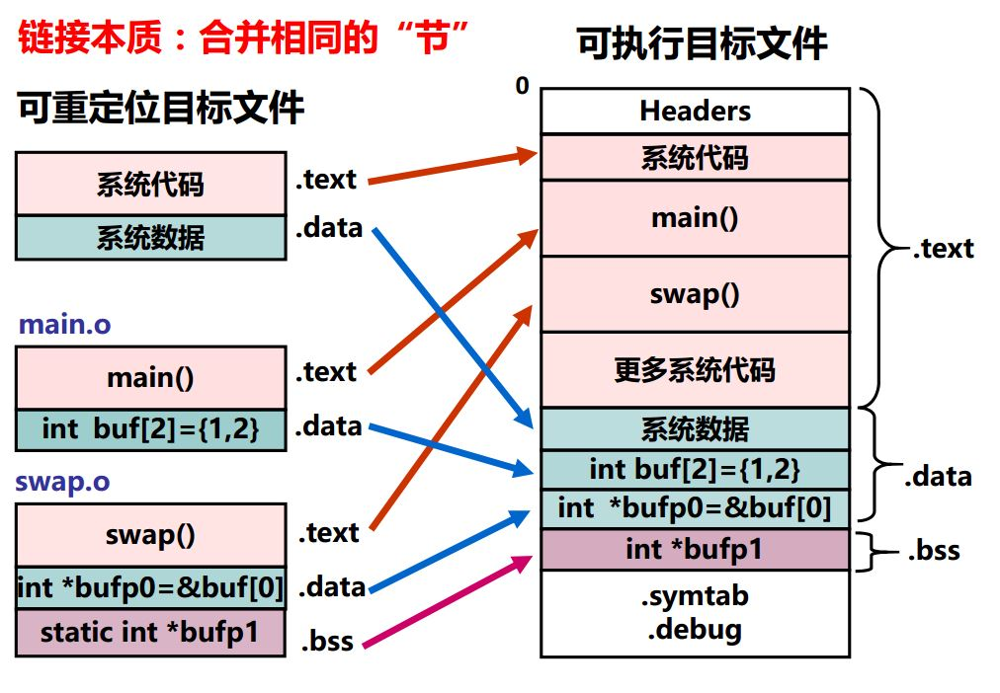

#### 测试源代码：   
```
// test.c
#include <stdio.h>

int global = 0;

int main()
{
  char local = 'A';
  printf("local = %c, global = %d \n", local, global);

  return 0;
}
```

### 1.1 可重定位文件
其代码和数据可和其他**可重定位文件**链接合并为**可执行文件**        
1. 每个**.o文件**由对应的**.c文件生成**
2. .o文件中的代码和数据地址**从0开始**===> 从0开始，那么如何合并？
3. 包含**重定位信息**，即指出哪些符号引用处需要重定位

```
asb@docker:~/Desktop/C$ gcc -c test.c 

// 可重定位版本
asb@docker:~/Desktop/C$ file test.o
test.o: ELF 64-bit LSB relocatable, x86-64, version 1 (SYSV), not stripped
``` 
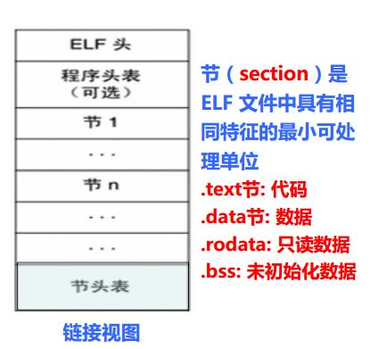

### 1.2 可执行文件
链接后生产(默认为a.out)           
1. 包含的代码和数据可以被**直接复制到内存**并被**CPU直接执行** ===> 复制到内存的那个位置      
2. 指令地址和指令给出的操作数地址都是**虚拟地址**，即代码和数据地址为**虚拟地址空间中的地址(已确定)** ===>也就是CPU看到的地址
3. 符号引用处**已经被重定位**，指向了**定义的位置**  ===>已经重定位好了？
4. 为了能执行，还需将具相同访问属性的节合并成**段(Segment)**，并说明每个段的属性，如：在可执行文件中的位移、大小、在**虚拟空间**中的位置、对齐方式、访问属性等

```
asb@docker:~/Desktop/C$ gcc -o test test.o

// 链接版本
asb@docker:~/Desktop/C$ file test
test: ELF 64-bit LSB executable, x86-64, version 1 (SYSV), dynamically linked, interpreter /lib64/ld-linux-x86-64.so.2, for GNU/Linux 2.6.32, BuildID[sha1]=ac19317f40f41df3c8c92049e09345497eb11f0e, not stripped
```


### 1.3 动态链接库文件
特殊的**可重定位文件**，能在**装入或运行时**被装入到**内存**并**自动被链接**       
```
asb@docker:~/Desktop/C$ gcc -c -fPIC test.c  ===> 位置无关码
asb@docker:~/Desktop/C$ gcc -fPIC -shared -Wl,-soname,libtest.so.0 -o libtest.so.0.0 test.o

// 动态链接库版本
asb@docker:~/Desktop/C$ file libtest.so.0.0 
libtest.so.0.0: ELF 64-bit LSB shared object, x86-64, version 1 (SYSV), dynamically linked, BuildID[sha1]=78a3ae512ac222ed871a5311ec88a4449083ae42, not stripped
```

------
#### 测试源代码    
```
// 头文件test.h
root@36637a20099f:~/C# vi test.h
#ifndef _TEST_H_
#define _TEST_H_

void myprintf(void);

#endif

// 源文件test.c:
root@36637a20099f:~/C# vi test.c
#include "test.h"

int main()
{
        myprintf();
        return 0;
}

// 源文件myprintf.c
root@36637a20099f:~/C# vi myprintf.c
#include <stdio.h>

void myprintf(void)
{
    printf("Hello, world!\n");
}
```
## 2. 可重定位ELF
```
asb@docker:C$ gcc -c myprintf.c test.c -m32
asb@docker:C$ ls
myprintf.c  myprintf.o  test.c  test.h  test.o
```
### 2.1 格式
#### 2.1.1 未初始化变量(.bss节区)
C语言规定：**未初始化**的**全局变量**和**局部静态变量**的默认**初始值为0**===>这是规定       
BSS(Block Started by Symbol)最初是UA-SAP汇编程序中所用的一个**伪指令**，用于为**符号预留一块内存空间**       
所有**未初始化的全局变量**和**局部静态变量**都被汇总到.bss节中，通过专门的**节头表Section header table**来说明应该为.bss节预留多大的空间       
将**未初始化变量.bss节**与**已初始化变量.data节**分开的优点：
1. .data节中存放**具体的初始值，需要占磁盘空间**    
2. .bss节中无需存放初始值，只要说明.bss中的每个变量**将来在执行时占用几个字节**，因此，.bss节实际上**不占用磁盘空间**，提高了磁盘空间利用率       

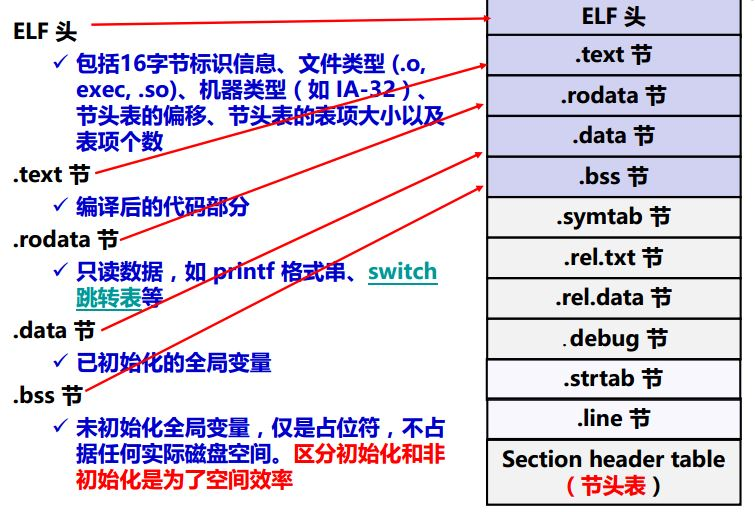
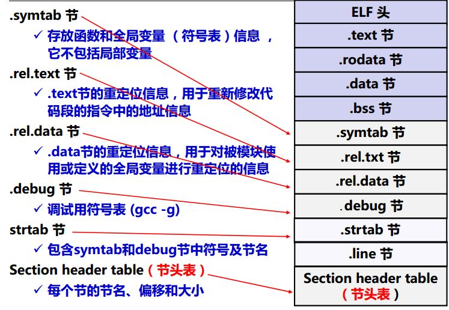


#### 2.1.2 ELF头
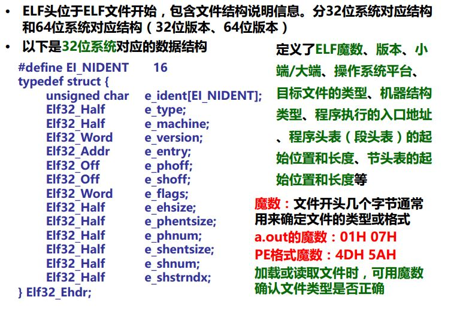
- 例子：test.o ELF header信息   
> **没有程序头表**
```
asb@docker:C$ readelf -h test.o
ELF Header:
  Magic:   7f 45 4c 46 01 01 01 00 00 00 00 00 00 00 00 00   <------ELF文件魔数7F 45 4C 46
  Class:                             ELF32
  Data:                              2's complement, little endian
  Version:                           1 (current)
  OS/ABI:                            UNIX - System V
  ABI Version:                       0
  Type:                              REL (Relocatable file)    <------可重定位文件
  Machine:                           Intel 80386
  Version:                           0x1
  Entry point address:               0x0
  Start of program headers:          0 (bytes into file)   <------没有程序头表
  Start of section headers:          260 (bytes into file)
  Flags:                             0x0
  Size of this header:               52 (bytes)   <------ELF头，定义的struct就是64K
  Size of program headers:           0 (bytes)
  Number of program headers:         0
  Size of section headers:           40 (bytes)   <------节表头大小
  Number of section headers:         12     <------ 节表头个数
  Section header string table index: 9       <------.strtab在节头表中的索引
```  
- myprintf.o ELF header信息
```
asb@docker:C$ readelf -h myprintf.o
ELF Header:
  Magic:   7f 45 4c 46 01 01 01 00 00 00 00 00 00 00 00 00 
  Class:                             ELF32
  Data:                              2's complement, little endian
  Version:                           1 (current)
  OS/ABI:                            UNIX - System V
  ABI Version:                       0
  Type:                              REL (Relocatable file)    <------可重定位
  Machine:                           Intel 80386
  Version:                           0x1
  Entry point address:               0x0        <------ 入口地址为0
  Start of program headers:          0 (bytes into file)
  Start of section headers:          284 (bytes into file)
  Flags:                             0x0
  Size of this header:               52 (bytes)
  Size of program headers:           0 (bytes)
  Number of program headers:         0
  Size of section headers:           40 (bytes)
  Number of section headers:         13
  Section header string table index: 10
```

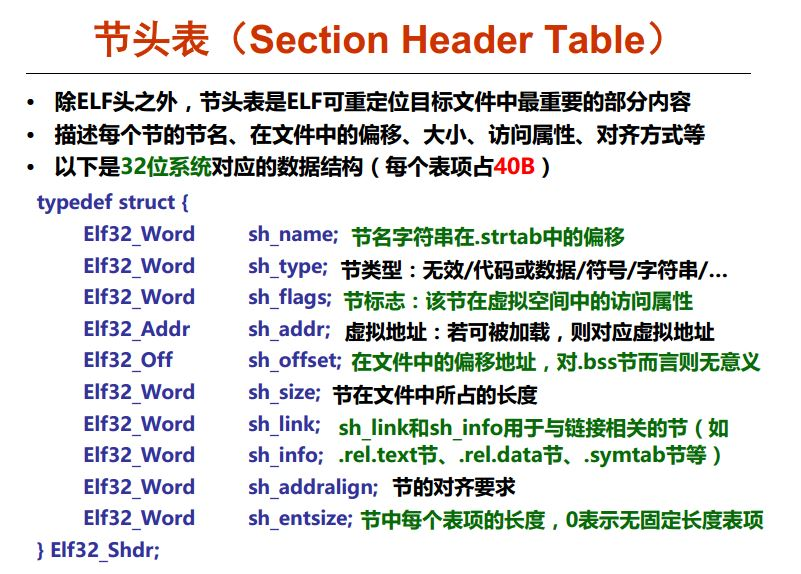
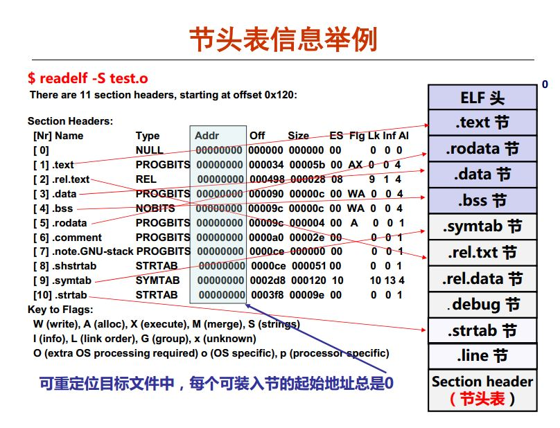
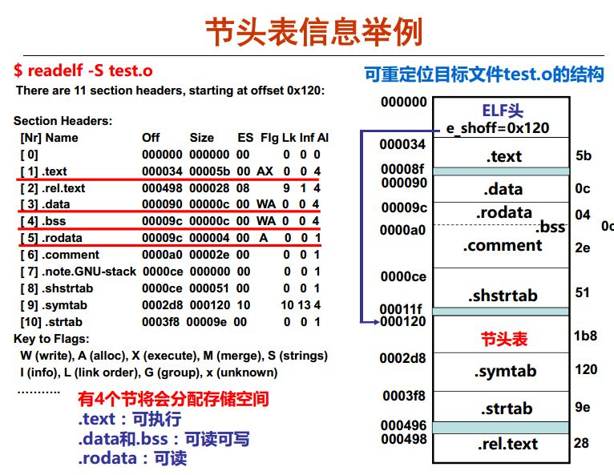

- 节头表信息
```
asb@docker:C$ readelf -S test.o
There are 12 section headers, starting at offset 0x104:

Section Headers:
  [Nr] Name              Type            Addr     Off    Size   ES Flg Lk Inf Al
  [ 0]                   NULL            00000000 000000 000000 00      0   0  0
  [ 1] .text             PROGBITS        00000000 000034 000012 00  AX  0   0  1
  [ 2] .rel.text         REL             00000000 00039c 000008 08     10   1  4
  [ 3] .data             PROGBITS        00000000 000046 000000 00  WA  0   0  1
  [ 4] .bss              NOBITS          00000000 000046 000000 00  WA  0   0  1
  [ 5] .comment          PROGBITS        00000000 000046 00002c 01  MS  0   0  1
  [ 6] .note.GNU-stack   PROGBITS        00000000 000072 000000 00      0   0  1
  [ 7] .eh_frame         PROGBITS        00000000 000074 000038 00   A  0   0  4
  [ 8] .rel.eh_frame     REL             00000000 0003a4 000008 08     10   7  4
  [ 9] .shstrtab         STRTAB          00000000 0000ac 000057 00      0   0  1
  [10] .symtab           SYMTAB          00000000 0002e4 0000a0 10     11   8  4
  [11] .strtab           STRTAB          00000000 000384 000016 00      0   0  1
Key to Flags:
  W (write), A (alloc), X (execute), M (merge), S (strings)
  I (info), L (link order), G (group), T (TLS), E (exclude), x (unknown)
  O (extra OS processing required) o (OS specific), p (processor specific)
```

### 2.2 符号和符号表
每个模块都会有自己的**代码**和**数据(初始化/未初始化的全局变量，静态变量，局部变量等)**        
> 局部变量分配在**栈中**，不在过程外引用，因此不是**符号定义**      

程序中有**定义**和**引用**的符号，含**变量**和**函数**      
编译器将**定义的符号**存放在一个**符号表symbol table**中        
> 符号表是一个结构数组，每个表项包含**符号名、长度、位置等信息**

链接器把**每个符号引用**都和一个**确定的符号定义**建立关系          

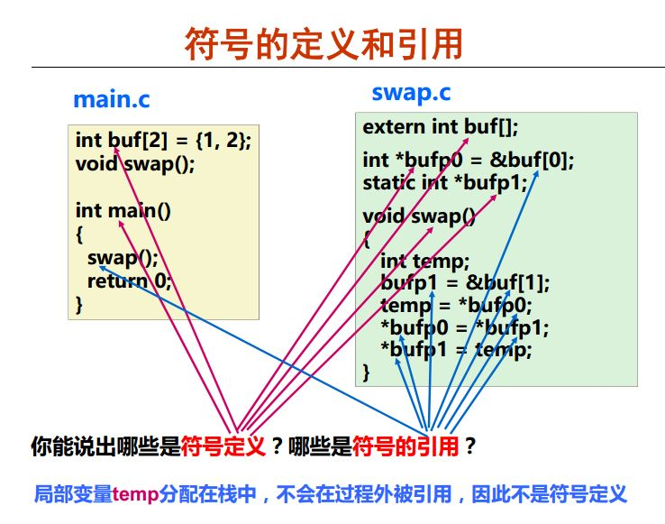

### 2.3 符号解析

### 2.4 符号重定位
将**多个代码节区与数据节区**分别合并为一个**单独的代码段和数据段**         
计算每个**定义的符号**在**虚拟地址空间**中的**绝对地址**===>重定位的时候就定义了**在虚拟地址空间的绝对地址**           
将可执行文件中符号**引用处的地址**修改为**重定位后的地址信息**===> 修改引用信息

------
## 3. 可执行ELF
```
// 链接两个可重定位的.o文件，生成可执行的文件
asb@docker:C$ gcc -o test test.o myprintf.o
asb@docker:C$ ls
myprintf.c  myprintf.o  test  test.c  test.h  test.o
```
### 3.1 格式
和可重定位文件稍有不同：         
1. ELF头中**字段e_entry**给出执行程序时**第一条指令的地址**，而在可重定位文件中，此字段**为0**===>在虚拟地址空间中的入口地址
2. 多一个**程序头表**，也称**段头表(segment header table)**，是一个**结构数组**===>合并节区成为段区
3. 多一个**init节**，用于定义**init函数**，该函数用来进行**可执行目标文件**开始执行时的**初始化工作**===>init函数?
4. 少两个**rel节**(**无需重定位**)===>因为已经重定位好了

#### 3.1.2 PHT 程序头表
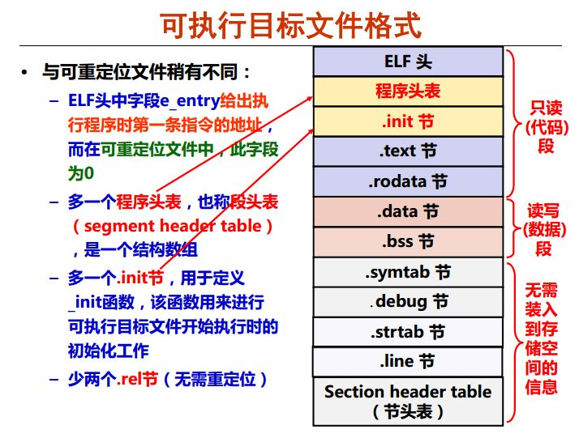
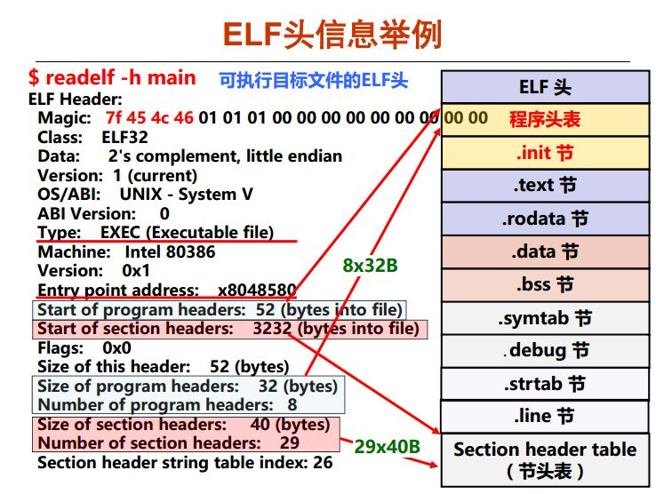

- test ELF header信息    
```
asb@docker:C$ readelf -h test
ELF Header:
  Magic:   7f 45 4c 46 01 01 01 00 00 00 00 00 00 00 00 00     <------ELF文件魔数7F 45 4C 46
  Class:                             ELF32
  Data:                              2's complement, little endian
  Version:                           1 (current)
  OS/ABI:                            UNIX - System V
  ABI Version:                       0
  Type:                              EXEC (Executable file)    <------可执行
  Machine:                           Intel 80386
  Version:                           0x1
  Entry point address:               0x8048320      <------入口地址
  Start of program headers:          52 (bytes into file)       <------ 程序头表在文件中的起始地址
  Start of section headers:          4476 (bytes into file)    <------ 节区表在文件中的起始地址
  Flags:                             0x0
  Size of this header:               52 (bytes)       <--------- ELF头的大小
  Size of program headers:           32 (bytes)      <------程序头的大小 struct为56字节
  Number of program headers:         9     
  Size of section headers:           40 (bytes)      <------ 节区表的大小
  Number of section headers:         30                 <------ 节区表的个数
  Section header string table index: 27

```
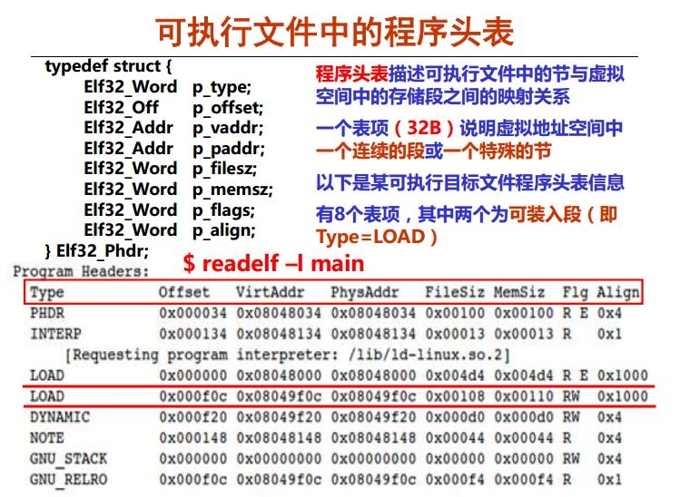
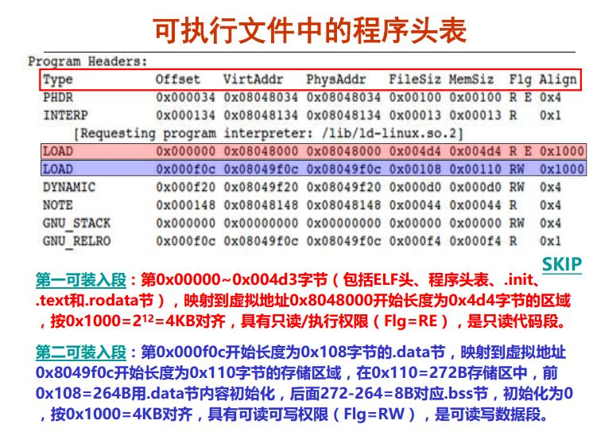

```
asb@docker:C$ readelf -l test

Elf file type is EXEC (Executable file)
Entry point 0x8048320
There are 9 program headers, starting at offset 52

Program Headers:
  Type           Offset   VirtAddr   PhysAddr   FileSiz MemSiz  Flg Align
  PHDR           0x000034 0x08048034 0x08048034 0x00120 0x00120 R E 0x4
  INTERP         0x000154 0x08048154 0x08048154 0x00013 0x00013 R   0x1
      [Requesting program interpreter: /lib/ld-linux.so.2] ===>动态加载器，这个需要绝对地址
  LOAD           0x000000 0x08048000 0x08048000 0x005f4 0x005f4 R E 0x1000
  LOAD           0x000f08 0x08049f08 0x08049f08 0x00118 0x0011c RW  0x1000
  DYNAMIC        0x000f14 0x08049f14 0x08049f14 0x000e8 0x000e8 RW  0x4
  NOTE           0x000168 0x08048168 0x08048168 0x00044 0x00044 R   0x4
  GNU_EH_FRAME   0x0004f0 0x080484f0 0x080484f0 0x00034 0x00034 R   0x4
  GNU_STACK      0x000000 0x00000000 0x00000000 0x00000 0x00000 RW  0x10
  GNU_RELRO      0x000f08 0x08049f08 0x08049f08 0x000f8 0x000f8 R   0x1

 Section to Segment mapping:
  Segment Sections...
   00     
   01     .interp 
   02     .interp .note.ABI-tag .note.gnu.build-id .gnu.hash .dynsym .dynstr .gnu.version .gnu.version_r .rel.dyn .rel.plt .init .plt .text .fini .rodata .eh_frame_hdr .eh_frame 
   03     .init_array .fini_array .jcr .dynamic .got .got.plt .data .bss 
   04     .dynamic 
   05     .note.ABI-tag .note.gnu.build-id 
   06     .eh_frame_hdr 
   07     
   08     .init_array .fini_array .jcr .dynamic .got 
```
### 3.2 存储映像

------
## 4. 静态链接
由若干个**可重定位文件**组成，多个可重定位模块和静态库组成**静态链接对象**      
**库函数模块**：无需自己写函数，可使用**共享的库函数**，如存储管理库，字符串处理等            
对于自定义模块，避免以下两种极情况：      
1. 将所有函数都放在一个源文件中，缺点：修改一个函数需要对所有函数重新编译；并且时间和空间两方面的效率都不高
2. 一个源文件中仅包含一个函数，缺点：需要程序员显式地进行链接；虽然效率高，但模块太多，太繁琐    

### 4.1 静态库(archive files)
打包相关可重定位目标模块(.o)为一个**单独的静态库文件.a**，也称**存档文件**    
构建**可执行文件**时，只需指定**库文件名**，链接器会自动到库中寻找用到的**目标模块**，并且**只把用到的模块从库中拷贝出来**        
在gcc命令行中**无需明显指定C标准库libc.a(默认库)**       
Archiver(归档器)允许**增量更新**，只要重新编译需修改的源码并将其.o文件替换到静态库中       

#### 4.1.1 常用静态库
- **libc.a**(C标准库) –- 包含I/O、存储分配、信号处理、字符串处理、时间和日期、随机数生成、定点整数算术运算    
- **libm.a**(C数学库) -- 浮点数算术运算    

```
// 查看静态库中的o文件
asb@docker:/$ sudo ar -t /usr/lib32/libc.a | sort
asb@docker:/$ sudo ar -t /usr/lib32/libm.a | sort
```

### 4.2 制作静态库
```
asb@docker:C$ gcc -c myproc1.c myproc2.c -m32
// 通过ar命令
asb@docker:C$ ar rcsv mylib.a myproc1.o myproc2.o 
a - myproc1.o
a - myproc2.o
// 查看文件
asb@docker:C$ ar -t mylib.a | sort
myproc1.o
myproc2.o
asb@docker:C$

// 使用需要加-static选项，并且./mylib.a要放在最后面，可以使用-L参数指定搜索路径指定搜索路径
// libc.a无需明显指出
asb@docker:C$ gcc -static -o myproc main.o ./mylib.a -m32

// 如果./mylib.a放在后面，就会提示找不到引用符号
asb@docker:C$ gcc -static -o myproc ./mylib.a main.o  -m32           
main.o: In function `main':
main.c:(.text+0x7): undefined reference to `myproc1'
collect2: error: ld returned 1 exit status
asb@docker:C$
```
- 调用关系：main ----> myfunc1 ----> printf，因此可重定位文件的顺序也应该是**按照调用顺序**

### 4.3 符号解析全过程
分析定义以下集合：       
1. E --- 将被合并，**组成可执行文件的所有可重定位文件集合**，这个怎么理解？理解为所有的**可重定位文件**
2. U --- 当前**所有未解析的引用符号的集合**
3. D --- 当前**所有定义符号的集合**

#### 解析流程：
1. 开始的时候E，U，D为空
2. 扫描main.o，把它加入E；把myfun1加入U，main加入D
3. 扫描到mylib.a，将U中所有符号（本例中为myfunc1）与mylib.a中所有**可重定位模块**(myproc1.o和myproc2.o)依次匹配，发现在myproc1.o中定义了myfunc1，故myproc1.o加入E，myfunc1从U转移到D
4. 在myproc1.o中发现还有**未解析符号printf**，将其加到U
5. 不断在mylib.a的各模块上进行迭代以匹配U中的符号，直到U、D都不再变化，此时U中只有一个未解析符号printf，而D中有main和myfunc1。因为模块myproc2.o没有被加入E中，因而它被丢弃
6. 扫描默认的库文件libc.a，发现**可重定位printf.o**定义了printf，于是printf也从U移到D，并将printf.o加入E，同时把它定义的所有符号加入D，而所有未解析符号加入U。处理完libc.a时，U一定是空的

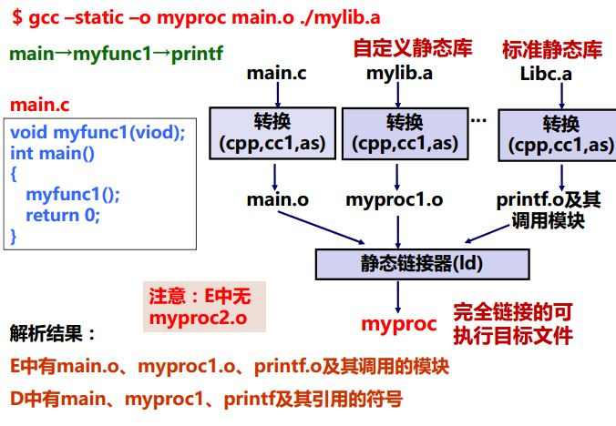

### 4.4 静态库算法
- 算法流程:
1. 按照**命令行给出的顺序**扫描.o和.a文件
2. 扫描期间将当前未解析的引用记录到一个**列表U中**
3. 每遇到一个新的.o或.a中的模块，都试图用其来**解析U中的符号**
4. 如果扫描到最后，**U中还有未被解析的符号，则发生错误**

- 问题和对策：
1. 能否正确解析与命令行给出的顺序有关
2. 好的做法：**将静态库放在命令行的最后**

- 例子：假设调用关系libtest.o ----> libfun.o(在libmine.a中)    
> -lxxx = libxxx.a
```
// 正确做法 -lmine理解为-static libmine.a
$ gcc -L. libtest.o -lmine

// 错误做法
// 在libtest.o中的main调用了libfun这个在库libmine中的函数，因此应该把libfun.a放在最后
$ gcc -L. -lmine libtest.o
libtest.o: In function `main':
libtest.o(.text+0x4): undefined reference to `libfun'
```
------
## 5. 动态链接
- 静态库缺点：
1. 库函数(如printf)**被包含在每个运行进程的代码段**中，对于并发运行很多个进程的系统，造成**主存资源浪费**    
2. 库函数(如printf)**被合并在可执行目标中**，磁盘上存放着很多可执行文件，造成**磁盘空间浪费**       
3. 需关注是否有**函数库的新版本**出现，并须定期下载、重新编 译和链接，**更新困难、使用不便**       
**因此，引入Shared Libraries(共享库)**

- 共享库：
1. 是一个目标文件，包含有代码和数据    
2. 从程序中分离出来，**磁盘和内存中都只有一个备份**    
3. 可以**动态地在装入时或运行时被加载并链接**    
4. Window称其为动态链接库(Dynamic Link Libraries，.dll文件)     
5. Linux称其为动态共享对象( Dynamic Shared Objects, .so文件)    

- 优点：
1. 在内存中只有一个备份，被所有进程共享，**节省内存空间**    
2. 一个共享库目标文件被所有程序共享链接，**节省磁盘空间**     
3. 共享库升级时，被自动加载到内存和程序动态链接，**使用方便**    
4. 共享库可分模块、独立、用不同编程语言进行开发，**效率高**    
5. 第三方开发的共享库可作为程序插件，**使程序功能易于扩展**

### 5.1 实现方式
```
asb@docker:C$ gcc -c myproc1.c myproc2.c -m32
asb@docker:C$ gcc -shared -fPIC -o mylib.so myproc1.o myproc2.o 
/usr/bin/ld: i386 architecture of input file `myproc1.o' is incompatible with i386:x86-64 output
/usr/bin/ld: i386 architecture of input file `myproc2.o' is incompatible with i386:x86-64 output
/usr/bin/ld: myproc1.o: file class ELFCLASS32 incompatible with ELFCLASS64
/usr/bin/ld: final link failed: File in wrong format
collect2: error: ld returned 1 exit status
asb@docker:C$ gcc -shared -fPIC -o mylib.so myproc1.o myproc2.o -m32
asb@docker:C$ gcc -c main.c -m32
asb@docker:C$ ls
  main.c  main.o  mylib.so  myproc1.c  myproc1.o  myproc2.c  myproc2.o
asb@docker:C$ gcc -o myproc main.o ./mylib.so 
./mylib.so: error adding symbols: File in wrong format
collect2: error: ld returned 1 exit status
```
- 第一种：**在第一次加载并运行时进行(load-time linking)**        
> Linux通常由**动态链接器(ld-linux.so)自动处理**; 如标准C库(libc.so)通常按这种方式**动态被链接**    
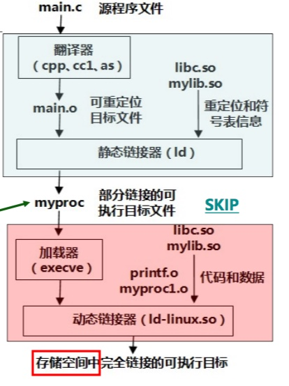
```
// libc.so无需明显指出 
asb@docker:C$ gcc -o myproc main.o ./mylib.so -m32
```
- 加载**myproc时**，加载器发现**在其程序头表中有INTERP段，其中包含了动态链接器路径名/lib/ld-linux.so.2**，因此加载器根据指定路径**加载并启动动态链接器运行**，动态链接器完成相应的重定位工作后，在把控制权交给**myproc**，启动其第一条指令执行

```
  INTERP         0x000154 0x08048154 0x08048154 0x00013 0x00013 R   0x1
      [Requesting program interpreter: /lib/ld-linux.so.2] ===>路径是绝对路径
  LOAD           0x000000 0x08048000 0x08048000 0x006d8 0x006d8 R E 0x1000
  LOAD           0x000f00 0x08049f00 0x08049f00 0x0011c 0x00120 RW  0x1000

```
- 第二种：**在已经开始运行后进行(run-time linking)**
> 在Linux中，通过**动态链接器接口**提供的函数**dlopen()等**接口来实现**运行时的动态链接**；如分发软件包、构建高性能Web服务器等
- 类UNIX系统中的动态链接器接口定义了相应的函数，如dlopen, dlsym, dlerror, dlclose等， 其头文件为dlfcn.h

```
#include <stdio.h>
#include <dlfcn.h> 
int main()
{
  void *handle;
  void (*myfunc1)();
  char *error;

  /* 动态装入包含函数myfunc1()的共享库文件 */   
  handle = dlopen("./mylib.so", RTLD_LAZY);    
  if (!handle)
  {
    fprintf(stderr, "%s\n", dlerror());
    exit(1);
  }

  /* 获得一个指向函数myfunc1()的指针myfunc1 */
  myfunc1 = dlsym(handle, "myfunc1");
  if((error = dlerror()) != NULL)
  {
    fprintf(stderr, "%s\n", error;
    exit(1);
  }

  /* 现在可以像调用其他函数一样调用函数myfunc1() */
  myfunc1();

  /* 关闭(卸载)共享库文件*/
  if(dlclose(handle) < 0)
  {
    fprintf(stderr, "%s\n", dlerror());
    exit(1);
  }
  return 0;
}
```

### 5.2 位置无关代码PIC(Position Independent code)
- **保证共享库代码的位置可以是不确定的**
- **即使共享库代码的长度发生变化，也不会影响调用它的程序**
- **要实现动态链接，必须生成PIC代码**
- **需要使用GCC选项-fPIC生成位置无关代码**
- **引入PIC，就可以使链接器无需修改代码即可将共享库加载到任意地址运行**


#### 5.2.1 模块内过程调用，跳转
> PC相对偏移寻址

#### 5.2.2 模块内数据访问

#### 5.2.3 模块外过程调用，跳转

#### 5.2.4 模块外数据访问

### 5.3 链接地址
指编译器**指定代码和数据需要存放的内存地址**，是链接器配置的       

### 5.4 加载地址
**程序被实际加载到内存的位置**，由程序加载器ld配置  

**注意**：      
**一般可执行文件结构信息和加载器保证这两个地址相同，如果不同则会导致**
1. 直接跳转位置错误
2. 直接访问内存(只读数据区和bss直接地址访问)错误
3. 堆和栈的使用不受影响，但是可能会覆盖程序，数据区

> **也存在link地址和load地址不一样的情况，如动态链接库**

------
## 6. 重定位
### 6.1 流程
#### a. 合并相同的节
将**集合E**的所有**目标模块**中**相同的节**合并成**新节**         
> 例如，所有**.text代码节**合并作为**可执行文件**中的**.text节**

#### b. 对定义符号进行重定位（确定地址）
确定新节中**所有定义符号**在**虚拟地址空间中的地址** ===>确定在**虚拟地址空间的地址**
> 例如，为**函数确定首地址**，进而**确定每条指令的地址**，为**变量确定首地址**；完成这一步后，每条**指令**和每个**全局或局部变量**都**可确定地址**

#### c. 对引用符号进行重定位（确定地址）
修改.text节和.data节中对每个符号的**引用地址**需要用到在**rel\_data**和**rel\_text节**中保存的重定位信息        

#### d. rel\_data和rel\_text
**汇编器**遇到**数据引用**时，生成一个**重定位条目**在**rel\_data节中**         
遇到**指令引用**时，生成一个**重定位条目**在**rel\_text节中**         

**ELF重定位条目格式：**     
```
typedef struct 
{
  int offset;     /*节内偏移*/
  int symbol:24;  /*所绑定符号*/
  int type: 8;    /*重定位类型*/
} Elf32_Rel;
```
### 6.2 重定位类型
- IA-32的两种最基本的重定位类型：R\_386\_32: **绝对地址**和R\_386\_PC32: **PC相对地址**
```
// 在rel\_text节中有重定位条目：
// 32类型
offset: 0x1
symbol: B
type: R_386_32===>绝对地址

// PC32类型
offset: 0x6
symbol: L0
type: R_386_PC32===>相对地址
```

#### 6.2.1 查看可重定位信息
在符号解析完以后，会产生：       
> **集合E**中有**main.o**和**swap.o**两个模块
> **集合D**中有**所有定义的符号**
> 在main.o和swap.o的**重定位条目中有重定位信息**，反映**符号引用的位置**、**绑定的定义符号名**、**重定位类型**

```
asb@docker:C$ readelf -r test.o

Relocation section '.rel.text' at offset 0x39c contains 1 entries:  // text节中
 Offset     Info    Type            Sym.Value  Sym. Name
00000007  00000902 R_386_PC32        00000000   myprintf

Relocation section '.rel.eh_frame' at offset 0x3a4 contains 1 entries:
 Offset     Info    Type            Sym.Value  Sym. Name
00000020  00000202 R_386_PC32        00000000   .text


asb@docker:C$ readelf -r myprintf.o

Relocation section '.rel.text' at offset 0x3f0 contains 2 entries:
 Offset     Info    Type            Sym.Value  Sym. Name
00000009  00000501 R_386_32          00000000   .rodata
0000000e  00000a02 R_386_PC32        00000000   puts

Relocation section '.rel.eh_frame' at offset 0x400 contains 1 entries:
 Offset     Info    Type            Sym.Value  Sym. Name
00000020  00000202 R_386_PC32        00000000   .text
```
------
## 7. 可执行文件加载
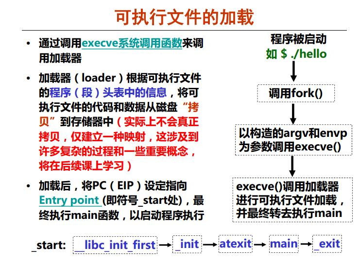

Linux系统中，通过调用**execve**()函数来启动加载器，execve函数的功能是在**当前进程上下文中加载并运行一个新程序**       
```
// filename是加载并运行的可执行文件名(如./hello)，可带参数列表argv和环境变量列表envp
// 若错误(如找不到指定文件filename)，则返回-1，并将控制权交给调用程序
// 若函数执行成功，则不返回，最终将控制权传递到可执行目标中的主函数main
int execve(char *filename, char *argv[], *envp[]);

// argc指定参数个数，参数列表中第一个总是命令名（可执行文件名）
// 如命令行为ld -o test main.o test.o时，argc=6
int main(int argc, char *argv[], char *envp[]);
```

### 7.1 加载流程(以hello程序为例)
1. 在shell命令行提示符后**输入命令**：$./hello[enter]

2. **shell命令行解释器**构造argv和envp，只有一个参数./hello

3. 调用**fork**()函数，创建一个子进程，与父进程shell完全相同(只读或者共享)，包括只读代码段、可读写数据段、堆以及用户栈等

4. 调用**execve**()函数，在当前进程(新创建的子进程)的上下文中加载并运行hello程序
> 将hello中的.text节、.data节、.bss节等内容加载到当前进程的虚拟地址空间(仅修改当前进程上下文中关于存储映像的一些数据结构，不从磁盘拷贝代码、数据等内容)

5. 调用hello程序的**main**()函数，hello程序开始在**一个进程的上下文中运行**

简单来说就是找到入口地址，把可执行程序各个段映射到内存中，然后CPU开始执行指令


------
## 总结：
- 可重定位文件本身不可以运行，仅仅是作为可执行文件，静态链接库(可重定位文件)、动态链接库的**组件**
- 静态链接库和动态链接库本身也不可以执行，作为可以执行文件的”组件“，其中静态链接库也是可重定位文件，并且在链接时加入到可执行文件中去
- 动态链接库在链接时，库文件本身并没有添加到可执行文件中，只是在可执行文件中加入了该库的名字等信息，以便在可执行文件运行过程中引用库中的函数时，由动态链接器去查找相关函数的地址，并调用它们
