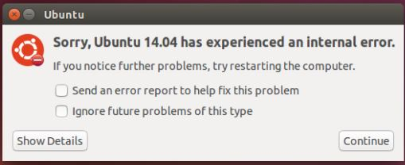

# 出现如下错误的解决方法


```
// 修改apport功能
asb@HP8300:~$   sudo vi  /etc/default/apport
enabled=0

// 然后重启

```

# 苹果隐藏显示文件方法
```
liu:~ xingyanl$ defaults write com.apple.finder AppleShowAllFiles -bool true
liu:~ xingyanl$ 
liu:~ xingyanl$ defaults write com.apple.finder AppleShowAllFiles -bool false
liu:~ xingyanl$ 
```

```
// dpkg error问题
asb@IoT:~$ sudo mv /var/lib/dpkg/info /var/lib/dpkg/info.bak
asb@IoT:~$ sudo mkdir /var/lib/dpkg/info
asb@IoT:~$ sudo proxychains4 apt-get update
asb@IoT:~$ sudo apt-get -f remove vim
asb@IoT:~$ sudo apt-get -f install vim
asb@IoT:~$ sudo mv /var/lib/dpkg/info/* /var/lib/dpkg/info.bak
asb@IoT:~$ sudo rm -rf /var/lib/dpkg/info
asb@IoT:~$ sudo mv /var/lib/dpkg/info.bak /var/lib/dpkg/info
```

##  问题
```
// libsodium找不到    

raise Exception('libsodium not found')
Exception: libsodium not found

// 解决方法 wget命令是下载包  
xingyanl@xy:~$ wget https://download.libsodium.org/libsodium/releases/LATEST.tar.gz
xingyanl@xy:~$ cd libsodium-stable/
xingyanl@xy:~/libsodium-stable$ ./configure
xingyanl@xy:~/libsodium-stable$ make
xingyanl@xy:~/libsodium-stable$ sudo make install
xingyanl@xy:~/libsodium-stable$ sudo ldconfig
```  


## 图形化界面和命令行界面切换
```
https://blog.csdn.net/davidhopper/article/details/79288573

```
