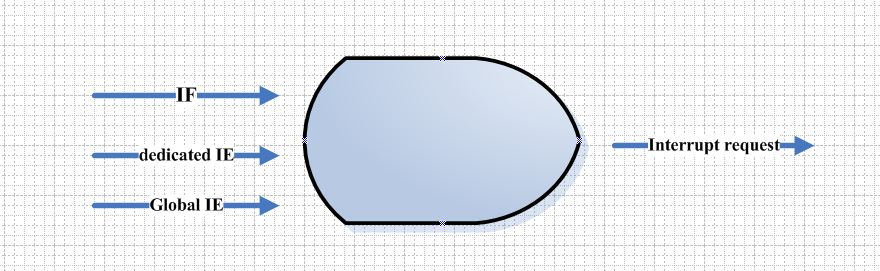

# 基础概念
------
## 1. CPU的组成
CPU包括(斜体为可选)：      
1. ALU --- 算术逻辑单元        
2. Register --- 寄存器组      
3. Control Unit --- 控制单元     
4. *浮点运算单元*        
5. *cache管理单元等*        
6. *内存管理单元MMU*       

### 1.1 运算逻辑单元4要素      
1. 操作数     
2. 执行什么样的运算       
3. 输出结果      
4. status===>flags标志位，用来表示溢出等        

### 1.2 状态寄存器PSR(程序状态寄存器)或者CCR(条件码寄存器)
用**电路实现**的用来临时保存0或者1的存储单元===>电路实现的存储器件     
状态是根据指令的执行**自动更新**的===>自动更新          
一般会保存ZNOC(Z:0, N:负数， O:溢出， C:进位)

------
## 2. 复位
### 2.1 初始化微控制器内部电路的过程
1. 将所有的寄存器恢复成默认值===>初始状态        
2. 确认MCU工作模式===>工作在哪种模式下?       
3. 禁止全局中断===>预防打断初始化动作      
4. 关闭外设
5. 将IO置为高阻输入状态
6. **等待时钟振荡趋于稳定** ===>给各个需要时钟的器件提供时钟源

**最后会从固定地址取得复位向量，执行第一条指令** ===>地址是固定的

### 2.2 中断向量表之复位
以ARM为例：      
1. 中断向量表，从0到15项，被称为异常(exception)，一类特殊的中断，包括了**复位** ===> 和PC机不同
2. 16-48项是interrupt，通常意义上的**中断**===>硬件中断，还是系统调用?
> PC指针寄存器指向要执行的指令

### 2.3 复位种类
有多种引起复位的因素，有相应的标志位和向量(可以进行不同的初始化流程)
1. 上电复位
2. 电源丢失复位
3. 外部产生的手动复位信号
4. 执行复位指令引发的复位
5. 非法指令引起的复位 illegal instruction
6. 时钟丢失引起的复位
7. 看门狗的复位
......

------
## 3. 时钟
1. 计算机的嵌入式系统是一个**典型的数字的时序逻辑系统**，而关键就是**需要一个时钟的驱动，来让一切有序的进行**，时钟一个一个的跳动会**驱动PC指针一个一个地址的向下跳转**，一条条取指令和执行指令        
2. 时钟是指令执行的基本时间间隔，它会推动PCU一个周期一个周期的往前运作，时钟频率高，意味着CPU执行运算能力强        
3. 看门狗，定时器，异步通信和时序的控制等都依赖于**一个稳定的时钟源**       
4. 在CPU的内部，为了**时序逻辑上边沿的对齐和时序上的一致性**，往往会有**一个统一的时钟树的概念**
5. 时钟树从一个比较高的频率**逐一分成它的子频率，低频率**，用来给不同的模块，不同的通讯，不同的时钟部分来加以使用，这样就构成了一个时钟树的概念，即clock tree
6. 时钟往往使用一个经典的**晶体的振荡电路**，产生一个**低电压到高电压的来回跳变的周期固定频率**来作为计算机系统的时钟源===>振荡电路来回跳变，产生固定的频率，来作为时钟源
7. 有时候使用一个外部的引脚接一个外围的时钟振荡电路来作为时钟源
8. MCU也可以在内部设置时钟源，时钟是系统运行的基础===>时钟是系统运行的基础
9. 广泛使用锁相环，锁频环的技术，在片外使用一个较低频率的振荡电路，在片内提高的高频率，供CPU高速运行===>提高时钟频率
10. 倍频处理的时钟tree会分出指令运行的bus clock和其他的模块所需要的时钟===> clock tree分出时钟给其他的模块使用
> 例如通过设置PLL生成400M，400M分频成100-133M给HCLK(内存类接口)，分成50M给PCLK(外部设备)；而PLL有一个锁定时间，需要设置**PLL寄存器**

------
## 4. 存储器
1. CPU上仅拥有若干的寄存器，程序指令和数据必须保存在外部存储器上===>内存和外存，缓存
2. ROM/FLASH相当于硬盘，掉电不丢
3. RAM相当于内存，掉电易丢失
> cpu中的寄存器相当于草稿纸，ROM存储器用来存储大量的数据，RAM内存则提供堆栈，用来保存返回地址，运行空间等===>提供堆栈

------
## 5. 总线
- CPU是通过内部总线接口访问外部存储器或者外设的，包括传数据的**数据总线**，访问地址的**地址总线**，传递控制信号的**控制总线**
> 因此总线就分为**地址总线**，**数据总线**和**控制总线**

### 5.1 地址总线
1. 总线设备(存储器)必须要具有一个确定的地址范围，在设计的时候CPU芯片手册会给出具体的地址分配
2. CPU驱动地址总线，地址译码逻辑(decoding circuit)选中对应的设备
3. 地址总线的宽度决定了CPU的寻址范围===>最终还要结合芯片手册才能决定**物理内存的使用**
4. 数据总线代表一次处理多少位===>一次能读取/写入多少位数据

### 5.2 从CPU的角度，按照地址段，看待外围设备
1. 对CPU内部寄存器的访问是**通过指令直接实现的**===>直接获取相关内存
2. 在CPU外部的片上的存储器，就必须通过地址加以访问，datasheet会给出每个地址段所对应的设备===>逻辑地址和物理地址并不是简单的对应关系

#### 总结
1. 从CPU的角度看，除了**独立的时钟**和**复位部分**通过电路和它连接外，其余的外设都是通过**总线连接**
2. CPU通过总线以地址的视角能够看到很多存储设备===>以地址的视角来看外围设备
3. 同时总线上还挂载了各种各样的外设(peripheral)
4. 外设是为特定的控制应用而设计的
> 输入输出外设：DIO, ECT, PWM等
> 模拟量处理：AD,DA
> 通讯处理：SCI， SPI， I2C， HDLC, CAN等

------
### 6. 外设的概念
1. 外设是通过一系列寄存器Register来完成设置和工作的===>如何操作这些外设       
> **此处的寄存器不同于CPU内部的寄存器**，这些寄存器在外面，它直接决定了外设电路的功能，所以CPU对这些寄存器的访问是通过**映射在总线上的地址来访问**

2. 外部寄存器是电路和编程的接口，所有的内容最终都会映射到内存空间中，这个空间指的是CPU看到的逻辑地址空间      

------
### 7. 嵌入式编程
1. 嵌入式编程的精髓就在于**对存储器的使用**
> 代码存储在flash中
> 变量保存在堆或栈中
> 外设映射到内存中，通过控制地址来控制外设===>外设映射到内存中，这个如何理解?这个地址应该是逻辑地址，而不是实际的物理内存的地址      

2. 有的写进去的数据，发挥作用的是电压

------
## 8. 中断
**中断**和**轮询**是做事情的两种方式      
以打电话为例，如果想找某人有事     
1. **轮询就是反复打电话确认某人是否在，直到把事情做完**
2. **中断就是等到某人回来以后，回个电话给我，在这段时间我就可以做任何自己想做的任何事情**

------
### 8.1 中断VS轮询

#### 轮询
1. 周期性，连续的检查外部事件是否发生
2. 消耗大量的CPU的处理时间
3. 轮询过程需要和其他功能代码结合
4. 由于CPU需要处理其他事件(可能是无关紧要的)，可能丢失关键事件

#### 中断
中断是一个需要CPU**立即处理的内部/外部事件**
1. 由**硬件和电路**来判断是否发生外部事件，并且通知CPU，处理完中断事情以后，继续之前的处理===>**上下文切换**
2. 专用的中断服务程序来处理
3. 内部事件：定时器时间到，AD变换结束===>软件触发
4. 外部事件：按键动作，发生外部通讯===>硬件触发
5. 可以在任意时刻产生

#### 两者适用方向
中断：    
1. 适用于处理对响应要求非常高的事件
2. 适用于处理持续事件短的事件===>**中断处理程序只做重要的事情**
3. 适用于低功耗应用
4. **程序设计较为复杂**

轮询：
1. 适用于处理响应要求低的事件
2. **程序事件简单**

------
### 8.2 基本概念
中断是是计算机演变过程中**产生前、后台程序**、**产生操作系统**的一个基础的知识；中断产生的机制，因为是一种**电路上的通知来告诉CPU，因此一定会设计为一种逻辑上的结构**===>**硬件来做的事情**                  
> 某一个事件一旦发生，**一定会从电学上产生一个信号**，表征为**逻辑0**或者**逻辑1**，通过一系列的控制，要让它有序地通知CPU知道一件事情发生了，而剩下的需要CPU来操作        

### 8.3 中断的允许/禁止控制
1. 全局中断控制 -- enable/disable ALL interrupts
> CPU的**CCR寄存器**中的一个特殊位；在复位后，全局禁止位是使能的；中断发生后，全局禁止位也是使能的；

2. Dedicated IE -- one bit for each interrupts sources
> 通常在复位后所有的中断都被禁止了

3. 根据**不同中断源**，电路一定会产生一个0或者1的信号，而这个信号一般称为中断标志位，代表我们所约定的，所期待的事情发生了

#### 中断标志位(IF-interrupt flag)：每个中断源都有对应的中断标志

**总结**：        
1. CPU总的开关中断
2. 与一类信号对应的开关量来表征编程人员允许这样一类的信号产生中断
3. 不同中断源对应的中断
因此基本概念就是三者全部允许才能允许中断请求，如下图所示：

### 8.4 中断流程
1. 外部/内部时间请求CPU处理
2. CPU停止正常流程，执行中断服务程序ISR===>中断服务例程
3. ISR结束后，cpu返回正常流程===>需要无缝衔接

#### 保存现场和还原现场
1. 保存当前的寄存器的值，在中断中称为**保存寄存器上下文(register context)**
2. 保存**返回地址**
3. 中断程序运行结束以后，**倒序弹出寄存器的值**，从而进行**寄存器上下文恢复**
> 中断的寄存器入栈是由CPU硬件自动完成，对于具体的CPU，在中断的时候哪些CPU寄存器被压入堆栈/寄存器在堆栈的保存顺序是在其数据手册中指明的；**如果没有你需要保存的寄存器，则需要程序员手动保存**===>寄存器的值除非必要，否则不会手动保存

### 8.5 中断服务子程(ISR，Interrupt Service Routine)
对于CPU，会有若干种不同的中断源；对于不同的中断源，都应该有相应的ISR来处理这样一个事情发生后所应该做的处理       
1. 在某些CPU中，中断服务子程不同于一般的C函数，函数退出时的**返回汇编指令有所区别**(如RTI中断返回指令需要完成堆栈操作)
2. 在ARM Cortex M0+中，等同一般的C函数，使用同样的**汇编指令即可**
3. **中断返回**的时候会有一系列的特殊操作，也就是**把保存的register context内容倒序弹出，去还原现场**
4. 普通的函数只是返回保存的返回地址===>不会弹出寄存器的上下文

#### 和普通函数的区别
1. ISR**被CPU硬件自动调用**，不在其他程序代码中调用
2. 在ISR执行前后，CPU自动进行栈出入操作
> 如当按键发生时，硬件电路产生信号，产生中断，而CPU在任意时刻获知这个中断产生的时候，会**自动调用相应的ISR函数**；C函数的调用时间是确定的，但是**ISR调用的时间点是不定的，因此要保存现场**===>时间不确定，所以要保存现场

3. 写成C函数**参数和返回值都应该为void**，也就是**ISR不接受参数**，**也不返回参数**

### 8.6 中断向量表
中断向量表的目的是：映射中断信号和ISR之间的对应关系      
1. 中断向量表是一段在CPU中保留的连续的存储空间
2. 在上电复位后，**有其默认的起始地址**
3. 每个**中断信号**在**向量表**中有其对应的**表项**，这个表项就是中断源；表项存储的值是**该中断对应的ISR的地址(函数指针)**，**这些是在CPU设计的时候就决定的**
4. 由程序代码确定中断向量表中的每个表项
5. 中断向量表的**位置**是可以通过修改**中断向量基地址寄存器**重新定位的

### 8.7 中断优先级
- 在多个中断同时发生的时候，高优先级中断先得到相应
- 中断优先级可以是固定的或者编程指定的
> 固定优先级：更加在中断向量表中的顺序；设定优先级：每个中断都有优先级设置位
- 相同优先级按照先后顺序进行处理

### 8.8 中断嵌套
- 新的中断优先级高，则保持现场，执行高优先级中断，然后返回；**中断嵌套会导致性能增加**
- 新的中断优先级低，继续执行，结束后执行新的中断

### 8.9 中断潜在风险
- 中断函数使用**全局变量**会带来风险
> 如果在**for**循环中使用到了**和中断一样的全局变量**，则可能会导致**for循环出错**，因为**中断是独立的、可能在任何时间发生的**

------
## 9. ARM体系CPU的7种工作模式
工作模式：
1. 不同的寄存器
在某种模式下面，有其自己独有的寄存器，在同一条指令，可能会操作不同的寄存器

2. 不同的权限
配合MMU来使用

3. 触发条件
上电后，位于管理模式，发送中断，进入中断模式，如果想读取时间，失败的时候，进入数据访问中止模式

------
## 10. IO中断编程
1. 把中断的开关打开
2. 配置中断源，多长时间中断一次
3. 编写ISR函数
4. 把ISR函数放到中断向量表中