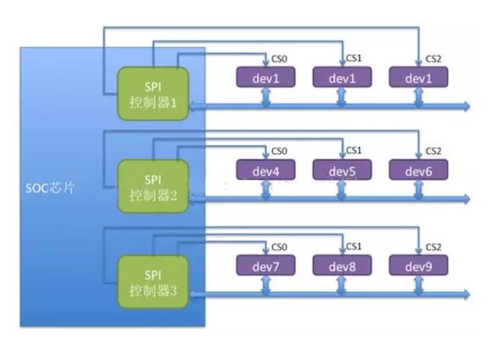
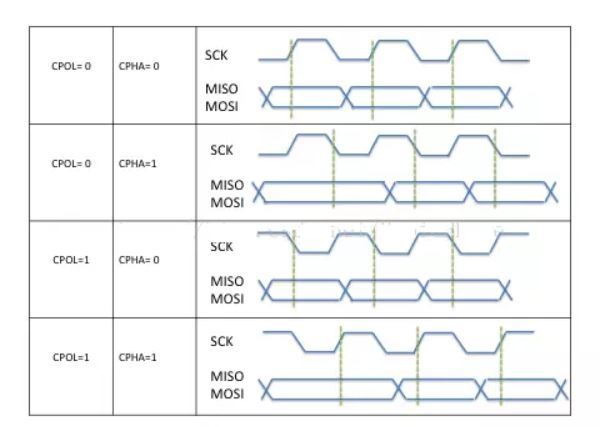
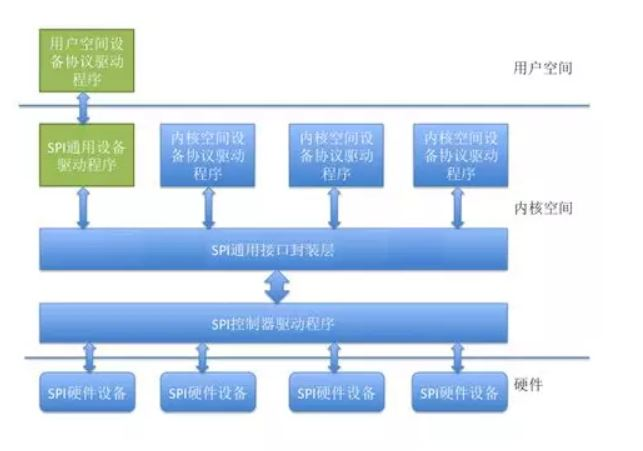

# SPI基础
------
## 1. 概念
- SPI(Serial Peripheral Interface)是一种**四线制的同步串行通讯接口**，主要用来连接**微控制器**，**传感器**，**存储设备等**；SPI分为**主设备**和**从设备**
- 用于通讯和控制的四根线分别是：
> 1. CS-**片选信号**
> 2. SCK-**时钟信号**    
> 3. MISO-**主设备的数据输入，从设备的数据输出**  
> 4. MOSI-**主设备的数据输出，从设备的数据输入**

------
## 2. 硬件架构
- 通常，负责发出时钟信号的设备称为**主设备**，另一方作为**从设备**

- 主设备对应SOC芯片上的SPI控制器，可以有多个；每个控制器可以连接多个SPI从设备，每个从设备有**独立的CS引脚**,并且**共享其他的3个信号引脚**；在任何时刻只有一个**CS引脚有效**，和这个有效引脚连接的从设备和主设备进行通讯，其他的从设备处于等待状态，并且它们的**3个引脚处于高阻态**
> 高阻态相当于隔断状态，即电阻很大，相当于开路        
> 使用**GPIO引脚**作为片选引脚，**输出低电平就选中从设备**

------
## 3. 工作时序
- 按照**时钟信号**和**数据信号**之间的**相位**关系，SPI有4种工作时序模式：

- **CPOL**表示时钟信号的初始电平的状态，为0表示初始信号为**低电平**；为1表示为**高电平**
- **CPHA**表示在哪个时钟沿采样数据，0表示在**首个时钟变化沿采样数据**，1表示在**第2个时钟变化沿采样数据**
- 内核通过**CPOL**和**CPHA**的组合来表示当前SPI的工作模式
> 1. CPOL = 0, CPHA = 0  模式0
> 2. CPOL = 0, CPHA = 1  模式1
> 3. CPOL = 1, CPHA = 0  模式2
> 4. CPOL = 1, CPHA = 1  模式3

------
## 4. 软件架构
- 内核中SPI驱动软件架构，如下图：

### 4.1 SPI控制器驱动程序
- **SPI控制器**：根据SPI控制器对应的寄存器的操作，**设置时钟**，发送的数据时，只要把数据写到对应的寄存器即可      
- SPI控制器不关心设备具体功能，只负责把**上层协议驱动**准备好的数据按照**总线的时序要求发送给SPI从设备**，同时把**从设备收到的数据返回给上层协议驱动**
- SPI控制器驱动**负责控制具体的硬件**，诸如**DMA**和**中断**等操作
- 因为**多个上层的协议驱动**可能会通过控制器请求数据传输操作，因此**SPI控制器驱动也要负责对这些请求进行队列管理**，保证**先进先出的原则**
> 区分**上层协议驱动**和**控制器驱动**？

### 4.2 SPI通用接口封装层
- 为简化SPI驱动程序编程，和**降低协议驱动**和**控制器驱动**的耦合关系，内核把控制器驱动和协议驱动的一些通用操作**封装成标准接口**，加上一些通用的**逻辑处理操作**，组成了**SPI接口封层**
- 这样的优点是，对**控制器驱动**，只要实现**接口回调API**，并把它注册到**通用接口层就可以了**，无需和**协议驱动程序进行交互**
- 对**协议驱动程序**，只需要**调用通用接口层提供的API，就可以完成设备和驱动的注册**，并且**通过通用接口层的API完成数据的传输**，而**无需关注SPI控制器驱动的实现细节**

### 4.3 SPI协议驱动层
- SPI设备的具体功能由**SPI协议驱动程序完成**，协议驱动程序**了解设备的功能和通讯数据的协议格式**
- 向下，协议驱动通过通用接口层和控制器交换数据
- 向上，协议驱动根据设备具体的功能和**内核的其它子系统进行交互**
> 和MTD层交互以便**把SPI接口的存储设备**实现为某个文件系统，和**TTY子系统交互**把**SPI设备实现为一个TTY设备**；当然如果是一个专有的**SPI设备**，也可以按照协议要求，实现自己的**专有协议驱动**

### 4.4 SPI通用设备驱动程序
- 某些时候，连接在SPI控制器上的设备，在内核没有**配备相应的协议驱动程序**，这种情况，内核准备了**通用的SPI设备驱动程序**
- 通用设备驱动程序**向用户空间提供了控制SPI控制的控制接口**，具体的**协议控制**和**数据传输工作**交由**用户空间根据具体的设备来完成**
- 以上方式中，只能采用**同步的方式**和SPI设备进行通信，所以**通常用于一些数据量较少的简单SPI设备**

