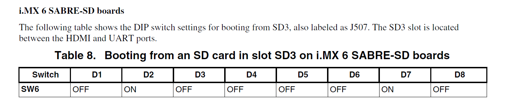
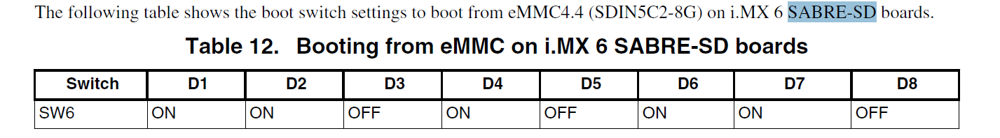

# Yocto项目开发
------
## 1. NXP CPU三种系列
- Cortex-A系列  -- 面向性能密集型系统的应用处理器内核
- Cortex-R系列 -- 面向实时应用的高性能内核  
- Cortex-M系列 -- 面向各类嵌入式应用的微控制器内核

------
## 2. IOMUX含义
- 目的：解决引脚复用的问题  
soc芯片有很多引脚，每个对应特定功能，如控制电机需要引脚1和2，控制传感器需要3和4，但是对应soc芯片需求方来说，可能只需要用来控制传感器，则就会浪费两个芯片，为了提供更多的功能，减少引脚的浪费，把1,2和3,4引脚合并，通过复用来解决问题   
> **pin**指芯片封装好后的管脚，也就是用户能看到的  
**pad**是硅片的管脚，在芯片内部，用户看不到  
**pin**和**pad**之间有一个导线

------
## 3. Imx6qsabresd启动模式
### 3.1 download/SD卡启动模式


### 3.2 emmc启动模式



------
## 4. Yocto环境搭建

### 4.1 Yocto简介
1. yocto是开源的协作软件，提供模板，工具，方法创建定制的linux系统和嵌入式产品，无需关心硬件体系
2. yocto项目通过Poky构建系统，提供开发源码的开发环境，针对各种CPU架构  
3. yocto兼容OpenEmbedded项目，能够简单可靠的编译和开发，完全支持通过QEMU模拟器模拟硬件和设备
4. yocto项目可以为多种设备生成镜像
5. 使用BitBake tool构建linux image，BitBake和OE(OpenEmbedded)已经集成到了Poky中

### 4.2 安装配置

#### 4.3 配置host
```
asb@HP8300:~$ sudo apt-get install gawk wget git-core diffstat unzip texinfo gcc-multilib \
> build-essential chrpath socat libsdl1.2-dev

asb@HP8300:~$ sudo proxychains4 apt-get update

asb@HP8300:~$ sudo proxychains4 apt-get install libsdl1.2-dev xterm sed cvs subversion coreutils texi2html docbook-utils python-pysqlite2 help2man make gcc g++ desktop-file-utils libgl1-mesa-dev libglu1-mesa-dev mercurial autoconf automake groff curl lzop asciidoc

asb@HP8300:~$ sudo proxychains4 apt-get update

asb@HP8300:~$ sudo proxychains4 apt-get install u-boot-tools
```

#### 4.4 配置git
```
asb@HP8300:Desktop$ vi .gitconfig
[http]
	proxy = http://135.245.48.34:8000/
[https]
	proxy = http://135.245.48.34:8000/
[credential]
	helper = store
[core]
	editor = vim
[user]
	name = xingyanl
	email = xingyang.liu@nokia-sbell.com
[url "https://github.com"]
	insteadOf = git://github.com
[url "http://git.freescale.com/git/cgit.cgi/proprietary/imx-firmware.git"]
	insteadOf = git://git.freescale.com/proprietary/imx-firmware.git

```

#### 4.5 下载依赖包
```
mkdir ~/bin
curl http://commondatastorage.googleapis.com/git-repo-downloads/repo > ~/bin/repo
chmod a+x ~/bin/repo
export PATH=~/bin:$PATH

// 创建目录
asb@HP8300:Desktop$  mkdir fsl-release-bsp
asb@HP8300:Desktop$  cd fsl-release-bsp
asb@HP8300:fsl-release-bsp$ 
asb@docker:fsl-release-bsp$ repo init -u git://git.freescale.com/imx/fsl-arm-yocto-bsp.git -b imx-4.1.15-1.0.0_ga
$ repo sync
```

#### 4.6 单独安装toolchain
```
asb@HP8300:toolchain-4.9.11$ cd /home/asb/toolchain-4.9.11
asb@HP8300:toolchain-4.9.11$ ./fsl-imx-x11-glibc-x86_64-meta-toolchain-cortexa9hf-neon-toolchain-4.9.11-1.0.0.sh 
NXP i.MX Release Distro SDK installer version 4.9.11-1.0.0
==========================================================
Enter target directory for SDK (default: /opt/fsl-imx-x11/4.9.11-1.0.0): <--------------------------
You are about to install the SDK to "/opt/fsl-imx-x11/4.9.11-1.0.0". Proceed[Y/n]? y   <--------------------------
[sudo] password for asb: <--------------------------
Extracting SDK.....................done
Setting it up...done
SDK has been successfully set up and is ready to be used.
Each time you wish to use the SDK in a new shell session, you need to source the environment setup script e.g.
 $ . /opt/fsl-imx-x11/4.9.11-1.0.0/environment-setup-cortexa9hf-neon-poky-linux-gnueabi <--------------------------
asb@HP8300:~$ . /opt/fsl-imx-x11/4.9.11-1.0.0/environment-setup-cortexa9hf-neon-poky-linux-gnueabi
asb@HP8300:~$ arm-poky-linux-gnueabi-gcc -v
Using built-in specs.
COLLECT_GCC=arm-poky-linux-gnueabi-gcc
COLLECT_LTO_WRAPPER=/opt/fsl-imx-x11/4.9.11-1.0.0/sysroots/x86_64-pokysdk-linux/usr/libexec/arm-poky-linux-gnueabi/gcc/arm-poky-linux-gnueabi/6.2.0/lto-wrapper
Target: arm-poky-linux-gnueabi
…….
Thread model: posix
gcc version 6.2.0 (GCC) 
```


------
# 1. 简介
1. Yocto是开源项目的名称，项目的目标是构建自定义Linux系统
2. Poky有两个含义。
- 第一个含义是用来构建Linux的构建系统，值得注意的该Poky仅仅是一个概念，而非一个实体：它包含了 BitBake工具、编译工具链、BSP、诸多程序包或层，可以认为Poky即是Yocto的本质
- 此外Poky还有另外一层意思，使用Poky系统得到的默认参考 Linux 发行版也叫Poky（当然，我们可以对此发行版随意命名）。Poky的两个含义千万不能混淆 

```
[chunxixi@hzlinb27 hangzhou_AEQB]$ ls -lrt
total 84
-rw-r--r--  1 chunxixi linseeusers_lte_wroclaw 2709 Dec 17 10:39 README.md
drwxr-xr-x  2 chunxixi linseeusers_lte_wroclaw 4096 Dec 17 10:39 project-configs
-rw-r--r--  1 chunxixi linseeusers_lte_wroclaw 2831 Dec 17 10:39 manifest.xml
-rw-r--r--  1 chunxixi linseeusers_lte_wroclaw 2242 Dec 17 10:39 env.conf
-rw-r--r--  1 chunxixi linseeusers_lte_wroclaw  307 Dec 17 10:39 build.env
drwxr-xr-x  4 chunxixi linseeusers_lte_wroclaw 4096 Dec 17 10:39 env-scripts
drwxr-xr-x 11 chunxixi linseeusers_lte_wroclaw 4096 Dec 17 10:39 meta-5g-layer-1
drwxr-xr-x 10 chunxixi linseeusers_lte_wroclaw 4096 Dec 17 10:39 meta-altera-bringup
drwxr-xr-x  5 chunxixi linseeusers_lte_wroclaw 4096 Dec 17 10:39 meta-bsp-made
drwxr-xr-x  9 chunxixi linseeusers_lte_wroclaw 4096 Dec 17 10:39 meta-bsp-rfsw-common
drwxr-xr-x  6 chunxixi linseeusers_lte_wroclaw 4096 Dec 17 10:39 meta-fpga-bitstream
drwxr-xr-x  5 chunxixi linseeusers_lte_wroclaw 4096 Dec 17 10:39 meta-kernel-modules-gp
drwxr-xr-x  8 chunxixi linseeusers_lte_wroclaw 4096 Dec 17 10:39 meta-l1low
drwxr-xr-x  9 chunxixi linseeusers_lte_wroclaw 4096 Dec 17 10:39 meta-middleware
drwxr-xr-x  7 chunxixi linseeusers_lte_wroclaw 4096 Dec 17 10:39 meta-rfsw-ccs
drwxr-xr-x  8 chunxixi linseeusers_lte_wroclaw 4096 Dec 17 10:39 meta-rfsw-common
drwxr-xr-x  7 chunxixi linseeusers_lte_wroclaw 4096 Dec 17 10:39 meta-rfsw-drivers-business
drwxr-xr-x 11 chunxixi linseeusers_lte_wroclaw 4096 Dec 17 10:39 meta-rfsw-gp
drwxr-xr-x  7 chunxixi linseeusers_lte_wroclaw 4096 Dec 17 10:39 meta-socsw
drwxr-xr-x 11 chunxixi linseeusers_lte_wroclaw 4096 Dec 17 10:39 poky
drwxr-xr-x  7 chunxixi linseeusers_lte_wroclaw 4096 Dec 17 11:23 made
```

# 2. 架构

# 3. 配置文件
- 以AEQB为例

# 4. patch

# 5. 编译流程

# 6. 其他
