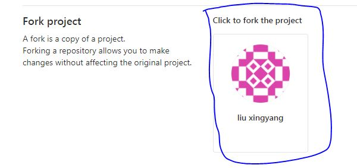
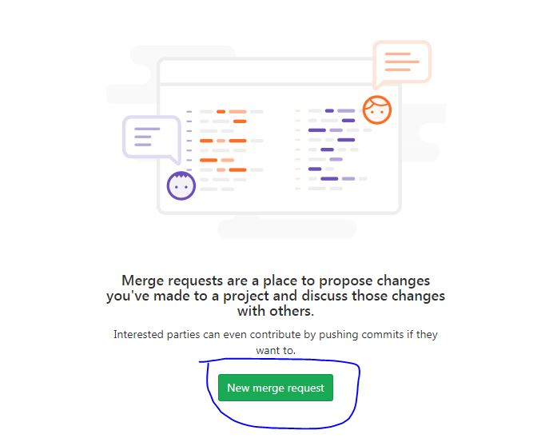
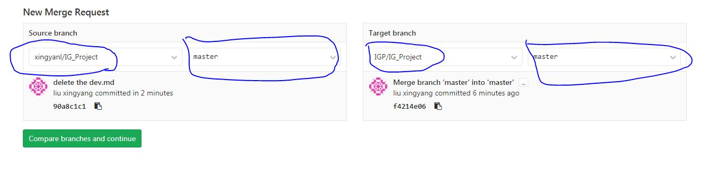
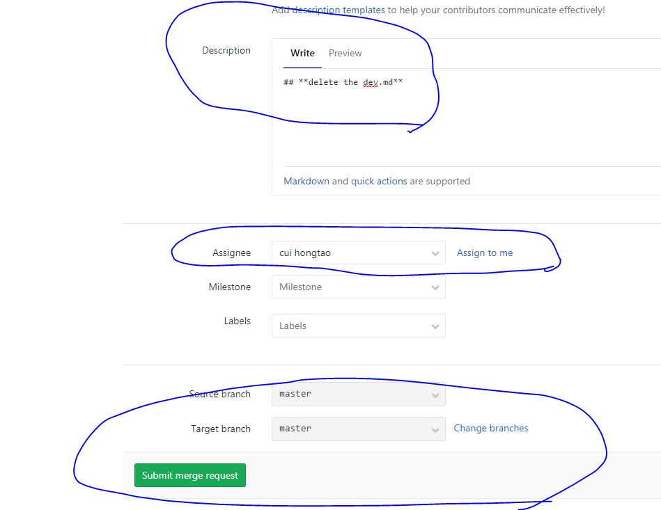
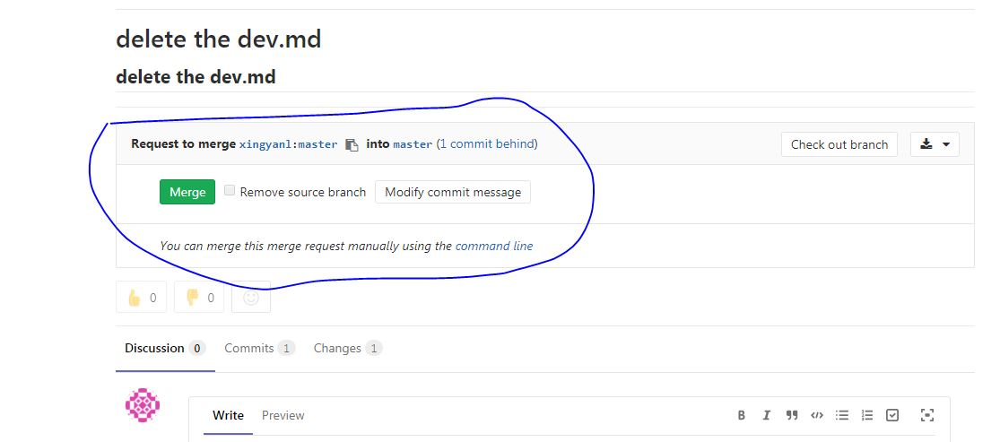

### **Git流策略**

#### **1. Fork项目**




#### **2. clone项目到个人目录(以下均以xingyanl为用户名)**
**地址如下：**


```
// clone到本地
xingyanl@yocto-DL580:gitlab$ git clone http://135.251.123.102/xingyanl/IG_Project.git

// 查看远程repository信息
xingyanl@yocto-DL580:IG_Project$ git remote -v
origin  http://135.251.123.102/xingyanl/IG_Project.git (fetch)
origin  http://135.251.123.102/xingyanl/IG_Project.git (push)

// 配置上游repository，也就是主stream
xingyanl@yocto-DL580:IG_Project$ git remote add upstream http://135.251.123.102/IGP/IG_Project.git
xingyanl@yocto-DL580:IG_Project$ git remote -v
origin  http://135.251.123.102/xingyanl/IG_Project.git (fetch)
origin  http://135.251.123.102/xingyanl/IG_Project.git (push)
upstream        http://135.251.123.102/IGP/IG_Project.git (fetch)
upstream        http://135.251.123.102/IGP/IG_Project.git (push)
xingyanl@yocto-DL580:IG_Project$
```

#### **3. 更改文件并push到远端repository**
```
xingyanl@yocto-DL580:gitlab$ vi dev.md
xingyanl@yocto-DL580:gitlab$ git add dev.md
xingyanl@yocto-DL580:gitlab$ git commit -m "Add the dev.md file"

// 首先查看主repository的分支信息
xingyanl@yocto-DL580:IG_Project$ git fetch upstream
......
From http://135.251.123.102/IGP/IG_Project
 * [new branch]      master     -> upstream/master
 * [new branch]      patch-1    -> upstream/patch-1
 * [new branch]      patch-2    -> upstream/patch-2
 * [new branch]      patch-3    -> upstream/patch-3

// 更新到需要和主stream同步的分支最新内容
xingyanl@yocto-DL580:IG_Project$ git merge upstream/master
 Already up-to-date.

// push自己的改动到远端repository
xingyanl@yocto-DL580:gitlab$ git push -u origin master

```

#### **4. 提交merge申请**
**4.1 merge申请**  


**4.2 创建新的request**



**4.3 填写源branch和目标branch**
> 源branch为个人fork的项目，目标为主项目



**4.4 填写描述**
> 目前Assignee一栏应当填写**sun hongliang**, 只有hongliang有权限



**4.5 hongliang决定是否同意merge申请，并添加描述**
> 此步骤只需要管理员来执行


