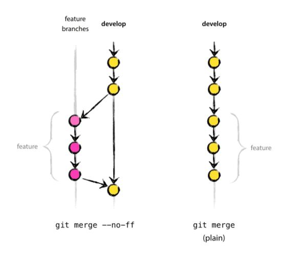

# git-flow版本控制流程


## 1. origin/master分支


------
## 2. origin/develop分支


------
## 3. other分支

### 3.1 新功能分支myfeature
- 继承自develop
- 最终回到develop

- 不需要在origin中创建
```
// 在develop中创建新功能分支
$ git checkout -b myfeature develop
Switched to a new branch "myfeature"
```

- 新功能完成后，合并到develop分支，准备下一次发布
```
$ git checkout develop
Switched to branch 'develop'
$ git merge --no-ff myfeature
Updating ea1b82a..05e9557
(Summary of changes)
$ git branch -d myfeature
Deleted branch myfeature (was 05e9557).
$ git push origin develop

```
> --no-ff 标记强制创建一个新的提交，禁止合并操作使用『快速前进（fast-forward）』方式进行。这样可以避免在合并时丢失了新功能分支脚力和消亡过程。标记功能的比较图示如下：



> 在右侧图中，新功能分支中的所有提交，都被嵌入到了develop分支中，除了认真阅读提交的日志信息，没法把他们分离出来。当我们试图回顾这个新功能分支中做了哪些改动时，将是个很麻烦的事情。但我们加上--no-ff标记，则可以很容易的解决这种麻烦。当然，这会导致新创建了一个空的提交。但它带来的好处，远大于这一点点消耗。


### 3.2 发布分支release
- 来自develop
- 合并目标：develop和master
- 分支命名规则：release-*